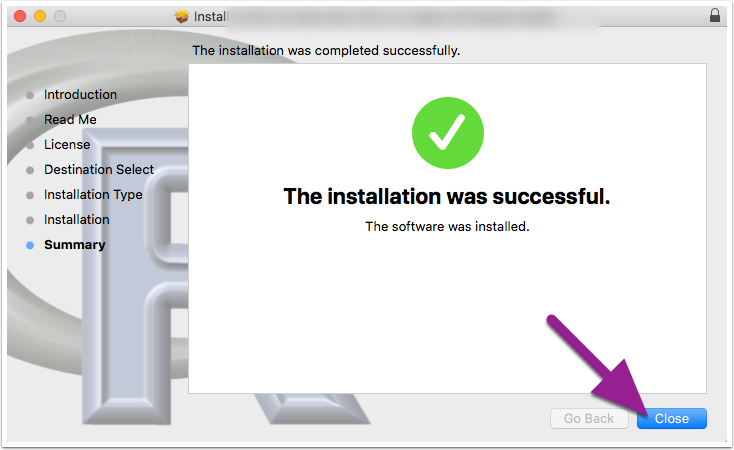
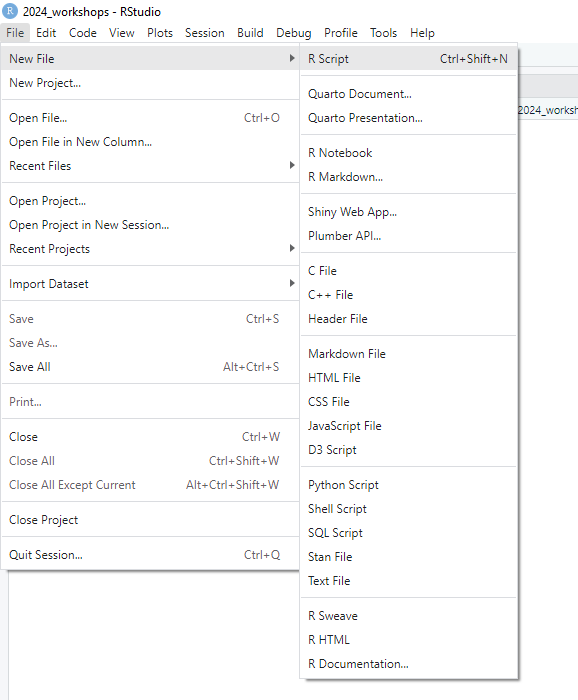
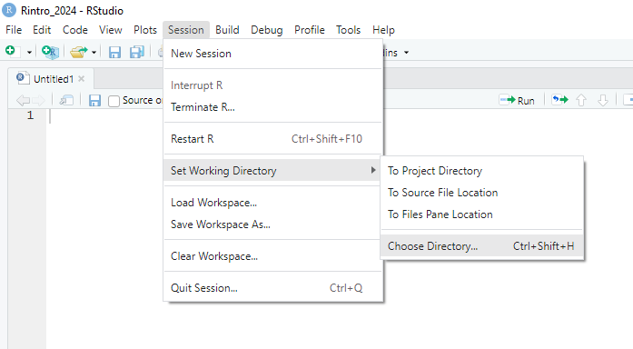

---
output:
  word_document: default
  html_document: default
---

# **Getting Started with R and RStudio** {#rstudio}

This session introduces the programming language R and the RStudio application. Today, we will download both R and RStudio, set up our RStudio environment, and write and run our first piece of R Code. This will set us up for the rest of the course.

## What is R?

R is a statistical programming language that enables us to directly communicate with our computers and ask it perform tasks. Typically we rely on button-click applications (e.g. SPSS, Excel, Word) to communicate with our computers on our behalf. These applications translate our button-click commands into a language that our computer can understand. Our computer then carries out those commands, returns the results to the application, which then translates those results back to us.

Applications like SPSS are convenient. They typically have a user-friendly interface that makes it easy to communicate with our computer. Consequently, this means one can become highly competent in a short amount of time with such applications.

However, these applications also limit what we can do. For example, base SPSS is functional when it comes to creating data visualisations, but it is difficult to make major changes to your graph (e.g., making it interactive). If we want to create such visualisations, we need to use an external application. Similarly, financial costs can limit our ability to use such apps, as proprietary software like SPSS is not cheap ([it can cost between \$3830 - 25200 for a single licence depending on the version](https://www.ibm.com/products/spss-statistics/pricing))!

In contrast, R is a free, open-source statistical programming language that enables us to conduct comprehensive statistical analysis and create highly elegant visualisations. By learning R, we can cut out the middleman.

```{r fig.cap = "BBC graphs created in R.", echo = FALSE, warning = FALSE}

library(knitr)

include_graphics("img/01-bbc.png")


```

But why R and not a different programming language? R was developed by statisticians for the purpose of conducting statistical analysis. In contrast, other popular programming languages (Python, JavaScript, C) were designed for different purposes. Consequently, R contains an extensive vocabulary that enables us to carry out sophisticated and precise analyses. I [Ryan] have both used R and Python (which is often used in Data Science) to conduct statistical analyses, and I have found it significantly easier to run a wide range of statistical tests in R compared to Python.Similarly, there is substantial online support for using R to conduct statistical analyses. This explains why R is typically used among statisticians, social scientists, data miners, and bioinformaticians. For these reasons, we will be using R in this course [^02-rstudio-1].

[^02-rstudio-1]: There are always tradeoffs in selecting a language. Many programming concepts are easier to grasp in Python than in R. Similarly, there is a lot of resources available for conducting machine-learning analysis in Python.

    But if you are goal is conduct data cleaning, analysis, visualization, and reporting, then R is a excellent choice. The good thing is that once you achieve a certain level of competency in one programming language, you will find it significantly easier to pick up a following one.

## Create a Posit Cloud Account.

In the next section, you'll learn how to download R and RStudio onto your laptop. But before we do that, I want you to set up a free account on Posit Cloud (formerly known as RStudio Cloud). Posit Cloud enables you to run R and RStudio online for free, without installing anything.

***If you are using the desktops in the lab,*** then please only use Posit Cloud in all of our R and RStudio classes. It is much easier to run R and RStudio on Posit Cloud than on the absolute tragic disaster on the limited Windows operating system on the Desktops in the class. Please, please, please do not use the RStudio version on the desktop computers in the lab, or else your R life will be frustrating and painful.

***If you are using your own laptop,*** then use Posit Cloud as a backup option in case any technical issues pop up. During class, we might not be able to solve those issues quickly and efficiently (in a large classroom, one must always account for Murphy's Law). Rather than being hamstrung by technical difficulties, you can sign into Posit Cloud and keep following along with the session.

You might be wondering, why not just use Posit Cloud? The reason is that there are some restrictions to the free version of Posit Cloud, namely that you can only use 25 hours per month and are limited in the amount of data you can use during that time. It's highly unlikely that we will hit those restrictions in the next 10 weeks, but if you primarily use your laptop and Posit Cloud secondarily, then we do not have to worry about that.

For those of you on the desktop computers, if you do hit the max limit, then get in touch with Ryan (email: ryan.donovan\@universityofgalway.ie). The simplest solution is just to create a second Posit Cloud account.

### Instructions for Creating a Posit Cloud Account

To create a Posit Cloud account, see the following instructions:

1.  [Go to their sign up page website](https://login.posit.cloud/register?redirect=%2Foauth%2Fauthorize%3Fredirect_uri%3Dhttps%253A%252F%252Fposit.cloud%252Flogin%26client_id%3Dposit-cloud%26response_type%3Dcode%26show_auth%3D0) and enter your details to create an account or Sign up with Google.

    ```{r echo = FALSE}

    include_graphics("img/01-posit-sign-up.png")

    ```

2.  Once you have created an account and are in Posit Cloud, click "New Project" From the drop-down menu click "New RStudio Project". This should take a few seconds to set up (or "deploy")

```{r echo=FALSE}

include_graphics("img/01-posit-newproject.png")

```

3.  Once it is deployed, name your project at the top as ***rintro***

```{r echo=FALSE}
include_graphics("img/01-posit-rintro.png")
```

Don't worry about what anything on the screen means for now. We'll come back to that in the section **Creating an R Project (2.5).**

## Downloading R on to your Computer (personal laptop or desktops only)

If you are using your own personal laptop or desktop (if at home), then please follow the following instructions to download R on either Windows or Mac.

***If you are using the Desktops in the lab, do not follow these instructions, as we will be using Posit Cloud***

### Installing R (Windows)

1.  Go to the website: <https://cran.r-project.org/>
2.  Under the heading *Download and Install R,* click *Download R for Windows*

```{r echo = FALSE}
include_graphics("img/01-cran.png")
```

3.  Click the hyperlink ***base*** or ***install R for the first Time***

4.  Click Download R-4.5.2 for Windows (If when you access this page, the number is different, don't worry. R is continuously updating, so download whatever version is in the equivalent place). Let the file download.

```{r fig.cap = "The R programming language is occasionally updated, so the specific version of R that you see might be different than mine. But that\'s okay!", echo = FALSE}

include_graphics("img/01-base.png")
```

5.  Once the file has downloaded, open it and click "Yes" if you are asked to allow this app to make changes to your device. Select English as your setup language. The file name should be something like "R-4.5.2.-win" (numbers will differ depending on the version downloaded).
6.  Agree to the terms and conditions and select a place to install R. The default option is fine.

### Installing R (Mac)

The instructions are largely the same for Mac.

-   Go to the website: <https://cran.r-project.org/>

-   Click Download R for (Mac) OS X.

```{r echo=FALSE}

include_graphics("img/01-rstudiodownload-mac.png")

```

-   Check the **Latest release** section for the appropriate version and follow the directions for download. You will notice there will be two download links, one if your Mac has an Intel Processor or Apple Silicon. If you are unsure which processor your Mac has, see the following webpage for help: <https://help.arcstudiopro.com/all-how-tos/how-do-i-know-if-my-mac-has-intel-processor-or-apple-m1>. 

```{r echo=FALSE}

include_graphics("img/01-rversion-mac.png")

```

-   Once the file download is complete, click to open the installer. Click **Continue** and proceed through the installer. I recommend going with all default options.

```{r fig.cap= "Depending on your version of Mac OS, this might look slightly different. But you should still be able to install it.", echo=FALSE}

include_graphics("img/01-mac_installer.png")

```

-   Once the R installer has finished, click **Close.**

```{r echo=FALSE}



```

## Install and Open RStudio

Once R is installed, we will install RStudio. ***Again, if you are using the desktops in the lab, you do not need to install RStudio—just make sure you have followed the Posit Cloud instructions.***

RStudio is a user-friendly front-end program for R, enhancing your R coding experience without sacrificing any capabilities. RStudio allows us to write and save R code, create plots, manage files, and perform other useful tasks. Think of RStudio as similar to Microsoft Word compared to a basic text editor; while you can write a paper in a text editor, it's much quicker and more efficient in Word.

1.  **NB:** Make sure that R is installed ***before*** trying to install RStudio.

2.  Go to the RStudio website: <https://posit.co/download/rstudio-desktop/.>

3.  The website should automatically detect your operating system. Click the ***Download RStudio Desktop*** button.

```{r echo = FALSE}
include_graphics("img/01-rstudiodownload.png")
```

Once the file is downloaded, open it and allow it to make changes to your device. Follow the instructions to install the program. I recommend using all the default options during installation.

After downloading both R and RStudio, open RStudio on your computer. You do not have to open R separately, as RStudio will work with R if everything is set up correctly.

## Creating an R Project

***Note: If you are only using PositCloud, you have already created a project on PositCloud. Feel free to skip to Section 2.6. Only follow this section if you are using your own personal computer or laptop

Our first step in RStudio is to create an *R Project*. R Projects are environments that group together input files (e.g., data sets), analyses on those files (e.g., code), and any outputs (e.g., results or plots). Creating an R Project will set up a new directory (folder) on your computer. Whenever you open that project, you are telling R to work within that specific directory (in this context, "directory" is just a fancy word for a folder).


***Activity - Create an R Project (Personal Computer or Laptop)***

Let's create an R Project that we will use during these sessions

1.  Click "File" in the top left-hand corner of RStudio → then click "New Project."

2.  The "New Project Wizard" screen will pop up. Click "New Directory" → "New Project."

3.  In the "Create New Project" screen, there are four options we are going to change:

**Option 1**: The "Directory name" options sets the name of the project and associated folder.

-   I ***recommend*** that you set the same directory name as me - ***rintro***

-   You can actually set this directory name to whatever you want, I cannot stop you. ***Just don't set it to "R",*** as this can create problems down the line.

**Option 2**: The "Create project as sub-directory of" option selects a place to store this project on your computer.

-   You can save it anywhere you like (e.g., your Desktop). Just ensure it's in a place you can easily find and where it won't be moved later.

-   My recommendation is to create a folder called "PS6183" on your desktop and save your project inside this folder.

-   Regardless of where you save your project, make a note of the location on your computer and keep it handy (e.g., in a text file).

**Option 3**: The "Use renv with this project" option enables you to create a virtual environment for this project that will be separate to other R projects. Don't worry for now about what that means, it will be explained later on.

-   Tick this option.

**Option 4:** The "Open in new session" just opens a new window on RStudio for this project.

-   Tick this option.

**Note on Github Repository**: This will probably not appear on your RStudio project, but that's okay, you don't need it for this course.

You can see my example below. Once you're happy with your input for each option, click "Create Project" This will open up the project ***rintro***.

```{r fig.cap = "New Project Set Up", echo = FALSE, warning = FALSE}

library(knitr)

include_graphics("img/01-newproject-ma.png")


```

## Navigating RStudio

When you first open RStudio, you will see three panes or "windows" in RStudio: **Console** (left), **Environment** (top right), and **Files** (bottom right) - more on what each of these panes are for in a second.

```{r echo = FALSE}

include_graphics("img/rstudio_first.png")

```

In our new project, ***rintro***, we are going to open the "Source" pane (again, more on this in a moment), which we will often use for writing code and viewing datasets.

### Opening the Source Pane

There are a variety of ways to open the Source pane:

-   **Button approach**: Click the "File" tab in the top-left corner → Click "New File" → Select "R Script."

```{r echo = FALSE}

```

-   **Button Shortcut**: Directly underneath the *File* tab, there is an icon of a white sheet with a green addition symbol. You can click that too.

-   **Keyboard Shortcut:** Press "Ctrl" + "Shift" + "N" on Windows, or "Cmd" + "Shift" + "N" on Mac.

Now you should see your four panes: **Source**, **Console**, **Environment**, and **Files**.

```{r echo = FALSE}

include_graphics("img/01-four-panes.png")

```

#### The RStudio Workspace

Let’s briefly describe the purpose of each pane:

-   **Source Pane**: Where you write R scripts. R scripts enable you to write, save, and run R code in a structured format. For instance, you might have an R script titled "Descriptive," containing code for computing descriptive statistics on your dataset. Similarly, you might have another R script titled "Regression" for performing regression analyses.

-   **Console Pane**: Where you can write R code or enter commands into R. The console also displays various outputs from your R scripts. For example, if you create a script for running a t-test, the results will appear here. Any error or warning messages related to your code will also be highlighted in the console. In short, this is where R actually runs your code.

-   **Environment Pane**: The "Environment" tab Displays information about the datasets and variables imported or created in R within a specific project. The "History" tab shows a history of R code executed during the project. This pane is helpful for reviewing your work or returning to a project after some time.

-   **Files Pane**: Includes project files (Files tab), outputs of plots you create (Plots tab), a list of downloaded packages (Packages tab), and help documentation about R functions (Help tab).

We use all four panes during these classes.

### Checking our Working Directory

Every time you open a project or file in RStudio, it's good practice to check the working directory. The working directory is the location in your computer where R is currently operating. Ideally, you want the working directory to match the same location in your computer as your R project. This ensures that any files from your R project are easily imported into R and than any files exported from R (e.g. results, figures, tables) will be saved to the R project folder, making it easier to find them. Checking the working directory can help prevent many common R problems.

To check the working directory, type the following into the console pane:

```{r}
getwd()
```

This will display the current working directory (i.e. location) where R is operating. Your working directory will likely differ from mine, which is normal. Just confirm that it matches the location you specified when creating your project (**Option 2**).

### Setting up a new Working Directory {#set_wd}

In our R Project, we are going to create a folder for Week 1 of the workshop. Anything we create in R will then be saved into this folder.

-   Click "Session" in the RStudio toolbar → Select "Set Working Directory" → Click "Choose Directory."

```{r echo = FALSE}



```

-   By default, this should be in your R Project (e.g., ***rintro***).

<!-- -->

-   Within this R Project, create a new folder and call it "week1."

-   Click "week1" and then click "Open."

```{r echo=FALSE}

include_graphics("img/01-new_wd.png")

```

You should see something like the following in your console. 

```         
> setwd("C:/Users/0131045s/Desktop/Programming/R/Workshops/rintro/week1")
```

Again my working directory won't match yours, but as long as it is pointing to the "week1" folder inside the "rintro" folder, then you are all set. If that does not work, then try resetting your working directory following the same steps:  Click "Session" in the RStudio toolbar → Select "Set Working Directory" → Click "Choose Directory."

### Changing some default settings

Like most applications, RStudio comes with default settings, some of which can be annoying if you use R frequently. One such setting restores your data and commands from your last session when you reopen RStudio. While this sounds helpful, it can cause issues if you’re working on multiple projects or sharing code with others. Let’s change this setting:

1.  In the toolbar at the top of RStudio, click **Tools** → **Global Options**.

2.  Under the **General** tab, look for the "Save workspace to .RData on exit" option. Change it to "Never." Untick the box as well.

```{r echo=FALSE}

include_graphics("img/01-workspace-setting.PNG")

```

## Writing our first R Code

Okay we have R and RStudio/Posit Cloud all set up. Now let’s write our first line of R code in the console. The R console uses the prompt symbol `>` to indicate that it is ready for a new line of code.

Type in each of the following instructions (after the `>` prompt) and press Enter. Feel free to modify the second line of code to include your own name:

```{r first piece of code}

print("Hello World")

print("My name is Ryan and I am learning to code in R")

```

Congratulations, you've written your first piece of code!

Let's describe what is going on here. We used a function called `print() ` to print the words "Hello World" and "My name is Ryan, and I am learning to code in R" in the console. Functions are equivalent to verbs in the English language—they describe actions. Here, R identifies the `print()` function, looks inside the parentheses to see what we want to print, and then displays the specified text. 

Functions are a core programming concept, and there is a lot more involved in functions than I have described so far. We will use functions repeatedly in this course, so they are important, and we will explore functions in significantly more depth. But for now, functions are verbs that tell our computer what actions to perform.

## Console vs Source Script

You might have noticed that I asked you to write code in the console rather than the source pane. Let’s discuss the differences:

-   **Console**: Writing code in the console is similar to having a live chat with R. You type commands, and R executes them immediately. The console is great for experimentation and quick feedback but not ideal for saving or organising your work.

-   **Source Script**: Writing code in scripts is similar to writing down what you are going to say before you call someone. Scripts allow you to keep a record of your work, organise it into sections and a coherent structure, and rerun it later. Think of the source pane as a document for your final code.

From now on, we’ll write most of our code in R scripts. If I want you to use the console, I’ll let you know. But the default is to write code in scripts. Let's do that now. 

## Let's write some statistical code {#firstpieceofcode}

Let's write some code that will. 

-   Import a dataset

-   Calculate descriptive statistics

-   Generate a graph

-   Save the results

Don’t worry if you don’t understand all the code provided below. Just follow along and type it yourself into the R script we opened earlier. If it’s not open, click "File" → "New File" → "R Script." Save the script as **"01-sleep-descriptives."**

When you download R, it comes with several built-in functions (e.g., `print()`) and datasets. One of these datasets is called **`sleep`**, which we’ll use here. To learn more about the **`sleep`** dataset, type **`?sleep`** into the console. You’ll find more information in the "Help" tab in the Files pane.

First, let’s take a look at the **`sleep`** dataset by writing the following code in your R script. To run scripts in R, highlight the code and click the "Run" button (with the green arrow) in the top right corner of the script pane.

```{r}

print(sleep) 

```

The **`print()`** function displays the **`sleep`** dataset in the console. There are other functions to explore datasets, such as **`head()`**, **`tail()`**, **`View()`**, and **`str()`**. Try these functions with the **`sleep`** dataset by typing them into the console to see their outputs.

From **`print(sleep)`**, we can see there are 20 observations (rows) with three variables (columns):

-   **extra**: The extra hours of sleep participants had

-   **group**: The treatment group they were assigned to

-   **ID**: Their participant ID

### Calculating Descriptive Statistics

Let’s calculate some descriptive statistics using the **`summary()`** function. This function takes an object (e.g., a dataset) and summarizes its data. Write the following code in your script and press "Run":

```{r}

summary(sleep) 
```

The **`summary()`** function provides descriptive statistics for each variable. For instance, it shows the mean change in hours of sleep (+1.5) and that there were 10 participants in each group.

However, this isn’t quite what we need. For instance, we don’t need descriptives for participant ID, and we want the mean scores split by treatment group. To get this, we can use the **`aggregate()`** function, which splits data into subsets and computes summary statistics for each subset. Add this to your script and run it:

```{r eval = F}


aggregate(data = sleep, extra ~ group, FUN = mean)


#Here is what the code means


# code: data = sleep -> Go to the sleep data set

# code: extra ~ group ->  Take the variable "extra" and split it into subsets based on the variable "group"

# code: FUN = mean -> Apply the mean() function (FUN) on each subset, i.e. calculate the mean per each subset 

```

```{r echo = F}


aggregate(data = sleep, extra ~ group, FUN = mean)


```

Running this code shows the mean extra sleep for each treatment group. Participants in **group 2** slept an extra 2.33 hours on average, while participants in **group 1** slept only 0.75 hours more. It seems treatment 2 is more effective.

### Creating a Visualisation

It's always a good step to create visualisations with your data to get a better picture of what is going on. Let's visualise our data with the `plot()` function.

```{r}
plot(sleep$group, sleep$extra)
```

The **`plot()`** function automatically determines the most appropriate plot—in this case, a boxplot. While this plot is functional, we can make it more informative by adding a title and labels for the axes:

```{r fig.cap="Generic Boxplot with appropriate labelling"}


#xlab = creates a label for the x-axis  

#ylab = creates a title for the y-axis  

#main = creates a title for the plot  


plot(sleep$group, sleep$extra, 
     xlab = "Treatment", 
     ylab = "Hours of Sleep", 
     main = "Effect of Treament on Sleep Duration")  


```

This plot is more descriptive and also suggests a difference between the two groups. But is this difference meaningful? Later in the course, we’ll learn how to evaluate whether differences like these are statistically significant using inferential statistical tests.

### Saving the Plot

Now, let's take this plot and save it to a PDF so that we can share our results with others. The standard way of doing this in R is a bit cumbersome. We have to tell R that we are about to create a plot that we want to make into a PDF. Then we have to generate the plot. Then we have to tell R we are done with creating the PDF. We'll learn a much simpler way to do this later on in the course, but this will do for now.

```{r}

pdf(file = "myplot.pdf") #Tells R that we will create a pdf file called "my_plot" in our working directory

plot(sleep$group, sleep$extra, xlab = "Treatment", ylab = "Hours of Sleep", main = "Effect of Treament on Sleep Duration")  #this will save the plot to our pdf


dev.off() #this tells R that we are done with adding stuff to our PDF

```

Go to the files pane, and open up the pdf "myplot.pdf". It should be in your working directory. Open up the PDF and have a look at your graph[^02-rstudio-2].

[^02-rstudio-2]: This is a fairly generic type of graph offered by base R. During the course we will looking at ways we can create "sexier" and more APA friendly type of graphs. But for one line of code, it's not bad!

### Comments

You might have noticed that I wrote several lines of text with a **`#`** before them. These are known as comments. Comments are pieces of text that R ignores - they are not executed as part of the code. 

We create comments using the **`#`** symbol. This tells R to ignore everything that comes **after** the `#` on the same line.

Comments are fundamental to writing clear and understandable code, as they can serve a variety of purposes. In the figure below, you can see four different types of comments 


```{r fig.cap = "Four Examples of Comments Use", echo = FALSE, warning = FALSE}

library(knitr)

include_graphics("img/03-comments.png")


```

1.  **Provide an Introduction**: This comments provides clear information on what the script is doing, what data it is doing it on (sleep dataset), and who wrote the script. Introduction comments help orient and provide context for anyone reviewing or trying to apply your code to their own data, making it significantly easier to understand what is going on. 

2.  **Structure Your Script**: This comment structures the format of the script by providing headings or steps. Again, this makes it significantly easier to understand what is going on.

3.  **Disable Code Temporarily**: This comments disables the code **`summary(sleep)`**, so it will not be executed in R. Remember, any piece of information that placed after a `#` and on the same line will be ignored by R. But why would we want to disable code? In this case, it's because we do not need the **`summary(sleep)`** right now, but we keep it there in case it is useful later on. There are also other reasons why we would want to disable code, such as: assessing whether the code is causing an error in our script, if the code takes a long time to run and we do not need it right now, or if we just want to skip that line of code for now. 

4.  **Explain Specific Lines of Code**: This comments provides some context or information on what a specific line of code is doing, namely, what the **`aggregate()`** function does. Again, this is really useful, particularly if you are using functions that are not well-known.

### Why Comments Are Important

Writing comments is like leaving notes for your future self (or for others working with your code). Imagine this scenario: you spend weeks creating a detailed R script to clean a messy dataset and run several analyses. Months later, a reviewer or your supervisor asks you to change your statistical approach. You go back to your script, reopen it, and realise you have forgotten what most of your code is doing! Without comments, you may spend days/hours trying to understand your own work.

By including comments, you save time and frustration. Additionally, comments help you solidify your understanding by requiring you to explain your code as you write it.

### Best Practices for Comments

-   Comment frequently: It's better to over-comment than to leave yourself guessing later.

-   Keep comments concise but clear: Avoid overly verbose comments that are harder to read.

-   Update comments if you change your code: Outdated comments can be misleading.

-   Use comments to break your script into logical sections.

## Summary

There we have it! That completes our first session with R and RStudio. Today was more about getting to grips with the software R and RStudio, but we still got our first pieces of code written. Hopefully, it's given you a tiny glimpse into what R can do.

In the next two sessions, we will learn basic programming concepts that will help you use R effectively, learn how to import data in R, and learn how to run descriptive statistics.

## Glossary

This glossary defines key terms introduced in Chapter 2.

| Term | Definition |
|----------------------|--------------------------------------------------|
| Comment | Text in an R script that is ignored by R. Comments are preceded by the `#` symbol and are used to add explanations, headings, or disable code temporarily. |
| Console | The interactive interface in RStudio where you can type and execute R commands and see their immediate output. |
| Environment Pane | The pane in RStudio that displays information about data sets, variables, and the history of R commands used in the current R session. |
| Files Pane | The pane in RStudio that displays the files and folders in your current working directory, as well as other useful tabs like Plots, Packages, and Help. |
| Function | A fundamental programming concept in R, representing a reusable block of code that performs a specific task. Functions are like verbs in English; they describe actions. |
| R | A programming language and environment for statistical analysis and data visualization. |
| R Project | An environment created in RStudio that groups together input files, code, and outputs. It helps organize and manage your work in a specific directory. |
| RStudio | An integrated development environment (IDE) for R, providing a user-friendly interface and tools for coding, data analysis, and visualization. |
| Script | A file containing a sequence of R commands that can be saved, executed, and reused. |
| Source Pane | The pane in RStudio where you can write and edit R scripts. |
| Term | Definition |
| Working Directory | The directory or folder on your computer where R is currently operating. It is important for managing file paths and organizing project files. |
