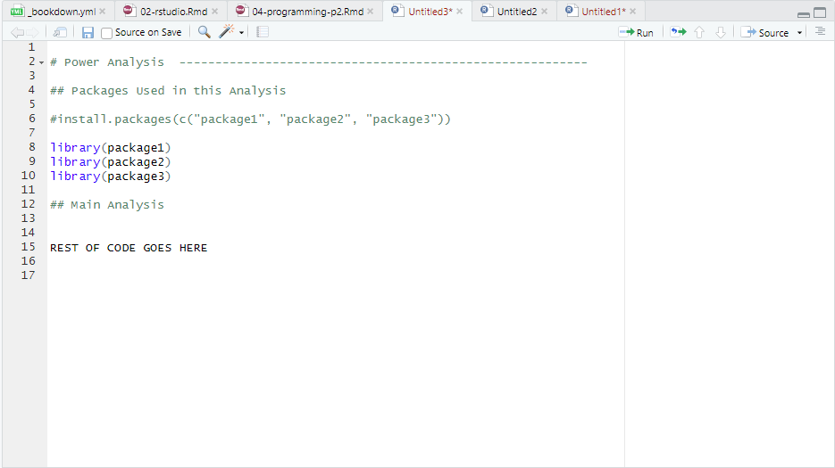

# **Programming Fundamentals in R (Part II)** {#programming2}

Today, we are going to build upon the foundational concepts introduced last week and delve deeper into the world of R programming.

By the end of this session, you should be capable of the following:

-   Understanding the logic of functions, including how and why they are created.

-   Being capable of enhancing your RStudio experience by installing and loading packages.

-   Importing and exporting datasets using R.


```{r echo=FALSE, warning=FALSE}

library(webexercises)

```

## How to read this chapter

If you are reading this chapter. I recommend that you type out every piece of code that I show on the screen, even the code with errors. The reason for this is that it will increase your comfortably with using R and RStudio and writing code. You can then test your understanding in the activities.

## Activities

There are several activities associated with this chapter. [You can find them by clicking this link.](https://ryandonovan.quarto.pub/week-3---activities-fb08/)

```{r echo=FALSE, warning=FALSE}

library(webexercises)

```

## Functions

In the previous sessions, we used several functions, like **`print()`**, **`head()`**, **`View()`**, **`mean()`**, **`sd()`**, **`summary()`**, **`aggregate()`**, **`plot()`**, **`pdf()`**, **`class()`**, and **`c()`**. Each of these functions has a job: they take some input (e.g., data or a variable), do something with it, and give you an output. In this sense, you could imagine functions as action words – like verbs – that tell R to do something.

But what *are* functions? Where do they come from?

Functions are actually a set of pre-written instructions to perform a specific task. Every function that we will use in this course has been written by someone else (or a group of people) and shared within the R community.

You might think that becoming good at R means memorising lots of functions and knowing exactly what each one does. While that helps, the real secret to getting better at programming is understanding how functions work and how to create your own. Once you get the hang of that, you’ll not only use existing functions more effectively but also make your own custom functions when you need them.

Let’s learn how to create our own function to better help us understand how functions work.

### The Syntax for Creating a Function

The process of creating a function is similar to creating a variable.

-   When we make a variable, we give it a name (e.g., **`my_name`**) and assign (\<-) some information to it (e.g., **`"Ryan"`**). Then, we can use that variable wherever we need it, like **`print(my_name)`**.

-   When we create a function, we give it a name (e.g., **`my_function`**) and assign a set of instructions to it. Every time we want to run those instructions, we can just use the function’s name instead of writing the same code repeatedly.

Here’s what the syntax for creating a function looks like:

```{r eval = FALSE}

my_function <- function(input) {
  instruction1
  instruction2
  ...
  instruction3
  return(output) # Return the result
}

```

Now let’s break this down step by step:

1.  **Naming the Function:**\
    We give our function a name (e.g., **`my_function`**) and use **`<-`** to assign something to it. Just like with variables, this tells R that the name will now store something.

2.  **Telling R It’s a Function:**\
    To let R know we’re creating a function (and not just storing data), we write **`function()`**. Inside the parentheses **`()`**, we can include input information (called an *argument*). This input helps the function do its job.

3.  **Writing the Instructions:**\
    Inside the curly brackets **`{}`**, we write the code that makes the function work. These are the steps (or instructions) the function will follow when we run it. A function could have just one step, or it could have many steps, depending on what it needs to do.

4.  **Returning the Output:**\
    To make the function give us a result, we use the **`return()`** function. Whatever we include inside **`return()`** will be the final output of the function, which R will show on the screen.

This is still a bit abstract, so let's work through a concrete example to show you what I mean.

### Creating a Simple Function (1-Argument)

#### Defining the Function

It may come as a shock to you to learn that I am not much of a chef. One big reason is that recipes confuse me with measurements like “1 cup,” “10 ounces,” or preheating an oven to “1000 degrees Fahrenheit.” Wouldn’t it be great if we could automate these conversions? That’s where functions come in handy!

Let’s create a simple function that converts cups to grams. We’ll call it **`cups_to_grams`**. When naming functions, try to pick a name that describes what the function does. This makes it easier to remember and understand.

Here’s how we start:

```{r eval = FALSE}

cups_to_grams <- function(cups) {
  
}

```

***What’s Happening Here?***

-   Inside **`function()`**, we’ve written **`cups`**, which is the input or *argument*. Think of it as a placeholder for the value we want to use later.

-   Right now, the function doesn’t do anything because we haven’t told R what to do with **`cups`**. Don’t worry! We’ll write the instructions next.

#### Writing the Instructions

To convert cups to grams, I googled and found this: **1 cup = 250 grams** (based on the metric system). So, our function needs to multiply the number of cups by 250.

Let’s add this instruction:

```{r eval = FALSE}

cups_to_grams <- function(cups) {
  grams <- cups * 250
}

```

Here’s what’s happening:

-   We’re creating a new variable called **`grams`** inside the function. It stores the result of **`cups * 250`**.

-   Still, we’re not done. If we want R to show us the result, we need to use **`return()`**.

#### Returning the Output

Here’s the final version of our function:

```{r}

cups_to_grams <- function(cups) {
  grams <- cups * 250
  return(grams)
}


```

The `return()` function tells us to keep the value of `grams` and print it out on our console.

There we have it, we have created our first function! Now let's see if it works. In programming lingo, we say that we **`call`** a function when we use it. To call **`cups_to_grams`** it is the same process as the other functions we have used, we type out the name and then we insert our input inside the parentheses.

```{r}

cups_to_grams(cups = 1)

```

This tells R: “Take **1 cup**, multiply it by 250, and give me the result.” The output should be **250 grams**.

#### Using the Function with Different Inputs

You can call the function multiple times with different values:

```{r}

cups_to_grams(cups = 4)    # 4 cups = 1000 grams
cups_to_grams(cups = 2)    # 2 cups = 500 grams
cups_to_grams(cups = 1.5)  # 1.5 cups = 375 grams
cups_to_grams(cups = 5L)   # 5 cups = 1250 grams

```

#### Defining the Argument Outside the Function

You can also define the value of **`cups`** separately and then use it in the function:

```{r}

cups = 2
cups_to_grams(cups)

```

#### Key Takeaways

-   This is an example of a **1-argument function** because it only takes in one input (**`cups`**).

-   The placeholder (**`cups`**) makes the function reusable. It doesn’t assume what the input would be ahead of time, so you can use it with any value.

One of the most powerful features of functions is that it can take multiple input values, or multiple arguments. In the next section, we’ll learn how to create functions with multiple arguments.

### Creating a Multi-Argument Function

A **multi-argument function** is a function that takes *more than one input* to perform its task. These inputs are called **arguments**, and they allow the function to work with different pieces of information.

For example, imagine you’re making pancakes. You need flour, sugar, baking powder, and butter to bake them. Each of these ingredients is like an argument — the recipe (function) needs all of them to do its job properly.

The process for creating a one-argument function is practically identical to creating a multi-argument function. The only difference is that we need to enter into more than one input when we define the function.

```{r eval = FALSE}

my_function <- function(input1, input2, input...3) {
  instruction1
  instruction2
  ...
  instruction3
  return(output) # Return the result
}

```

Again, this is abstract, so let's create our own multi-argument function. More specifically, let's create a function called `average_score` that will will calculate the **average score** on a psychological test, once we have specified the **total score** and the **number of items** on the test.

```{r}

average_score <- function(total_score, num_items) {
  # Calculate the average
  average <- total_score / num_items
  
  # Return the average
  return(average)
}

```

You can see we have provided two inputs `total_score` and `num_items` inside `function()`. This tells R that it should expect multiple inputs when this function is called. Again, we have not defined what the values of `total_score` or `num_items` is ahead of time, because we want our function to be reusable and adaptable.

Let's give our function a test drive with multiple different possible input values.

```{r}

average_score(total_score = 30, num_items = 10)
average_score(total_score = 40, num_items = 5)
average_score(total_score = 78, num_items = 17)


```

The function carries out the same set instructions regardless of what values we insert for `total_score` and `num_items`.

#### What Happens if I Don’t Name the Inputs?

When calling the function, you don’t always need to type out the names of the input variables, as long as you provide the values in the correct order. For example:

```{r}

average_score(65, 5) #what happens if I do not write out the input variable names?


```

This works because R remembers the order of the inputs (`total_score` first, then `num_items`).

However, what if you mix up the order of the inputs?

```{r}

average_score(5, 65)

```

The function still runs, but the result is wrong. Why? Because R doesn’t have common sense — it doesn’t know you meant to input the `total_score` as `65` and the `num_items` as `5`. It blindly follows the order you gave.

To avoid this kind of mistake, it’s a good idea to **always specify the names of your input variables** when calling a function. This way, you make your code clearer and less prone to errors. It’s also great practice when sharing your code with others — naming the inputs makes your code more readable, especially if someone hasn’t seen the function before.

### Some Important Features about Functions

Before we finish up on functions, there are some important features about functions that you should know. Namely, the difference between Global and Local Variables, the ability to set and override Default Arguments or inputs, and the ability to search for help on functions in R (and why it's not always the best idea).

#### Global vs Local Variables

When working with R, it’s important to understand that variables you define *inside* a function are treated differently from those you define *outside* a function. Here’s the key idea:

-   Variables defined **inside a function** are called ***local variables***. They only exist while the function is running and can’t be seen or used anywhere else.

-   Variables defined **outside a function** are called ***global variables***. These can be used anywhere in your script, including inside functions.

Again this is all abstract and boring, so let's use an example.

I’m going to create a simple function called `my_favourite_number_generator()`. This function will always tell you my favourite number (spoiler: it’s 7). It’s not the most useful function in the world, but it’ll help us understand local and global variables.

```{r}

my_favourite_number_generator <- function() {
  my_favourite_number <- 7  # This is a local variable
  return(my_favourite_number)  # The function returns 7
}


```

Here’s what’s happening:

-   I define the variable `my_favourite_number` *inside* the function. This makes it a local variable — it only exists while the function is running.

-   When I call the function, it will return the value of the local variable (`7`).

Let’s try it out:

```{r}

my_favourite_number_generator()

```

It prints `7`, just as expected.

Now, let’s see what happens when I define a global variable called `my_favourite_number` *outside* the function, and then call the function again:

```{r}

my_favourite_number <- 10
my_favourite_number_generator()


```

Even though we defined `my_favourite_number` globally as `10`, the function still returns `7`. Why? Because the function uses its *local* version of `my_favourite_number` — it doesn’t care about the global variable.

Finally, let’s check what happens if we print the global variable after calling the function:

```{r}

my_favourite_number <- 10 #global variable

my_favourite_number_generator()

print(my_favourite_number)

```

The function only works with its *local* variable (`7`), but the global variable (`10`) remains unchanged outside the function.

**Key Takeaway**

-   **Local variables** exist only inside the function and disappear once the function finishes running.

-   **Global variables** exist outside the function and can be used anywhere in your script.

If you keep these ideas in mind, you’ll avoid common mistakes and better understand how functions work in R!

#### Default Arguments

Default arguments in R are like having a "backup plan" for your functions. You can assign a **default value** to an argument when you define the function. This means that if you don’t provide a specific value for that argument when you call the function, R will automatically use the default.

Think of it like ordering coffee at a café. If you don’t specify the type of milk you want, they might use regular milk as the default. But if you do specify oat milk, they’ll make it with oat milk instead. Default arguments in R work the same way — you can stick with the default or override it with your own value.

We’ve actually already seen a default argument in action! Remember the `sort()` function? By default, it sorts numbers in **ascending order** (from smallest to largest). But if you add the argument `decreasing = TRUE`, it sorts the numbers in **descending order** (from largest to smallest).

Here’s how it works:

```{r}

rintro_marks <- c(69, 65, 80, 77, 86, 88, 92, 71)

# Using the default (ascending order)
sort(rintro_marks)  # Output: 65, 69, 71, 77, 80, 86, 88, 92

# Overriding the default to sort in descending order
sort(rintro_marks, decreasing = TRUE)  # Output: 92, 88, 86, 80, 77, 71, 69, 65

```

In this example:

-   The default value of `decreasing` is `FALSE.` Unless we change it, it will sort from smallest to largest.

-   By specifying `decreasing = TRUE`, we override the default and sort from largest to smallest.

Now, let’s write our own function that uses a default argument. Imagine I want a function called `greet()` that says hello to someone. If I don’t specify who to greet, the function will say "Hello, World!" by default.

```{r}

# Function with a default argument
greet <- function(name = "World") {
  print(paste("Hello,", name))
}

```

Here’s what happens when we call the function:

**Using the default value:**

```{r}

# Calling the function without providing arguments
greet() 
```

-   Since we didn’t specify a name, the function used the default value of `"World"`.

-   **Overriding the default value:**

```{r}

greet(name = "Ryan") #please feel free to type in your own name

```

By specifying `name = "Ryan"`, we told the function to use `"Ryan"` instead of the default `"World"`.

### How to Search for Help on Functions in R

When learning R, you’ll often come across functions that you don’t fully understand or need more details about. Thankfully, R has built-in tools to help you learn how functions work and how to use them properly.

1.  **Using the `?` Operator**

The easiest way to find help for a specific function is to type a `?` followed by the name of the function. This will bring up the function’s help page, which includes:

-   A description of what the function does.

-   A list of arguments the function takes.

-   Examples of how to use the function.

```{r eval = F}

?mean

```

2.  **Using `help()`**

Another way to access a function’s help page is by using the `help()` function. This works the same way as the `?` operator.

```{r eval = F}

help(mean)

```

3.  **Searching for Keywords with `??`**

If you don’t know the exact name of a function but have a general idea of what you’re looking for, you can use `??` followed by a keyword. This searches through R’s documentation for functions or topics related to that keyword.

Example:

If you’re looking for functions related to "regression":

```{r eval = F}

??regression

```

This will show you a list of related functions and packages.

4.  **Using the Help Tab in RStudio**

If you’re using RStudio, the **Help** tab (in the bottom-right panel) is a great resource. You can:

-   Search for a function or topic in the search bar.

-   Browse R documentation for built-in functions and packages.

-   View the help page for any function you’re working with.

5.  **Online Resources**

If the built-in documentation isn’t enough, you can find additional help online:

-   **R Documentation website**: <https://rdocumentation.org>

-   **Stack Overflow**: A forum where R users ask and answer questions.

-   **CRAN Vignettes**: Many R packages include detailed tutorials or "vignettes" that explain how to use them. You can search for these on CRAN ([https://cran.r-project.org)](https://cran.r-project.org)).

#### **When R’s Help Pages Are Difficult to Understand**

While R’s built-in help pages are useful, they can sometimes feel overwhelming, especially for beginners. The language might be too technical, or the examples might not clearly show what you need. If this happens, don’t worry — it’s very common (I still come across help pages that I don't understand), and there are plenty of other ways to find help.

1.  **Googling for Help**

When the help page doesn’t make sense, a quick Google search can often provide more beginner-friendly explanations or practical examples. Here’s how to effectively search for help online:

-   Include the function name and the word "R" in your search query.

    For example:

    ```{r eval = F}

    "mean function R example"

    ```

2.  **YouTube and Tutorials**

Sometimes, written documentation isn’t enough. Watching a tutorial on YouTube can be incredibly helpful for visual learners. Search for:

-   "[function name] in R tutorial"

-   "How to use [function name] in R"

3.  **Ask Us**

We are here to help!

### PSA: Don't Feel Frustrated

It’s important for students to know that *nobody memorises everything in R*. Even experienced programmers regularly Google or use forums to find help. We do it all the time. The goal is not to memorise everything but to know how to find the resources you need.

## R Packages

Throughout this course, we've been exploring the tools that come with **base R**, which is the version of R you get right out of the box. Base R provides many useful functions for tasks like data analysis and visualisation. However, one of the biggest advantages of R is that you can expand its capabilities significantly by using **packages**.

Think of packages like apps on your phone. When you first set up your phone, it comes with essential apps like a web browser and maps. But you'd missing out on a lot of the potential for your smartphone if you only used the basic applications. To make more use of your phone, you might download additional apps like Spotify or Netflix.

Similarly, R packages allow you to "install" extra features for R, created by the R community, that can make your programming life much easier.

### What Are R Packages?

R packages are **add-ons** that extend the functionality of R. They often contain:

-   **Functions**: Special tools to make tasks easier (e.g., functions to visualise data or run statistical tests).

-   **Datasets**: Pre-loaded data that you can use for practice.

-   **Documentation**: Guides on how to use the package.

R packages are created by people in the R community and shared for free. They’re often designed to solve specific problems, such as making a statistical test easier to run or creating beautiful graphs. By using R packages, you benefit from the hard work and expertise of others — in a sense, you’re standing on the shoulders of R giants.

### Installing and Loading R Package

One of the most important things to know about R packages is that you first need to install them on your computer. Once installed, you will not need to install them again[^04-programming-p2-1].

[^04-programming-p2-1]: There are a couple of important exceptions to this rule. 

    Firslty, If you are creating R projects on your own personal computers using the `renv` option (which we did), this basically partitions your R project into its own little self-contained space on your computer where it will operate. So when you download and install R packages in that project, they will only exist in that location on your computer (i.e. your project). You won't need to install packages on that project more than once. However, if you set up a new project, and you need the same packages, then you will need to install those packages on that new project. 


    This is equivalent to having separate user accounts on your desktop. If I install something on my account, that doesn't mean it will be installed on your account.
    
    Secondly, the same holds true for Posit Cloud. In Posit Cloud, every new R project you make will be self-contained, so any packages you install in one project will not transfer over to other projects. 

However, if you want to use a package, then you will need to load it while you are in RStudio. Every time you open RStudio after closing it, you will need to load that package again if you want to use it.

We do something similar when we download apps on our phone. Once you download Spotify, you don't need to install it again and again every time you want to use it. However, if you do want to use it, you will need to open (i.e. load) the application.

#### Installation

We are going to install three packages - pwr, jmv, and praise. We will be using jmv and pwr packages later on in the course, but we will install them for now. The praise package provides users with, well, praise. And the pwr package will spit out statistic and programming quotes at you. It's not particularly useful, other than demonstrating the process of loading packages.

There are two main ways to install packages in R:

**Using the RStudio Interface:**

1.  Look for the **Packages** tab in the bottom-right pane of RStudio.

2.  Click the "Install" button above the list of installed packages.

3.  In the pop-up window, type the name of the package (e.g., `pwr`) and make sure "Install dependencies" is checked.

4.  Click "Install." You’ll see messages in the console that indicate the installation process.

```{r eval = FALSE}
> install.packages("pwr")
trying URL 'https://cran.rstudio.com/bin/macosx/big-sur-x86_64/contrib/4.3/rio_1.0.1.tgz'
Content type 'application/x-gzip' length 591359 bytes (577 KB)
==================================================
downloaded 577 KB


The downloaded binary packages are in
	/var/folders/h8/8sb24v_x2lg51cg2z7q8fk3w0000gp/T//RtmpvaY1Ue/downloaded_packages
```

Don’t worry about the "scary" red text — it’s normal and means the package is being installed correctly.

**Using R Commands:**

You can also install packages directly by typing the `install.packages()` command in the console. For example:

```{r eval = FALSE}

install.packages("package name")

```

The important thing here is that whatever goes inside the parentheses is inside quotation marks.

You can even install multiple packages at once:

```{r eval = FALSE}

install.packages(c("jmv", "praise"))


trying URL 'https://cran.rstudio.com/bin/macosx/big-sur-x86_64/contrib/4.3/praise_1.0.0.tgz'
Content type 'application/x-gzip' length 16537 bytes (16 KB)
==================================================
downloaded 16 KB

trying URL 'https://cran.rstudio.com/bin/macosx/big-sur-x86_64/contrib/4.3/pwr_1.5-4.tgz'
Content type 'application/x-gzip' length 208808 bytes (203 KB)
==================================================
downloaded 203 KB


The downloaded binary packages are in
	/var/folders/h8/8sb24v_x2lg51cg2z7q8fk3w0000gp/T//RtmpvaY1Ue/downloaded_packages

```

Again the output is rather scary but the sentences "package 'praise' successfully unpacked and MD5 sums checked" and "package 'pwr' successfully unpacked and MD5 sums checked" mean that they are successfully installed onto your computer.

### Loading Packages

Okay, now to actually use those packages, we will need to load them. Again, I will show you two ways to load packages.

#### Loading using RStudio Interface

Once a package is installed, you need to **load it** into your R session using the `library()` function. You’ll need to do this every time you start RStudio and want to use the package.

**Using the RStudio Interface:**

1.  Go to the **Packages** tab.

2.  Scroll down to find the package you want (e.g., `praise`) and tick the checkbox next to its name. This loads the package.

```{r fig.cap = "Loading Packages through RStudio Interface", echo = FALSE, warning = F}

library(knitr)

include_graphics("img/04-praise-loaded.png")

```

You should see something like the following in your R console (don't worry if you get a warning message like mine, or if you don't receive a warning message)

```{r eval = FALSE}

> library(praise)
Warning message:
package ‘praise’ was built under R version 4.3.2 

```

#### Loading using the R Console Command

We can use the same syntax from that R console output to load in packages there. To load in the `pwr` and `jmv` packages, you can type each of these into your script and run each one. 

```{r warning=F}

library(pwr)
library(jmv)

```

There is one significant difference between installing and loading packages through code. When you are installing packages, you can install multiple packages in one command. However, you can only load one package at a time

```{r eval = FALSE}

#This code will work
install.packages(c("package1", "package2", "package3")) 


#This code will work
library(package1)
library(package2)
library(package3)


#This code will not work
library(c("package1", "package2", "package3")) 


```

### Testing a Package

Let’s test the `praise` package, which generates random compliments (not groundbreaking, but fun to use!). After loading the package, run:

```{r echo = FALSE}

library(praise)

praise() #everytime you run this line of code it gives you a different line of praise
#so don't be worried if your result is different than mine


```

```{r eval = FALSE}

praise() #everytime you run this line of code it gives you a different line of praise
#so don't be worried if your result is different than mine


```

Every time you run `praise()`, you’ll get a different compliment. Try it out!

### Troubleshooting Common Issues

1.  **Error: "There is no package called..."**

This means the package hasn’t been installed. Use `install.packages("package_name")` to install it.

2.  **Error: "Package was built under a different version of R"**

This is a warning that your version of R might be out of data. Usually it can be ignored, but if you are unable to use the package, then you will need to download the latest version of R (using the same steps we used to download it in Chapter 2!).

3.  **Dependencies Missing**:

If you see a message about missing dependencies, reinstall the package with "Install dependencies" checked, or run:

```{r eval = F}
install.packages("package_name", dependencies = TRUE)
```

4.  **Conflicting Function Names Between Packages**:

If two loaded packages have functions with the same name, R will use the version from the package loaded most recently. You will typically see a message that looks like this in your R console

```{r eval = F}

Attaching package: ‘dplyr’

The following objects are masked from ‘package:stats’:

    filter, lag

```

***Here’s what this means:***

R is informing you that the functions filter and lag from the stats package (which comes with base R) are now "masked" by the versions from the dplyr package.
    
This simply means that if you call filter() or lag() without specifying the package, R will use the version from dplyr because it was loaded most recently.
    
***How to Handle This:***

If you see this message, it’s not an error — it’s just a warning that there’s a conflict. To explicitly use a function from a specific package, you can use the :: operator

```{r eval = F}

stats::filter()  # Use the filter function from stats
dplyr::filter()  # Use the filter function from dplyr

```

### Best Practices for Installing and Loading Packages

There are important rules to follow when writing code to install and load packages in R.

1.  **Load Packages at the Top of Your Script:** Place all `library()` calls at the very top of your R script. This helps others see which packages are required for your code.

2.  **Avoid Running `install.packages()` in a Script:** Use `install.packages()` in the console, not in your script. If someone downloads your script and accidentally runs it, it will automatically install the packages on their computer. Generally it's better for people to make a decision themselves on whether they want to install anything on their computer. By not writing the `install.packages()` command in our script, we give them the power.

3.  **Comment Out Install Commands:** If you include `install.packages()` in your script for documentation purposes, make sure it’s commented out:

```{r fig.cap = "Conventions for Installing and Loading Packages in R Script", echo = FALSE}



```

### Summary

There you have it. You have successfully installed and loaded your first packages in R. The praise package is not exactly groundbreaking, but we will be coming back to the jmv and pwr packages later on.

## Importing and Exporting Data {#importing}

While creating data frames and lists in R is valuable, the majority of the data you'll work with in R will likely come from external sources. Therefore, it's essential to know how to import data into R. Similarly, once you've processed and analysed your data in R, you'll often need to export it for further use or sharing.

First, you'll need to download two files: `psycho.csv`. Both files are available on Canvas. 

### Importing CSV files.

Comma-Separated Values (CSV) files are a prevalent format for storing tabular data. Similar to Excel files, data in CSV files is organized into rows and columns, with each row representing a single record and each column representing a different attribute or variable.

CSV files are plain text files, making them easy to create, edit, and view using a simple text editor. This simplicity and universality make CSV files a popular choice for data exchange across various applications and platforms.

In a CSV file, each value in the table is separated by a comma (,), hence the name "comma-separated values." However, depending on locale settings, other delimiters such as semicolons (;) or tabs (\\t) may be used instead.

One of the key advantages of CSV files is their compatibility with a wide range of software and programming languages, including R. They can be effortlessly imported into statistical software for analysis, making them a versatile and widely adopted format for data storage and sharing.

To import the "psycho.csv" file, please follow these steps:

1.  Make sure you have download (or uploaded) the "psycho.csv" file to your `week3` folder

2.  In your script, write and run the following line of code:

```{r echo = FALSE}

psycho <- read.csv("datasets/psycho.csv")


```

```{r eval =F}

psycho_df <- read.csv("psycho.csv")

```

3.  Once you have run that line of code, you can have a look at the data frame by using the `head()` and `summary()` functions.

```{r}

head(psycho) #this will print out the first six rows

summary(psycho) #print out summary stats for each column

```

If your results match mine, it means you have correctly imported the data.

### Exporting Datasets in R

After analysing and processing your data in R, you may need to export the results to share them with others or use them in other applications. R provides several functions for exporting data to various file formats, including CSV, Excel, and R data files. In this section, we'll explore how to export datasets using these functions.

#### Exporting to CSV Files

To export a dataset to a CSV file, we can use the `write.csv()` function:

```{r eval = FALSE}

# Export dataset to a CSV file using the following syntax
write.csv(my_dataset, file = "output.csv")

```

The argument `file` will create the name of the file and enable you to change the location of the file. The way this is currently written, it will save your file to your working directory. If you need a reminder on how to set and check your working directory [click here](#set_wd). Make sure it is set to the location you want your file to go.

Let's export a copy of our psycho dataframe:

```{r eval = F}

write.csv(psycho, file = "psycho_copy.csv")

```

In your working directory (check the Files pane), you should see the file `psycho_copy.csv`. If you go to your file manager system on your computer or on Posit Cloud, find the file, and open it, the file should open in either a text or Excel file.

## Summary

Congratulations, you've made it through Programming Part I and II! We've covered a lot of useful (but let's be honest, not exactly riveting) concepts in programming with R. Throughout these sections, we've learned how R categories data, stores it in data structures, converts data types, and creates variables and functions. Additionally, we've explored how to install and load packages to enhance R's capabilities, and how to import and export data.

For the next few weeks, we will focus on using R to run descriptive and inferential statistical analysis. 


## Glossary

| **Term** | **Definition** |
|----------------------|--------------------------------------------------|
| CSV | Comma-Separated Values: a common file format for storing tabular data, where each value is separated by a comma. |
| SPSS | Statistical Package for the Social Sciences: software commonly used for statistical analysis, often associated with .sav files. |
| Dataframe | A two-dimensional data structure in R that resembles a table with rows and columns. It can store mixed data types. |
| Importing | The process of bringing data from external sources into R for analysis or manipulation. |
| Exporting | The process of saving data from R to external files or formats for use in other applications. |
| write.csv() | A function in R used to export a dataset to a CSV file. |

