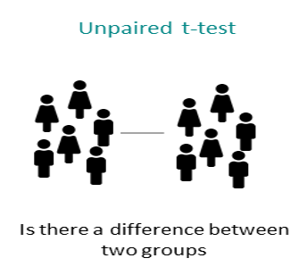

# Descriptive Statistics and T-Tests in R

In this weeks workshop, we are going to learn how to perform descriptive statistics and conduct both independent and paired-samples t-tests (which you covered in today's lecture).


Additionally, we will learn how to check parametric assumptions in R. By the end of this session, you will be able to:

-   Use the jmv package to run descriptive statistics and check parametric assumptions.

-   Conduct an independent samples t-test in R.

-   Conduct a paired-samples t-test in R.

-   Conduct an apriori power analysis in R for t-tests.

## How to read this chapter

This chapter aims to supplement your in-lecture learning about t-tests, to recap when and why you might use them, and to build on this knowledge to show how to conduct t-tests in R.

## Activities

As in previous sessions there are several activities associated with this chapter. You can find them here or on Canvas under the **Week 4 module**.

## Between-Groups Comparisons

For our between group comparisons we will be using the **wellbeing.csv** data, which we have saved as **df_wellbeing**

This data was collected from an experimental study investigating the effects of **Caffeine** (Low Caffeine, and High Caffeine) on various outcome variables, including experiences of pain, fatigue, depression, and overall wellbeing. Additionally, participants' age and gender were recorded.

After loading the datasets, it's always good practice to inspect it before doing any analyses. You can use the **head()** function to get an overview of the wellbeing dataset:

## Descriptive Statistics

Descriptive statistics (such as the mean and standard deviation) give us important additional information to the results of our statistical tests. As such it is important to calculate them, and to include them in your write-up.

### Writing up the results of an independent samples t-test

**The results of a t-test are typically written up as such:**

A Welch independent samples t-test was perfomed and **a** / **no** significant difference on performance was found between group A (M= **Group A mean value**, SD= **Group A standard deviation**) and group B (M= **Group B mean value**, SD= **Group B standard deviation**) on the task t(**df value**)= **t statistic value**, p=**exact p value to two or three decimal places**), with a large effect (d= **Cohen's d to two decimal places**, 95% CI [**lower bound** ‐ **higher bound**]).

In the associated activities with this chapter (specifically Activity 4) you will learn how to use the descriptives function from the jmv package to get the descriptive statistics you need to fill in the blanks above.

## Statistically comparing between 2 groups: Independent samples t-test (unpaired t-test)

Let's imagine we're interested in investigating the effects of caffeine consumption on levels of self-reported health. Specifically, we want to determine whether people in the high caffeine condition scored significantly differently from those in the low caffeine condition.

In this case:

Our **independent variable** is caffeine consumption group (low caffeine vs high caffeine)

Our **dependent variable** is health

We could specify our hypothesis as such:

**H1**: We predict there will be statistically significant difference in reported health levels between people in the high versus low caffeine conditions.

**H0 (Null hypothesis)**: There will not be a statistically significant difference in reported health levels between people in the high versus low caffeine conditions.

Note that as we do not specify which group will have higher/lower health levels this is a **nondirectional hypothesis**

As we have two independent groups we want to compare, this would be best addressed via an **independent samples t-test**. Before we can do this, there are a couple of preliminary steps we need to take. First, we need to check the parametric assumptions required for an independent samples t-test.



**Checking our parametric assumptions**

There are several key assumptions for conducting an independent samples t-test. We don't need R to check the first three assumptions (a-c). A quick visual inspection of the dataset and knowledge of the design will tell us whether these are met, and in this case, they are.:

a.  The dependent variable should be measured on a continuous scale.

b.  The independent variable should consist of two categorical, independent groups.

c.  The groups should be independent of each other.

d.  There should be no significant outliers. We can check this assumption via a boxplot, which will flag any outliers by placing numbers next to them.

e.  The dependent variable should be approximately normally distributed for each group. We can check this using a Shapiro-Wilk test. When interpreting Shapiro-Wilk A **significant p-value (p \< 0.05)** means that the *assumption has been violated*, and you cannot run an independent samples t-test. A **not significant p-value (p \> 0.05)** means that the *assumption has been met*, and you can proceed.

f.  The dependent variable should exhibit homogeneity of variance. We can check this using Levene's Test using the function *levenetest* from the *car* package. The syntax for this is below:

```{r eval=FALSE}
leveneTest(DependentVariable ~ IndependentVariable, data = ourdataset)
```

When interpreting Levenes test A **significant p-value (p \< 0.05)** means that the *assumption has been violated*, and you cannot run an independent samples t-test. A **not significant p-value (p \> 0.05)** means that the *assumption has been met*, and you can proceed.

Activity 5 in the associated Activities for this week will show in detail how to check assumptions d-f. Once again we will be using the **descriptives** function for this.

For future reference you could use code like that below to check your assumptions (except for homogeneity of variance) **and** get your descriptive statistics

```{r eval=FALSE}
descriptives(dataframe_name, # our dataset
             vars = "DV", # our DV
             splitBy = "IV", # our IV
             ci = TRUE, # this outputs confidence intervals to include in your descriptives
             box = TRUE, # this outputs boxplots, so you can check for outliers
             sw = TRUE) # this conducts a shapiro-wilk test to check if our dependent variable is normally distributed 
```

If all of the assumptions are met you can proceed to running the independent samples t-test.

We use the **t.test function** to perform the t-test. The syntax is:

```{r eval=FALSE}
t.test(DV ~ IV, 
       paired = FALSE,
       alternative = c("two.sided", "less", "greater"),
       data = ourdataset)
```

In this function:

DV \~ IV specifies the **dependent variable (DV)** and **independent variable (IV)**.

**paired = FALSE** indicates that we are conducting an independent samples t-test. If we were comparing related groups (e.g., pre-test vs. post-test), we would set paired = TRUE.

The **alternative** argument specifies the hypothesis test type:

*"two.sided"* tests for any difference between groups.

*"less"* tests whether the first group has a lower mean than the second.

*"greater"* tests whether the first group has a higher mean than the second.

As we have a **non-directional hypothesis** we will run a *two-sided* t-test on our df_wellbeing dataset.

Remember that in Psychology we set our alpha level as 0.05. That means that in interpreting the results of your t-test.

If your p value is **less than** 0.05 (aka p \< 0.05) then you have a **statistically significant** effect.

If your value is **greater than** or equal to 0.05 (aka p \> 0.05) then you do not have a **statistically significant** effect

## Effect sizes!


The final thing to calculate before writing up the results of our t-test is the effect size. If you recall for t-tests we use Cohen's d as our effect size of interest (helpful visualisation here to recap). Cohen's d has the following rules of thumb for interpretation:

d = 0.2 is a small effect

d = 0.5 is a medium effect

d = 0.8 is a large effect

We can use the below code to calculate the effect size for the independent samples t-test which we ran this week. We need to do a little data wrangling to run this for our paired-samples t-test, which is fine, but we'll come back to it in later weeks.

```{r eval=FALSE}
library(effectsize) #that calculates the effect size - note we may need to install this package
cohens_d(health ~ condition, # DV ~ IV
              paired = FALSE, #paired = FALSE for independent samples, but would be true for paired samples t-test
              data = df_wellbeing) # our data
```

**Writing up the results:**

After following the steps outlined above/in the activities you should be able to fill in the below blanks to write up the results of the independent samples t-test.

A Welch independent samples t-test was perfomed and **a** / **no** significant difference on performance was found between group A (M= **Group A mean value**, SD= **Group A standard deviation**) and group B (M= **Group B mean value**, SD= **Group B standard deviation**) on the task t(**df value**)= **t statistic value**, p=**exact p value to two or three decimal places**), with a large effect (d= **Cohen's d to two decimal places**, 95% CI [**lower bound** ‐ **higher bound**]).

## Within-Subjects Comparisons

For our within-subjects comparisons we will be using the **reading.csv** data, which we have saved as df_reading

This data was collected from a reading intervention study investigating the effects of a literacy intervention, comparing the same participants before and after the intervention. As such we will be comparing participants reading at: **Baseline**, and **Time2**.

A lot of the steps for conducting within-subjects comparisons are very similar to between-groups comparisons. So we can refer to the above sections for help if we get unsure.

## Descriptive Statistics for a paired-samples t-test

A paired-samples t-test was perfomed and **a** / **no** significant difference on **dependent variable** was found between **Baseline** (M= **Baseline mean value**, SD= **Baseline standard deviation**) and **Time 2** (M= **Time 2 mean value**, SD= **Time 2 standard deviation**) on the task t(**df value**)= **t statistic value**, p=**exact p value to two or three decimal places**), with a **large** effect (d= **Cohen's d to two decimal places**, 95% CI [**lower bound** ‐ **higher bound**]).

Once again you can use the **descriptives** function to fill in the descriptive statistics needed above.

Let's imagine we're interested in investigating the effects of our intervention on levels of reading ability. Specifically, we want to determine whether children's reading ability was significantly better at Time 2 (after intervention) compared to at baseline (before the intervention).

In this case:

Our **independent variable** is time (Baseline vs Time2)

Our **dependent variable** is reading ability

We could specify our **hypothesis** as such:

**H1**: We predict there will be statistically higher reading ability in children at Time 2 (after intervention) than at Baseline.

**H0 (Null hypothesis)**: There will not be statistically significant higher reading ability in children at Time 2 (after intervention) than at Baseline.

Note that as we do specify which condition will have higher reading ability this is a **directional hypothesis**

As all participants take part in both conditions (e.g. are tested at two timepoints), this would be best addressed via a **paired samples t-test**. Before we can do this, there are a couple of preliminary steps we need to take. First, we need to check the parametric assumptions required for a paired samples t-test.


Checking our parametric assumptions

a.  Our dependent variable should be measured on a continuous scale

b.  The observations are independent of one another

c.  There should be no significant outliers

d.  Our dependent variable should be normally distributed

Here, it's only really the outliers and the normal distribution that needs to be evaluated using functions in R, both of which we can assess using the **descriptives** function. The below code will output the descriptive statistics you need, **and** check your assumptions.

```{r eval=FALSE}
descriptives(df_reading, # your dataframe name here
             vars = c("Baseline", "Time2"), # your two conditions / timepoints
             ci = TRUE, # this outputs confidence intervals to include in your descriptives
             box = TRUE, # this outputs boxplots, so you can check for outliers
             sw = TRUE) # this conducts a shapiro-wilk test to check if our dependent variable is normally distributed 
```

We use the t.test function to perform the t-test. Here the syntax is:

```{r eval=FALSE}
t.test(ourDataset$Condition1, ourDataset$Condition2, # here we specify our two conditions         
       paired = TRUE, # here we specify that it is a paired samples t-test       
       alternative = c("two.sided", "less", "greater")) #here you specify whether the test is directional or nondirectional, dependent on your hypothesis
```

Once you have run the t-test you should have the information to replace the information in bold with the correct information.

A paired-samples t-test was perfomed and **a** / **no** significant difference on **dependent variable** was found between **Baseline** (M= **Baseline mean value**, SD= **Baseline standard deviation**) and **Time 2** (M= **Time 2 mean value**, SD= **Time 2 standard deviation**) on the task t(**df value**)= **t statistic value**, p=**exact p value to two or three decimal places**), with a **large** effect (d= **Cohen's d to two decimal places**, 95% CI [**lower bound** ‐ **higher bound**]).

## Power analyses

Now you may recall in your Week 3 lecture Ciara being very enthusiastic about power analyses, and the importance of conducting one before you collect any data (called an a priori or prospective power analysis). There are also power analyses you can conduct after data collection, but there are issues with them, and generally best practice is to do one beforehand (A useful paper if you're interested in learning more).

Here we are going to learn about how to conduct a power analysis for both an independent samples and paired-samples t-test.

As you may recall there are some key pieces of information we need for a power analysis

-   Alpha level (typically 0.05 in Psychology and the social sciences)

-   The minimum effect size of interest

-   Our desired power

-   If our test is one or two-tailed (i.e. do we have a directional or nondirectional hypothesis)

Reminder that this [interactive visualisation](https://rpsychologist.com/d3/nhst/ "interactive visualisation") can be helpful in understanding how these things interact.

## Power analysis for an independent samples t-test

The syntax for conducting an apriori statistical power analysis for an independent samples t-test is the following:

```{r eval=FALSE}
# Conduct power analysis for an independent samples t-test
pwr.t.test(d = 0.5,         # Your Expected effect size
           sig.level = 0.05, # Significance level
           power = 0.80,     # Desired power level
           type = "two.sample",  # Indicates an independent t-test
           alternative = "two.sided")  # Indicates a two-tailed test, #can be changed to "one.sided"
```

## Power analysis for a paired-samples t-test

If we want to run a paired samples-test, then we can change the type from "two.sample" to "one.sample":

```{r eval=FALSE}
pwr.t.test(d = 0.5,         # Your Expected effect size
           sig.level = 0.05, # Significance level
           power = 0.80,     # Desired power level
           type = "paired",  # Indicates an independent t-test
           alternative = "two.sided")  # Indicates a two-tailed test, #can be changed to "one.sided"

```
