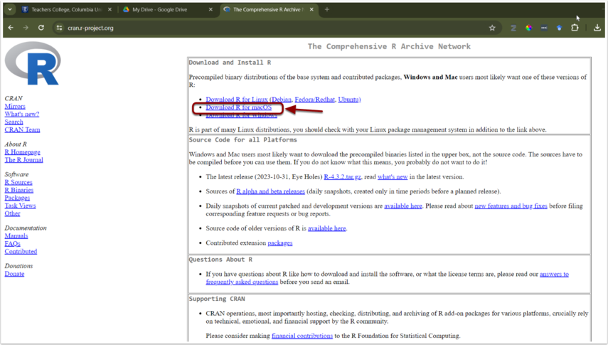
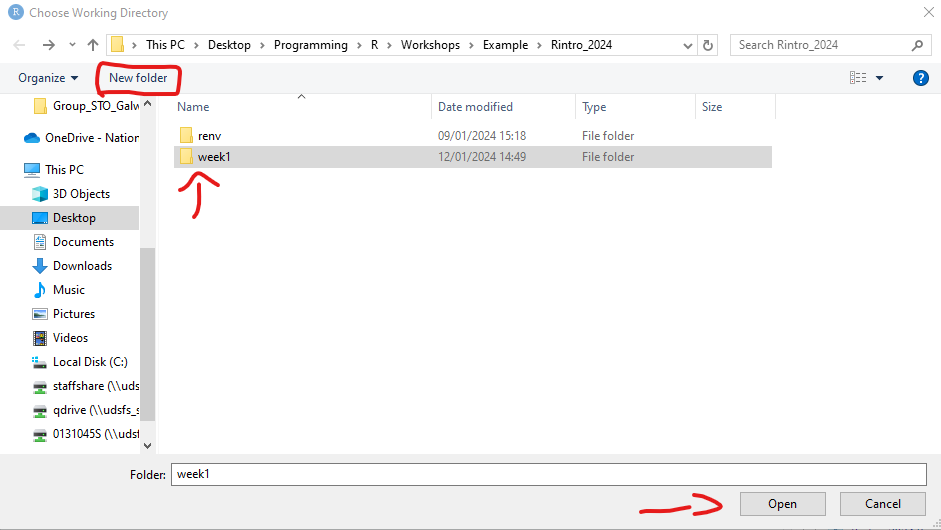

# **Overview**

**Authors:** Dr Ryan Donovan and Dr Ciara Egan.

This is the textbook for the Advanced Research Methods module (PS6183).
This textbook will describe how to use R programming language to import, clean, process, and visualise psychological data.
No prior knowledge of R or any other programming language or statistical software is required to successfully complete this module.

This textbook is still undergoing development and is not the final product.
Consequently, all textbook materials are used for educational purposes only and should only be shared within the University of Galway's School of Psychology.
Any issues or errors with the textbook should be reported to Ryan Donovan (ryan.donovan\@universityofgalway.ie).

## What will I learn in R?

In terms of specific R skills, students will learn how to:

-   Import, export, and create datasets.

-   Use basic programming concepts such as data types, functions, and loops.

-   Apply key techniques for data cleaning to enable statistical analysis.

-   Run descriptive and inferential statistics.

-   Create APA-standard graphs.

-   Deal with errors or bugs with R code.

## What will I not learn to do in R?

This is not an exhaustive introduction to R.
Similar to human languages, programming languages like R are vast and will take years to master.
After this course, you will still be considered a "newbie" in R.
But the material covered here will at least provide you a solid foundation in R, enabling you to go ahead and pick up further skills if required as you go on.

This course will teach you data cleaning and wrangling skills that will enable you to wrangle and clean a lot of data collected on Gorilla or Qualtrics.
But you will not be able to easily handle all data cleaning problems you are likely to find out in the "wild" world of messy data.
Such datasets can be uniquely messy, and even experienced R programmers will need to bash their head against the desk a few times to figure out a way to clean that dataset entirely in R.

Similarly, do not expect to be fluent in the concepts you learn here after these workshops.
It will take practice to become fluent.
You might need to refer to these materials or look up help repeatedly when using R on real-life datasets.
That's normal - so do not be discouraged when it happens.

This textbook mainly uses the tidyverse approach to R.
The tidyverse is a particular philosophical approach to how to use R (more on that later).
The other approach would be to use base R.
This can incite violent debates in R communities on which approach is better.
We will focus mainly on tidyverse and use some base R.

This textbook does not teach you how to use R Markdown.
R Markdown is a package in R that enables you to write reproducible and dynamic reports with R that can be converted into Word documents, PDFs, websites, PowerPoint presentations, books, and much more.
There are a lot of excellent resources available to learn how to use R markdown, but it's far more important to learn how to use R first.

## Why are we learning R?

There are many reasons to learn R.

Psychological research is increasingly moving towards open-science practices.
One of the key principles of open-science is that all aspects of data handling - including data wrangling, pre-processing, processing, and output generation - are openly accessible.
This is not just an abstract ideal; several top-tier journals require that you submit R scripts along with manuscripts.
If you don't know how to use R (or at least no one in your lab does), then this puts you at a disadvantage.
The upside to this is that if you do know how to use R, then you will be at an advantage in your future career prospects.

R enables you to import, clean, analyse, and publish manuscripts from R itself.
You do not have to switch between SPSS, Excel, and Word or any other software.
You can conduct your statistical analysis directly in R and have that "uploaded" directly to your manuscript.
In the long run, this will save you significant time and energy.

R is capable of more than statistical analysis.
You can create websites, documents, and books in R.
This e-book was developed in R!
We will talk more in class about the advantages of using R over existing propriety statistical software.

## Where and when will the classes take place?

The sessions will take place in **AMB-G035** (Psychology PC Suite).
The schedule for the sessions is as follows:


## Do I need to bring a laptop to the class?

If you have a laptop that you work on, please bring it.
That way, we can get R and RStudio installed onto your laptop, and you'll be able to run R outside of the classroom.

If you work with a desktop, don't worry.
The lab space will have computers that you can sign in and work on and use R.

## Office hours and why they are important for everyone (R Support - Ryan Donovan).

Programming concepts can take a while to sink in and it is naturally to need additional help.\
But in my experience, students often worry about asking for help, often from fears of being judged by their instructor.
This fear is exacerbated in courses involving mathematics and programming, as students are quick to label themselves as "*no good*" at these subjects.

This is a completely unwarranted belief.
My job is to teach you R.
Consequently, if you are reading the material or listening in class, and it's not sinking in at all, then that is ***my fault, not yours.*** If this is happening, then it is important that this feedback is being relayed.
The most valuable teaching hours I've had are while talking with a student who is struggling to understand the material, because it forces me to see the errors in how I am explaining that material and adjust.
That way, I learn better ways to explain a particular concept and the student comes with away with a greater understanding of said concept.
We all win.

So pretty please, do not be a silent martyr and let me know if you are struggling with any of the R-based material in this course.

+-------------------------------------+-----------------------------------------------------+-------------------------------------------------------------------------------------------------------------------------------------------------------------------------------------------------------------------------------------------------------------------------------+
| Staff Member                        | Office Hours                                        | Location                                                                                                                                                                                                                                                                      |
+-------------------------------------+-----------------------------------------------------+-------------------------------------------------------------------------------------------------------------------------------------------------------------------------------------------------------------------------------------------------------------------------------+
| Ryan Donovan                        | Wednesdays, 2.30-3.30pm.                            | 2065A, which is on the top floor of the Psychology building. It is in the corridor right next to the elevator.                                                                                                                                                                |
|                                     |                                                     |                                                                                                                                                                                                                                                                               |
| ryan.donovan\@universityofgalway.ie | (In-person or online option).                       | Teams Link: [click here](https://teams.microsoft.com/l/meetup-join/19%3ameeting_NDQ1YjRiNmQtNDQ4MC00NjgzLWIwYTQtNWI5OTg3ZmE1NWRj%40thread.v2/0?context=%7b%22Tid%22%3a%2213e3b186-c446-4aab-9c6d-9ab9bb76816c%22%2c%22Oid%22%3a%22c088ea08-9d92-460e-8972-64cd26bc4899%22%7d) |
|                                     |                                                     |                                                                                                                                                                                                                                                                               |
|                                     | Time doesn't suit?                                  |                                                                                                                                                                                                                                                                               |
|                                     |                                                     |                                                                                                                                                                                                                                                                               |
|                                     | Just get in touch, we can arrange a different time. |                                                                                                                                                                                                                                                                               |
+-------------------------------------+-----------------------------------------------------+-------------------------------------------------------------------------------------------------------------------------------------------------------------------------------------------------------------------------------------------------------------------------------+

<!--chapter:end:index.Rmd-->

---
output:
  word_document: default
  html_document: default
---

# **Getting Started with R and RStudio** {#rstudio}

This session introduces the programming language R and the RStudio application. Today, we will download both R and RStudio, set up our RStudio environment, and write and run our first piece of R Code. This will set us up for the rest of the course.

## What is R?

R is a statistical programming language that enables us to directly communicate with our computers and ask it perform tasks. Typically we rely on button-click applications (e.g. SPSS, Excel, Word) to communicate with our computers on our behalf. These applications translate our button-click commands into a language that our computer can understand. Our computer then carries out those commands, returns the results to the application, which then translates those results back to us.

Applications like SPSS are convenient. They typically have a user-friendly interface that makes it easy to communicate with our computer. Consequently, this means one can become highly competent in a short amount of time with such applications.

However, these applications also limit what we can do. For example, base SPSS is functional when it comes to creating data visualisations, but it is difficult to make major changes to your graph (e.g., making it interactive). If we want to create such visualisations, we need to use an external application. Similarly, financial costs can limit our ability to use such apps, as proprietary software like SPSS is not cheap ([it can cost between \$3830 - 25200 for a single licence depending on the version](https://www.ibm.com/products/spss-statistics/pricing))!

In contrast, R is a free, open-source statistical programming language that enables us to conduct comprehensive statistical analysis and create highly elegant visualisations. By learning R, we can cut out the middleman.

```{r fig.cap = "BBC graphs created in R.", echo = FALSE, warning = FALSE}

library(knitr)

include_graphics("img/01-bbc.png")


```

But why R and not a different programming language? R was developed by statisticians for the purpose of conducting statistical analysis. In contrast, other popular programming languages (Python, JavaScript, C) were designed for different purposes. Consequently, R contains an extensive vocabulary that enables us to carry out sophisticated and precise analyses. I [Ryan] have both used R and Python (which is often used in Data Science) to conduct statistical analyses, and I have found it significantly easier to run a wide range of statistical tests in R compared to Python.Similarly, there is substantial online support for using R to conduct statistical analyses. This explains why R is typically used among statisticians, social scientists, data miners, and bioinformaticians. For these reasons, we will be using R in this course [^02-rstudio-1].

[^02-rstudio-1]: There are always tradeoffs in selecting a language. Many programming concepts are easier to grasp in Python than in R. Similarly, there is a lot of resources available for conducting machine-learning analysis in Python.

    But if you are goal is conduct data cleaning, analysis, visualization, and reporting, then R is a excellent choice. The good thing is that once you achieve a certain level of competency in one programming language, you will find it significantly easier to pick up a following one.

## Create a Posit Cloud Account.

In the next section, you'll learn how to download R and RStudio onto your laptop. But before we do that, I want you to set up a free account on Posit Cloud (formerly known as RStudio Cloud). Posit Cloud enables you to run R and RStudio online for free, with no need to install anything.

***If you are using the desktops in the lab,*** then please only use Posit Cloud in all of our R and RStudio classes. It is much easier to run R and RStudio on Posit Cloud than on the absolute tragic disaster of an operating system they use on the desktop Windows machines. Please, please, please do not use the RStudio version on the desktop computers in the lab, or else your R life will be brutal and painful.

***If you are using your own laptop,*** then use Posit Cloud as a backup option in case any technical issues pop up. During class, we might not be able to solve those issues quickly and efficiently (in a large classroom, one must always account for Murphy's Law). Rather than being hamstrung by technical difficulties, you can sign into Posit Cloud and keep following along with the session.

You might be wondering, why not just use Posit Cloud? The reason is that there are some restrictions to the free version of Posit Cloud, namely that you can only use 25 hours per month and are limited in the amount of data you can use during that time. It's highly unlikely that we will hit those restrictions in the next 10 weeks, but if you primarily use your laptop and Posit Cloud secondarily, then we do not have to worry about that.

For those of you on the desktop computers, if you do hit the max limit, then get in touch with Ryan (email: ryan.donovan\@universityofgalway.ie). The simplest solution is just to create a second Posit Cloud account.

### Instructions for Creating a Posit Cloud Account

To create a Posit Cloud account, please follow the following instructions:

1.  [Go to their sign up page website](https://login.posit.cloud/register?redirect=%2Foauth%2Fauthorize%3Fredirect_uri%3Dhttps%253A%252F%252Fposit.cloud%252Flogin%26client_id%3Dposit-cloud%26response_type%3Dcode%26show_auth%3D0) and enter your details to create an account or Sign up with Google.

    ```{r echo = FALSE}

    include_graphics("img/01-posit-sign-up.png")

    ```

2.  Once you have created an account and are in Posit Cloud, click "New Project" From the drop-down menu click "New RStudio Project". This should take a few seconds to set up (or "deploy")

```{r echo=FALSE}

include_graphics("img/01-posit-newproject.png")

```

3.  Once it is deployed, name your project at the top as ***rintro***

```{r echo=FALSE}
include_graphics("img/01-posit-rintro.png")
```

Don't worry about what anything on the screen means for now. We'll come back to that in the section **Creating an RProject (2.5).**

## Downloading R on to your Computer (personal laptop or desktops only)

If you are using your own personal laptop or desktop (if at home), then please follow the following instructions to download R on either Windows or Mac.

***If you are using the Desktops in the lab, do not follow these instructions, as we will be using Posit Cloud***

### Downloading R on Windows

1.  Go to the website: <https://cran.r-project.org/>
2.  Under the heading *Download and Install R,* click *Download R for Windows*

```{r echo = FALSE}
include_graphics("img/01-cran.png")
```

3.  Click the hyperlink ***base*** or ***install R for the first Time***

4.  Click Download R-4.5.2 for Windows (depending on the date you access this, the version of R might have been been updated. That's okay, you can download the newer version). Let the file download.

```{r fig.cap = "The R programming language is occasionally updated, so the specific version of R that you see might be different than mine. But that\'s okay!", echo = FALSE}

include_graphics("img/01-base.png")
```

5.  Once the file has been downloaded, open it and click "Yes" if you are asked to allow this app to make changes to your device. Choose English as your setup language. The file name should be something like "R-4.5.2.-win" (numbers will differ depending on the version downloaded).
6.  Agree to the terms and conditions and select a place to install R. The default option is fine.

### Downloading R on Mac

The instructions are largely the same for Mac.

-   Go to the website: <https://cran.r-project.org/>

-   Click Download R for (Mac) OS X.

```{r echo=FALSE}



```

-   Check the **Latest release** section for the appropriate version and follow the directions for download. If you are unsure, please ask me.

```{r echo=FALSE}

include_graphics("img/01-rversion-mac.png")

```

-   Once the file download is complete, click to open the installer. Click **Continue** and proceed through the installer. I recommend going with all default options.

```{r fig.cap= "Depending on your version of Mac OS, this might look slightly different. But you should still be able to install it.", echo=FALSE}

include_graphics("img/01-mac_installer.png")

```

-   Once the R installer has finished, click **Close.**

```{r echo=FALSE}

include_graphics("img/01-install_finish_mac.png")

```

## Install and Open RStudio

Once R is installed, we will install RStudio. ***Again, if you are using the desktops in the lab, you do not need to install RStudio—just make sure you have followed the Posit Cloud instructions.***

RStudio is a user-friendly front-end program for R, enhancing your R coding experience without sacrificing any capabilities. RStudio allows us to write and save R code, create plots, manage files, and perform other useful tasks. Think of RStudio as similar to Microsoft Word compared to a basic text editor; while you can write a paper in a text editor, it's much quicker and more efficient in Word.

1.  **NB:** Make sure that R is installed ***before*** trying to install RStudio.

2.  Go to the RStudio website: <https://posit.co/download/rstudio-desktop/.>

3.  The website should automatically detect your operating system. Click the ***Download RStudio Desktop*** button.

```{r echo = FALSE}
include_graphics("img/01-rstudiodownload.png")
```

Once the file is downloaded, open it and allow it to make changes to your device. Follow the instructions to install the program. I recommend using all the default options during installation.

After downloading both R and RStudio, open RStudio on your computer. You do not have to open R separately, as RStudio will work with R if everything is set up correctly.

When you first open RStudio, you will see three panes or "windows" in RStudio: **Console** (left), **Environment** (top right), and **Files** (bottom right).

```{r echo = FALSE}

include_graphics("img/rstudio_first.png")

```

## Creating an R Project

***Note: If you are using PositCloud instructions from 2.2.1, you have already created a project on PositCloud. Only follow this section if you are using your own computer or laptop. 

Our first step in RStudio is to create an *R Project*. R Projects are environments that group together input files (e.g., data sets), analyses on those files (e.g., code), and any outputs (e.g., results or plots). Creating an R Project will set up a new directory (folder) on your computer. Whenever you open that project, you are telling R to work within that specific directory (in this context, "directory" is just a fancy word for a folder).


***Activity - Create an R Project (Personal Computer or Laptop)***

Let's create an R Project that we will use during these sessions

1.  Click "File" in the top left-hand corner of RStudio → then click "New Project."

2.  The "New Project Wizard" screen will pop up. Click "New Directory" → "New Project."

3.  In the "Create New Project" screen, there are four options we are going to change:

**Option 1**: The "Directory name" options sets the name of the project and associated folder.

-   I ***recommend*** that you set the same directory name as me - ***rintro***

-   You can actually set this directory name to whatever you want, I cannot stop you. ***Just don't set it to "R",*** as this can create problems down the line.

**Option 2**: The "Create project as sub-directory of" option selects a place to store this project on your computer.

-   You can save it anywhere you like (e.g., your Desktop). Just ensure it's in a place you can easily find and where it won't be moved later.

-   My recommendation is to create a folder called "PS6183" on your desktop and save your project inside this folder.

-   Regardless of where you save your project, make a note of the location on your computer and keep it handy (e.g., in a text file).

**Option 3**: The "Use renv with this project" option enables you to create a virtual environment for this project that will be separate to other R projects. Don't worry for now about what that means, it will be explained later on.

-   Tick this option.

**Option 4:** The "Open in new session" just opens a new window on RStudio for this project.

-   Tick this option.

**Note on Github Repository**: This will probably not appear on your RStudio project, but that's okay, you don't need it for this course.

You can see my example below. Once you're happy with your input for each option, click "Create Project" This will open up the project ***rintro***.

```{r fig.cap = "New Project Set Up", echo = FALSE, warning = FALSE}

library(knitr)

include_graphics("img/01-newproject-ma.png")


```

## Navigating RStudio

In our new project, ***rintro***, we are going to open the "Source" pane, which we will often use for writing code and viewing datasets.

### Opening the Source Pane

There are a variety of ways to open the Source pane:

-   **Button approach**: Click the "File" tab in the top-left corner → Click "New File" → Select "R Script."

```{r echo = FALSE}
include_graphics("img/rstudio_create_file.png")
```

-   **Button Shortcut**: Directly underneath the *File* tab, there is an icon of a white sheet with a green addition symbol. You can click that too.

-   **Keyboard Shortcut:** Press "Ctrl" + "Shift" + "N" on Windows, or "Cmd" + "Shift" + "N" on Mac.

Now you should see your four panes: **Source**, **Console**, **Environment**, and **Files**.

```{r echo = FALSE}

include_graphics("img/01-four-panes.png")

```

#### The RStudio Workspace

Let’s briefly describe the purpose of each pane:

-   **Source Pane**: Where you write R scripts. R scripts enable you to write, save, and run R code in a structured format. For instance, you might have an R script titled "Descriptive," containing code for computing descriptive statistics on your dataset. Similarly, you might have another R script titled "Regression" for performing regression analyses.

-   **Console Pane**: Where you can write R code or enter commands into R. The console also displays various outputs from your R scripts. For example, if you create a script for running a t-test, the results will appear here. Any error or warning messages related to your code will also be highlighted in the console. In short, this is where R actually runs your code.

-   **Environment Pane**: Displays information about datasets and variables imported or created in R within a specific project. The "History" tab shows a history of R code executed during the project. This pane is helpful for reviewing your work or returning to a project after some time.

-   **Files Pane**: Includes project files (Files tab), outputs of plots you create (Plots tab), a list of downloaded packages (Packages tab), and help documentation about R functions (Help tab).

We will use all four panes extensively during these classes.

### Checking our Working Directory

Every time you open a project or file in RStudio, it's good practice to check the working directory. The working directory is the environment on your computer where R is currently operating.

Ideally, you want the working directory to match the location of your R project. This ensures that any files you import into RStudio or any files you export (datasets, results, graphs) can be easily found in your R project folder. Checking the working directory can help prevent many common R problems.

To check the working directory, type the following into the console pane:

```{r}
getwd()
```

This will display the current working directory where R is operating. Your working directory will likely differ from mine, which is normal. Just confirm that it matches the location you specified when creating your project (**Option 2**).

### Setting up a new Working Directory {#set_wd}

In our R Project, we are going to create a folder for Week 1 of the workshop. Anything we create in R will then be saved into this folder.

-   Click "Session" in the RStudio toolbar → Select "Set Working Directory" → Click "Choose Directory."

```{r echo = FALSE}

include_graphics("img/01-wd.png")

```

-   By default, you should be in your R Project (e.g., ***rintro***).

<!-- -->

-   Within this R Project, create a new folder and call it "week1."

-   Click "week1" and then click "Open."

```{r echo=FALSE}



```

You should see something like the following in your console

```         
> setwd("C:/Users/0131045s/Desktop/Programming/R/Workshops/rintro/week1")
```

Check whether this location is where you want to store your files for this course. If it is, you're all set. If not, let me know during class.

### Changing some default settings

Like most applications, RStudio comes with default settings, some of which can be annoying if you use R frequently. One such setting restores your data and commands from your last session when you reopen RStudio. While this sounds helpful, it can cause issues if you’re working on multiple projects or sharing code with others. Let’s change this setting:

1.  In the toolbar at the top of RStudio, click **Tools** → **Global Options**.

2.  Under the **General** tab, look for the "Save workspace to .RData on exit" option. Change it to "Never." Untick the box as well.

```{r echo=FALSE}


```

## Writing our first R Code

Let’s write our first line of R code in the console. The R console uses the prompt symbol `>` to indicate that it is ready for a new line of code.

Type in each of the following instructions (after the `>` prompt) and press Enter. Feel free to modify the second line of code to include your own name:

```{r first piece of code}

print("Hello World")

print("My name is Ryan and I am learning to code in R")

```

Congratulations, you've written your first piece of code!

Let's describe what is going on here. We used a function called print() to print the words "Hello World" and "My name is Ryan, and I am learning to code in R" in the console. Functions are equivalent to verbs in the English language—they describe actions. Here, R identifies the `print()` function, looks inside the parentheses to see what we want to print, and then displays the specified text. 

Functions are a core programming concept, and there is a lot more involved in functions than I have described so far. We will use functions repeatedly in this course, so they are important, and we will explore functions in significantly more depth. But for now, functions are verbs that tell our computer what actions to perform.

## Console vs Source Script

You might have noticed that I asked you to write code in the console rather than the source pane. Let’s discuss the differences:

-   **Console**: Writing code in the console is similar to having a live chat with R. You type commands, and R executes them immediately. The console is great for experimentation and quick feedback but not ideal for saving or organising your work.

-   **Source Script**: Writing code in scripts is similar to writing down what you are going to say before you call someone. Scripts allow you to keep a record of your work, organise it into sections and a coherent structure, and rerun it later. Think of the source pane as a document for your final code.

From now on, we’ll write most of our code in R scripts. If I want you to use the console, I’ll let you know.

## Let's write some statistical code {#firstpieceofcode}

Now that we’ve talked a lot about R and RStudio, let’s write some code that will:

-   Take a dataset

-   Calculate descriptive statistics

-   Generate a graph

-   Save the results

Don’t worry if you don’t understand all the code provided below. Just follow along and type it yourself into the R script we opened earlier. If it’s not open, click "File" → "New File" → "R Script." Save the script as **"01-sleep-descriptives."**

When you download R, it comes with several built-in functions (e.g., `print()`) and datasets. One of these datasets is called **`sleep`**, which we’ll use here. To learn more about the **`sleep`** dataset, type **`?sleep`** into the console. You’ll find more information in the "Help" tab in the Files pane.

First, let’s take a look at the **`sleep`** dataset by writing the following code in your R script. To run scripts in R, highlight the code and click the "Run" button (with the green arrow) in the top right corner of the script pane.

```{r}

print(sleep) 

```

The **`print()`** function displays the **`sleep`** dataset in the console. There are other functions to explore datasets, such as **`head()`**, **`tail()`**, **`View()`**, and **`str()`**. Try these functions with the **`sleep`** dataset by typing them into the console to see their outputs.

From **`print(sleep)`**, we can see there are 20 observations (rows) with three variables (columns):

-   **extra**: The extra hours of sleep participants had

-   **group**: The treatment group they were assigned to

-   **ID**: Their participant ID

### Calculating Descriptive Statistics

Let’s calculate some descriptive statistics using the **`summary()`** function. This function takes an object (e.g., a dataset) and summarizes its data. Write the following code in your script and press "Run":

```{r}

summary(sleep) 
```

The **`summary()`** function provides descriptive statistics for each variable. For instance, it shows the mean change in hours of sleep (+1.5) and that there were 10 participants in each group.

However, this isn’t quite what we need. For instance, we don’t need descriptives for participant ID, and we want the mean scores split by treatment group. To get this, we can use the **`aggregate()`** function, which splits data into subsets and computes summary statistics for each subset. Add this to your script and run it:

```{r eval = F}


aggregate(data = sleep, extra ~ group, FUN = mean)


#Here is what the code means


# code: data = sleep meaning: Go to the sleep data set

# code: extra ~ group meaning: Take the variable "extra" and split it into subsets based on the variable "group"

# code: FUN = mean meaning: Apply the mean() function (FUN) on each subset 

```

```{r echo = F}


aggregate(data = sleep, extra ~ group, FUN = mean)


```

Running this code shows the mean extra sleep for each treatment group. Participants in **group 2** slept an extra 2.33 hours on average, while participants in **group 1** slept only 0.75 hours more. It seems treatment 2 is more effective.

### Creating a Visualisation

It's always a good step to create visualisations with your data to get a better picture of what is going on. Let's visualise our data with the `plot()` function.

```{r}
plot(sleep$group, sleep$extra)
```

The **`plot()`** function automatically determines the most appropriate plot—in this case, a boxplot. While this plot is functional, we can make it more informative by adding a title and labels for the axes:

```{r fig.cap="Generic Boxplot with appropriate labelling"}


#xlab = creates a label for the x-axis  

#ylab = creates a title for the y-axis  

#main = creates a title for the plot  


plot(sleep$group, sleep$extra, xlab = "Treatment", ylab = "Hours of Sleep", main = "Effect of Treament on Sleep Duration")  


```

This plot is more descriptive and also suggests a difference between the two groups. But is this difference meaningful? Later in the course, we’ll learn how to evaluate whether differences like these are statistically significant using inferential statistical tests.

### Saving the Plot

Now, let's take this plot and save it to a PDF so that we can share our results with others. The standard way of doing this in R is a bit cumbersome. We have to tell R that we are about to create a plot that we want to make into a PDF. Then we have to generate the plot. Then we have to tell R we are done with creating the PDF. We'll learn a much simpler way to do this in future weeks, but this will do for now.

```{r}

pdf(file = "myplot.pdf") #Tells R that we will create a pdf file called "my_plot" in our working directory

plot(sleep$group, sleep$extra, xlab = "Treatment", ylab = "Hours of Sleep", main = "Effect of Treament on Sleep Duration")  #this will save the plot to our pdf


dev.off() #this tells R that we are done with adding stuff to our PDF

```

Go to the files pane, and open up the pdf "myplot.pdf". It should be in your working directory. Open up the PDF and have a look at your graph[^02-rstudio-2].

[^02-rstudio-2]: This is a fairly generic type of graph offered by base R. During the course we will looking at ways we can create "sexier" and more APA friendly type of graphs. But for one line of code, it's not bad!

### Comments

You might have noticed that I wrote several lines of text with a **`#`** before them. These are known as comments. Comments are pieces of text that R ignores—they are not executed as part of the code. They are fundamental to writing clear and understandable code.

We create comments using the **`#`** symbol. This tells R to ignore everything that comes **after** the `#` on the same line.

Comments serve a variety of purposes:

```{r fig.cap = "Four Examples of Comments Use", echo = FALSE, warning = FALSE}

library(knitr)

include_graphics("img/03-comments.png")


```

In the above figure, you'll see four different types of comments.

1.  **Provide an Introduction**: It can be really useful here to provide clear information on what this script is trying to do, what data it is working on (the sleep dataset), and who wrote or developed this script. This makes it significantly easier for anyone who might be reviewing your work or trying to apply your code to their own work to understand what is going on.

2.  **Structure Your Script**: The second type of comment structures the format of the script by providing headings or steps. Again, this just makes it easier to understand what is going on.

3.  **Disable Code Temporarily**: The third type of comment is placed before the summary. This means that the code **`summary(sleep)`** will not be executed in R. Why would we do this? If we wanted to temporarily disable a piece of code but not delete it, because we think might be useful later. This is useful if you want to skip certain steps or keep old code for reference.

4.  **Explain Specific Lines of Code**: The fourth type of comment provides some context or information on what a specific line of code is doing, namely, what the **`aggregate()`** function does. Again, this is really useful, particularly if you are using functions that are not well-known.

### Why Comments Are Important

Writing comments is like leaving notes for your future self (or for others working with your code). Imagine this scenario: you spend weeks creating a detailed R script to clean a messy dataset and run complex analyses. Months later, a reviewer or your supervisor asks for changes. When you reopen your script, you realise you’ve forgotten what each piece of code does! Without comments, you may spend hours trying to understand your own work.

By including comments, you save time and frustration. Additionally, comments help you solidify your understanding by requiring you to explain your code as you write it.

### Best Practices for Comments

-   Comment frequently: It's better to over-comment than to leave yourself guessing later.

-   Keep comments concise but clear: Avoid overly verbose comments that are harder to read.

-   Update comments if you change your code: Outdated comments can be misleading.

-   Use comments to break your script into logical sections.

## Summary

There we have it! That completes our first session with R and RStudio. Today was more about getting to grips with the software R and RStudio, but we still got our first pieces of code written. Hopefully, it's given you a tiny glimpse into what R can do.

In the next two sessions, we will learn basic programming concepts that will help you use R effectively, learn how to import data in R, and learn how to run descriptive statistics.

## Glossary

This glossary defines key terms introduced in Chapter 2.

| Term | Definition |
|----------------------|--------------------------------------------------|
| Comment | Text in an R script that is ignored by R. Comments are preceded by the `#` symbol and are used to add explanations, headings, or disable code temporarily. |
| Console | The interactive interface in RStudio where you can type and execute R commands and see their immediate output. |
| Environment Pane | The pane in RStudio that displays information about data sets, variables, and the history of R commands used in the current R session. |
| Files Pane | The pane in RStudio that displays the files and folders in your current working directory, as well as other useful tabs like Plots, Packages, and Help. |
| Function | A fundamental programming concept in R, representing a reusable block of code that performs a specific task. Functions are like verbs in English; they describe actions. |
| R | A programming language and environment for statistical analysis and data visualization. |
| R Project | An environment created in RStudio that groups together input files, code, and outputs. It helps organize and manage your work in a specific directory. |
| RStudio | An integrated development environment (IDE) for R, providing a user-friendly interface and tools for coding, data analysis, and visualization. |
| Script | A file containing a sequence of R commands that can be saved, executed, and reused. |
| Source Pane | The pane in RStudio where you can write and edit R scripts. |
| Term | Definition |
| Working Directory | The directory or folder on your computer where R is currently operating. It is important for managing file paths and organizing project files. |

<!--chapter:end:02-rstudio.Rmd-->

# **Programming Fundamentals in R (Part I)** {#programming1}

In this session, we are going to introduce fundamental programming concepts in R. In particular, we will learn important information about the syntax and rules of R, best practices on creating variables, the different ways that R stores, handles, and structures data, and how we can create and access that data.

By the end of this session, you should be capable of the following:

-   Running and troubleshooting commands in the R console.
-   Understanding different data types and when to use them.
-   Creating and using variables, and understanding best practices in naming variables.
-   Grasping key data structures and how to construct them.

## How to read this chapter

If you are reading this chapter. I recommend that you type out every piece of code that I show on the screen, even the code with errors. The reason for this is that it will increase your comfortably with using R and RStudio and writing code. You can then test your understanding in the activities.

## Activities

There are several activities associated with this chapter. [You can find them by clicking this link.](https://ryandonovan.quarto.pub/week-2---activities/) 

## Using the Console

In the previous chapter, I made a distinction between the script and the console. I said that the script was an environment where we would write and run polished code, and the R console is an environment for writing and running "dirty" quick code to test ideas, or code that we would run once.

That distinction is kinda true, but it's not completely true. In reality, when we create a script we are preparing ***commands*** for R to ***execute*** in the console. In this sense, the R script is equivalent to a waiter. We tell the waiter (script) what we want to order, and then the waiter hands that order to the chef (console).

It's important to know how to work the R console, even if we mostly use scripts in these workshops. We don't want the chef to spit on our food.

### Typing Commands in the Console

We can type commands in the console to get R to perform calculations. Just a note, if you are typing these commands into the console, there is no need to type the `>` operator; it simply indicates that R is ready to execute a new command, which can be omitted for clarity.[^03-programming-p1-1]

[^03-programming-p1-1]: Including the "\>" is a pain when formatting this book, so I won't include "\>" in examples of code from this point forward.

```{r eval=FALSE}

> 10 + 20

[1] 30

```

```{r eval=FALSE}

> 20 / 10

[1] 2

```

R follows the BEMDAS convention when performing calculations ([BEDMAS - Bracets, Exponents, Division, Multiplication, Addition, and Subtraction](https://www.tes.com/en-ie/teaching-resource/bidmas-bodmas-bedmas-bimdas-pemdas-permdas-11154272#:~:text=%E2%80%A2%20BIMDAS%20%2D%20Brackets%2C%20Indices%2C,Multiplication%2C%20Division%2C%20Addition%2C%20Subtraction)). So if you are using R for this purpose, just be mindful of this if the result looks different from what you expected.

```{r eval = FALSE}


> (20 + 10 / 10) * 4 

[1] 84

> ((20 + 10) / 10) * 4

[1] 12

```

You may have noticed that the output after each of line of code has **`[1]`** before the actual result. What does this mean?

This is how R labels and organises its response. Think of it as having a conversation with R, where every question you ask gets an answer. The square brackets with a number, like **`[1]`**, serve as labels on each response, indicating which answer corresponds to which question. This is R ***indexing*** its answer.

In all the examples above, we asked R questions that have only 1 answer, which is why the output is always **`[1]`**. Look what happens when I ask R to print out multiple answers.

```{r}

print(sleep$extra) #this will print out the extra sleep column in the sleep dataset we used last week

```

Here R tells us that the first answer (i.e., value) corresponds to `0.1`. The next label is `[16]`. which tells us that the 16th answer corresponds to 4.4. If you run this code in your console, you might actually see a different number than `[16]` depending on wide your console is on your device.

But why does it only show the `[1]` and `[16]`th index? This is because R only prints out the index when a new row of data is needed in the console. If there were indexes for every single answer, it would clutter the console with unnecessary information. So R uses new rows as a method for deciding when to show us another index.

We'll delve deeper into indexing later in this session; it's a highly useful concept in R.

### Console Syntax (Aka "I'm Ron Burgundy?")

#### R Console and Typos

One of the most important things you need to know when you are programming, is that you need to type *exactly* what you want R to do. If you make a mistake (e.g., a typo), R won't attempt to decipher your intention. For instance, consider the following code:

```{r eval=F}

> 10 = 20

```

```{r error = TRUE, echo = FALSE}

10 = 20

```

R interprets this as you claiming that 10 equals 20, which is not true. Consequently, R panics and refuses to execute your command. Now any person looking at your code would guess that since `+` and `=` are on the same key on our keyboards, you probably meant to type `10 + 20`. But that's because we have a theory of mind, whereas programming languages do not.

So be exact with your code or else be [Ron Burgundy?](https://www.youtube.com/watch?v=X3zfP14pLxc).

On the grand scheme of mistakes though, this type of mistake is relatively harmless because R will tell us immediately that something is wrong and stop us from doing anything.

However, there are silent types of mistakes that are more challenging to resolve. Imagine you typed `-` instead of `+`.

```{r eval= FALSE}

> 10 - 20

[1] -10

```

In this scenario, R runs the code and produces the output. This is because the code still makes sense; it is perfectly legitimate to subtract 20 away from 10. R doesn't know you actually meant to add `10` to `20`. All it can see is three objects `10`, `-`, and `20` in a logical order, so it executes the command. In this relationship, you're the one in charge.

In short calculations like this, it is clear what you have typed wrong. However, if you have a long block of connected code with a typo like this, the result can significantly differ from what you intended, and it might be hard to spot.

The primary way to check for these errors is to always review the output of your code. If it looks significantly different from what you expected, then this silent error may be the cause.

I am not highlighting these issues to scare you, it's just important to know that big problems (R code not running or inaccurate results) can often be easily fixed by tiny changes.

#### R Console and Incomplete Commands

I have been talking a lot of smack about the console, but there are rare times it will be a good Samaritan.

For example, if R thinks you haven't finished a command it will print out `+` to allow you to finish it.

```{r eval = FALSE}

> (20 + 10
 
+ 

```


In this case, you just need to type finish the `)` next to the `+` symbol.

```{r eval = FALSE}


```{r eval = FALSE}

> (20 + 10
 
+ )

[1] 30

```


So when you see "+" in the console, this is R telling you that something is missing. R won't let you enter a new command until you have finished with it.

```{r eval = FALSE}

(20 + 10

+ #if I press enter, it will keep appearing until I finish the code or press Esc
+
+
+
+ )

[1] 30

```

If nothing is missing, then this indicates that your code might not be correctly formatted. To break out of the endless loops of "+", press the ***Esc*** key on your keyboard.

## Data Types

Our overarching goal for this course is to enable you to import your data into R, prepare it for analysis, conduct descriptive and statistical analysis, and create nice data visualisations.

Each of these steps becomes significantly easier to perform if we understand ***What is data and how is it stored in R?***

Data comes in various forms, such numeric (integers and decimal values) or alphabetical (characters or lines of text). R has developed a system for categorising this range of data into different data types.

## Basic Data types in R

R has 4 basic data types that are used 99% of the time. We will focus on these following data types:

### Character

A character is anything enclosed within quotation marks. It is often referred to as a *string*. Strings can contain any text within single or double quotation marks.

```{r}

#we can use the class() function to check the data type of an object in R

class("a")

```

```{r}

class("cat")

```

Numbers enclosed in quotation marks are also recognised as character types in R.

```{r}

class("3.14") #recognized as a character
class("2") #recognized as a character
class(2.13) #not recognised as a character

```

### Numeric (or Double)

In R, the numeric data type represents all real numbers, with or without decimal value, such as:

```{r}

class(33)

class(33.33)

class(-1)

```

### Integer

An integer is any real whole number without decimal points. We tell R to specify something as an integer by adding a capital "L" at the end.

```{r}

class(33L)

class(-1L)

class(0L)

```

You might wonder why R has a separate data type for integers when numeric/double data types can also represent integers.

The very technical and boring answer is that integers consume less memory in your computer compared to the numeric or double data types. \``33 contains less information than 33.00`\`. So, when dealing with very large datasets (in the millions) consisting exclusively of integers, using the integer data type can save substantial storage space.

It is unlikely that you will need to use integers over numeric/doubles for your own research, but its good to be aware of just in case.

### Logical (otherwise know as Boolean)

The Logical data type has two possible values: **`TRUE`** or **`FALSE`**. In programming, we frequently need to make decisions based on whether specific conditions are true or false. For instance, did a student pass the exam? Is a p-value below 0.05[^03-programming-p1-2]?

[^03-programming-p1-2]: If you do not know what a p-value is, do not worry. We will introduce this concept later and discuss it extensively.

The Logical data type in R allows us to represent and work with these true or false values.

```{r}


class(TRUE)

class(FALSE)

```

One important note is that it is case-sensitive, so typing any of the following will result in errors:

```{r eval = FALSE}

class(True)   # Error: object 'True' not found
class(False)  # Error: object 'False' not found
class(true)   # Error: object 'true' not found
class(false)  # Error: object 'false' not found

```

### Data Types - So What?

The distinction between data types in programming is crucial because some operations are only applicable to specific data types. For example, mathematical operations like addition, subtraction, multiplication, and division are only meaningful for numeric and integer data types.

```{r, eval=FALSE}
11.00 + 3.23 #will work

[1] 14.23


11 * 10 #will work

[1] 120

"11" + 3 # gives error

Error in "11" + 3 : non-numeric argument to binary operator

```

This is an important consideration when debugging errors in R. It's not uncommon to encounter datasets where a column that should be numeric is incorrectly saved as a character. This can be problematic if we need to perform statistical operations (e.g., calculating the mean) on that column. Luckily, there are ways to convert data types from one type to another.

### Data Type Transformation

Following on from our previous example, we can convert a data type into numeric using the **`as.numeric()`** function.

```{r}

as.numeric("22")


```

The following functions enable you to convert one data type to another:

```{r eval=FALSE}

as.character()  # Converts to character
as.integer()    # Converts to integer
as.logical()    # Converts to logical

```

## Variables

Until now, the code we have used has been disposable; once you type it, you can only view its output. However, programming languages allow us to store information in objects called ***variables.***

Variables are labels for pieces of information. Instead of running the same code to produce information each time, we can assign it to a variable. Let's say I have a character object that contains my name. I can save that character object to a variable.

```{r}

name <- "Ryan"

```

To create a variable, we specify the variable's name (in this case, **`name`**), use the assignment operator (**`<-`**) to inform R that we're storing information in **`name`**, and finally, provide the data that we will be stored in that variable (in this case, the string "Ryan"). Once we execute this code, every time R encounters the variable **`name`**, it will substitute it with "Ryan."

```{r}

print(name)

```

Some of you might have seen my email and thought, *"Wait a minute, isn't your first name Brendan? You fraud!"* Before you grab your pitchforks, yes, you are technically correct. Fortunately, we can reassign our variable labels to new information.

```{r}

name <- "Brendan" #please do not call me this

print(name)

```

We can use variables to store information for each data type.

```{r}

age <- 30L

height <- 175 #centimetre 

live_in_hot_country <- FALSE

print(age)

print(height)

print(live_in_hot_country)

```

```{r}


paste("My name is", name, "I am", age, "years old and I am", height, "cm tall. It is", live_in_hot_country, "that I was born in a hot country")


```

We can also use variables to perform calculations with their information. Suppose I have several variables representing my scores on five items measuring Extraversion (labeled **`extra1`** to **`extra5`**). I can use these variable names to calculate my total Extraversion score.

```{r}

extra1 <- 1
extra2 <- 2
extra3 <- 4
extra4 <- 2
extra5 <- 3

total_extra <- extra1 + extra2 + extra3 + extra4 + extra5

print(total_extra)

mean_extra <-  total_extra/5

print(mean_extra)
```

Variables are a powerful tool in programming, enabling us to create code that works across various situations.

### What's in a name? (Conventions for Naming Variables)

There are strict and recommended rules for naming variables that you should be aware of.

**Strict Rules (Must follow to create a variable in R)**

-   Variable names can only contain uppercase alphabetic characters (A-Z), lowercase (a-z), numeric characters (0-9), periods `(.)`, and underscores `(_)`.

-   Variable names must begin with a letter or a period (e.g., **`1st_name`** or **`_1stname`** is incorrect, while **`first_name`** or **`.firstname`** is correct).

-   Avoid using spaces in variable names (**`my name`** is not allowed; use either **`my_name`** or **`my.name`**).

-   Variable names are case-sensitive (**`my_name`** is not the same as **`My_name`**).

-   Variable names cannot include special words reserved by R (e.g., if, else, repeat, while, function, for, in, TRUE, FALSE). While you don't need to memorize this list, it's helpful to know if an error involving your variable name arises. With experience, you'll develop an intuition for valid names.

**Recommended Rules (Best practices for clean and readable code):**

-   Choose informative variable names that clearly describe the information they represent. Variable names should be self-explanatory, aiding in code comprehension. For example, use names like "income," "grades," or "height" instead of ambiguous names like "money," "performance," or "cm."

-   Opt for short variable names when possible. Concise names such as **`dob`** (date of birth) or **`iq`** (intelligence quotient) are better than lengthy alternatives like **`date_of_birth`** or **`intelligence_quotient`**. Shorter names reduce the chances of typos and make the code more manageable.

-   However, prioritize clarity over brevity. A longer but descriptive variable name, like **`total_exam_marks`**, is preferable to a cryptic acronym like **`tem`**. A rule of thumb is that if an acronym would make sense to anyone seeing the data, then use it. Otherwise, you a more descriptive variable name.

-   Avoid starting variable names with a capital letter. While technically allowed, it's a standard convention in R to use lowercase letters for variable and function names. Starting a variable name with a capital letter may confuse other R users.

-   Choose a consistent naming style and stick to it. There are three common styles for handling variables with multiple words:

    1.  **snake_case**: Words are separated by underscores (e.g., **`my_age`**, **`my_name`**, **`my_height`**). This is the preferred style for this course as it aligns with other programming languages.

    2.  **dot.notation**: Words are separated by periods (e.g., **`my.age`**, **`my.name`**, **`my.height`**).

    3.  **camelCase**: Every word, except the first, is capitalized (e.g., **`myAge`**, **`myName`**, **`myHeight`**).

For the purposes of this course, I recommend using **`snake_case`** to maintain consistency with my code. Feel free to choose your preferred style outside of this course, but always maintain consistency.

## Data Structures

So far, we have talked about the different types of data that we encounter in the world and how R classifies them. We have also discussed how we can store this type of data in variables for later use. However, in data analysis, we rarely work with individual variables. Typically, we work with large collections of variables that have a particular order. For example, datasets are organized by rows and columns.

Collections of variables like datasets are known as **data structures.** Data structures provide a framework for organising and grouping variables together. In R, there are several different types of data structures, with each structure having specified rules for how to create, change, or interact with them. For the final part of this session, we are going to introduce the two main data structures used in this course: **`vectors`** and **`data frames`**.

### Vectors

The most basic and important data structure in R is ***vectors***. You can think of vectors as a list of data in R that are of the same data type.

For example, I could create a character vector with names of people in the class:

```{r}

rintro_names <- c("Gerry", "Aoife", "Liam", "Eva", "Helena", "Ciara", "Niamh", "Owen")


print(rintro_names)

```

```{r}

is.vector(rintro_names) 

```

And I can create a numeric vector with their marks (which were randomly generated!)[^03-programming-p1-3]

[^03-programming-p1-3]: I used the function `rnorm()` to generate these values. If you want to read more about this very handy function, type `?rnorm` into the console, or follow this [link](https://www.statology.org/r-runif-vs-rnorm/).

```{r}

rintro_marks <- c(69, 65, 80, 77, 86, 88, 92, 71)

print(rintro_marks)

```

And I can create a logical vectors that describes whether or not they were satisfied with the course (again randomly generated!):

```{r}

rintro_satisfied <- c(FALSE, TRUE, TRUE, FALSE, FALSE, TRUE, TRUE, FALSE) 

print(rintro_satisfied)

```

Technically, we have been using vectors the entire class. Vectors can have as little as 1 piece of data:

```{r}

instructor <- "Ryan/Brendan"

is.vector(instructor)

```

However, we can't include multiple data types in the same vector. Going back to our numeric marks vector, look what happens when we try to add in a character grade to it.

```{r}

rintro_grades <- c(69, 65, 80, 77, 86, 88, "A1", 71)


print(rintro_grades)
```

So what happened here? Well, R has converted every element within the `rintro_grades` vector into a character. The reason for this is that R sees that we are trying to create a vector, but sees that there are different data types (numeric and character) within that vector. Since a vector can only have elements with the same data type, it will try to convert each element to one data type. Since it is easier to convert numerics into character (all it has to do it put quotation marks around each number) then characters into a vector (how would R know what number to convert A1 into?), it converts every element in `r_intro_grades` into a character.

This is a strict rule in R. A vector can only be created if every single element (i.e., thing) inside that vector is of the same data type.

If we were to check the class of `rintro_marks` and `rintro_grades`, it will show us this conversion

```{r eval=FALSE}


class(rintro_marks) 

[1] "numeric"


class(rintro_grades)

[1] "character"

```

Remember how I mentioned that you might download a dataset with a column that has numeric data but is actually recognized as characters in R? This is one scenario where that could happen. The person entering the data might have accidentally entered text into a cell within a data column. When R reads this column, it sees the text, and then R converts the entire column into characters.

#### Working with Vectors

We can perform several types of operations on vectors to gain useful information about it.

**Numeric and Integer Vectors**

We can run functions on vectors. For example, we can run functions like **`mean()`**, **`median`**, or **`sd()`** to calculate descriptive statistics on numeric or integer-based vectors:

```{r}


mean(rintro_marks)

median(rintro_marks)

sd(rintro_marks)

```

A useful feature is that I can sort my numeric and integer vectors based on their scores:

```{r}

sort(rintro_marks) #this will take the original vector and arrange from lowest to highest scores

```

The **`sort()`** function by default arranges from lowest to highest, but we can also tell it to arrange from highest to lowest.

```{r}

sort(rintro_marks, decreasing = TRUE) 

```

**Character and Logical Vectors**

We are more limited when it comes to operators with character and logical vectors. But we can use functions like `summary()` to describe properties of character or logical vectors.

```{r}


summary(rintro_names)
summary(rintro_satisfied)


```

The **`summary()`** function tells me how many elements are in the character vector (there are six names), whereas it gives me a breakdown of results for the logical vector.

#### Vector Indexing and Subsetting

A vector in R is like a list of items. To be more specific, vectors in R are actually *ordered* lists of items. Each item in that list will have a position (known as its index). When you create that list (i.e. vector), the order in which you input the items (elements) determines its position (index). So the first item is at index 1, the second at index 2, and so on. Think of it like numbering items in a shopping list:

```{r fig.cap = "Indexing for Numeric Vector", echo = FALSE, warning = FALSE}


library(knitr)


```

```{r fig.cap = "Indexing for Character Vector", echo = FALSE, warning = FALSE}


library(knitr)

include_graphics("img/03-index-character.png")

```

```{r fig.cap = "Indexing for Logical Vector", echo = FALSE, warning = FALSE}

library(knitr)

include_graphics("img/03-index-logical.png")


```

This property in vectors means we are capable of extracting specific items from a vector based on their position. If I wanted to extract the first item in my list, I can do this by using **`[]`** brackets:

```{r}

rintro_names[1]

```

Similarly, I could extract the 3rd element.

```{r}

rintro_marks[3]

```

Or I could extract the last element.

```{r}

rintro_satisfied[8]

```

This process is called subsetting. I am taking an original vector and taking a sub-portion of its original elements.

I can ask R even to subset several elements from my vector based on their position. Let's say I want to subset the 2nd, 4th, and 6th elements. I just need to use **`c()`** to tell R that I am subsetting several elements:

```{r}

rintro_names[c(2, 4, 8)]

```

```{r}

rintro_marks[c(2, 4, 8)]

```

```{r}

rintro_satisfied[c(2, 4, 8)]

```

If the elements you are positioned right next to each other on a vector, you can use **`:`** as a shortcut:

```{r}

rintro_names[c(1:4)] #this will extract the elements in index 1, 2, 3, 4

```

It's important to know, however, that when you perform an operation on a vector or you subset it, it does not actually change the original vector. None of these following code will actually change the variable **`rintro_marks`.**

```{r warning = FALSE, eval = FALSE}

sort(rintro_marks, decreasing = TRUE)

[1] 91 90 89 88 87 87

print(rintro_marks)
[1] 69 65 80 77 86 88 92 71

rintro_marks[c(1, 2, 3)]

[1] 87 91 87

print(rintro_marks)
[1] 69 65 80 77 86 88 92 71

```

You can see that neither the **`sort()`** function nor subsetting changed the original vector. They just outputted a result to the R console. If I wanted to actually save their results, then I would need to assign them to a variable.

Here's how I would extract and save the top three exam marks:

```{r}

marks_sorted <- sort(rintro_marks, decreasing = TRUE)

marks_top <- marks_sorted[c(1:3)]

print(marks_top)

```

#### Vectors - making it a little less abstract.

You might find the discussion of vectors, elements, and operations very abstract - I did when I was learning R. While the list analogy is helpful, it only works for so long before it becomes problematic, mainly because there's another data structure called **`lists`**. This confused me.

What helped me understand vectors was realising that a vector is simply a “line of data.” Imagine we’re running a study and collecting data on participants’ age. When we open the Excel file, there will be a column called “age” with all the ages of our participants. That column is like a vector in R, containing a single line of data, where every value must be of the same type. For example, a column of ages in Excel becomes this vector in R:

```{r}

age <- c(18, 23, 43, 23, 44,32, 56, 67, 32, 23)

```

```{r echo = FALSE}

include_graphics("img/03-column-vector.png")

```

Similarly, rows are lines of data going horizontally. Imagine, I collect data from another participant (p11). I could represent the data from that individual participant like this in R:

```{r}

p11 <- c(30, 175)


```

So whenever you think of a vector, just remember that it refers to a line of data, like a column or a row.

```{r fig.cap = "Vectors can visually conceptualised as a column or row of data.", warning = FALSE, echo = FALSE}

include_graphics("img/03-vectors-summarised.png")

```

What happens when we combine different vectors (columns and rows) together? We create a **`data frame`**.

### Data frames

A data frame is a rectangular data structure that is composed of rows and columns. A data frame in R is like a spreadsheet in Excel or a table in a word document:

```{r fig.cap = "The relationship between data frames and vectors. The different colours in the data frame indicate they are composed of independent vectors", warning = FALSE, echo = FALSE}

library(knitr)

include_graphics("img/03-dataframes_vectors.png")

```

Data frames are an excellent way to store and manage data in R because they can store different types of data (e.g., character, numeric, integer) all within the same structure.

Let's create such a data frame using the **`data.frame()`** function:

```{r}


my_df <- data.frame(
  name = c("Alice", "Bob", "Charlie"), #a character vector
  age = c(25L, 30L, 22L), #an integer vector
  score = c(95.65, 88.12, 75.33) #a numeric vector
)

my_df

```

Take a moment and think about what is going on inside `data.frame`. We have three variables `name`, `age`, `score`. Each of these variables correspond to a different type of vector (character, integer, and numeric). Or in other words, each of these variables correspond to different lines of data. We use the `data.frame` function to combine these vectors together into a table.

#### Selecting Data from a Data Frame

Once you have created or imported a data frame, you will often need to access it and perform various tasks and analyses. Let's explore how to access data within a data frame effectively.

##### Selecting Columns

Columns in a data frame represent different variables or attributes of your data. Often in data analysis, we want to select a specific column and then perform analyses on it. So how can we individually select columns? Well, in a data frame, every column has a name, similar to how each column in an Excel spreadsheet has a header. These column names enable you to access and manipulate specific columns or variables within your data frame.

We select columns based on their names via two methods:

The **\$** Notation: You can use a dollar sign (\$) followed by the column name to select **an individual column** in a data frame. For example, let's select the **`name`** column in the **`my_df`** data frame:

```{r}

my_df$name

```

**Square Brackets** **`[]`**: This is a similar approach to accessing elements from a vector. Inside the brackets, you can specify both the row and columns that you want to extract. The syntax for selecting rows and columns is: **`the dataframe[the rows we want, the columns we want]`**.

So if we wanted to access the "age" column of **`my_df`**, we could run the following code:

```{r}

my_df[, "age"]

```

You will notice that we left the "rows" part empty in the square brackets. Leaving this empty tells R "keep all the rows for this column."

We can also use this approach to access multiple columns using the **`c()`** function:

```{r}

my_df[, c("age", "score")]

```

##### Selecting Rows

Rows in a data frame represent individual observations or records. You can access rows using indexing, specifying the row number you want to retrieve, following the syntax: **`the dataframe[the rows we want, the columns we want]`**.

To get the first row of your data frame (**`my_df`**), you can type the following:

```{r}
my_df[1, ]
```

This time I left the columns part blank; this tells R "please keep all the columns for each row."

To access the third row:

```{r}
my_df[3, ]
```

If you want multiple rows, you can use the **`c()`** function to select multiple rows. Let's select the 1st and 3rd rows:

```{r}

my_df[c(1, 3), ]

```

If you wanted to select a range of rows, you can use the : operator:

```{r}
my_df[2:4, ]
```

These methods allow you to extract specific rows or subsets of rows from your data frame.

##### Selecting Rows and Columns

We can also select both rows and columns using **`[]`** and our syntax: **`the dataframe[the rows we want, the columns we want]`**.

For example, we could select the first and third rows for the **`Age`** and **`Score`** columns:

```{r}

my_df[c(1,3), c("age", "score")]
```

Similar to when we indexed vectors, this won't change the underlying data frame. To do that, we would need to assign the selection to a variable:

```{r}

my_df2 <- my_df[c(1,3), c("age", "score")]

my_df2

```

#### Adding Data to your Data Frame

##### Adding Columns

You may often need to add new information to your data frame. For example, we might be interested in investigating the effect of **`Gender`** on the **`Score`** variable. The syntax for creating a new data frame is very straightforward:

```{r eval = FALSE, warning = FALSE}

existing_df$NewColumn <- c(Value1, Value2, Value3)

```

Using this syntax, let's add a **`Gender`** column to our **`my_df`** dataframe:.

```{r}

my_df$gender <- c("Female", "Non-binary", "Male")

#let's see if we have successfully added a new column in

my_df

```

Let's say I noticed I mixed up the genders, and that Bob is Male and Charlie is Non-Binary. Just like we can rewrite a variable, we can also rewrite a column using this approach:

```{r}

my_df$gender <- c("Female", "Male", "Non-binary")

#let's see if we have successfully rewritten the Gender Column

my_df

```

##### Adding Rows

What about if we recruited more participants and wanted to add them to our data frame (it is pretty small at the moment)? This is slightly more complicated, especially when we are dealing with data frames where each column (vector) is of a different data type.

What we need to do is actually create a new data frame that has the same columns as our original data frame. And this new data frame will contain the new row(s) we want to add.

```{r}

new_row <- data.frame(name = "John", age = 30, score = 77.34, gender = "Male")

```

Once we have this new data frame we can use the **`rbind()`** function to add the new row to your original data frame. **`rbind`** takes in two data frames and combines them together. The syntax is as follows:

```{r}

my_df <- rbind(my_df, new_row)

my_df
```

There is one important thing to note when adding rows. There must be the same amount of columns as in the original data frame. Otherwise you will get an error. See what happens when I try to add the following new row to our data frame without adding the score column.

```{r error = T}

new_row2 <- data.frame(name = "Eric", age = 34, gender = "Non-binary")

my_df <- rbind(my_df, new_row2)

my_df

```

The names in this error message refers to the names of the columns (in this example, name, age, scores, and gender). Since our new_row2 is missing a column name that is in my_df, we cannot add this row to the column.

But what if we don't have a score for Eric? Is there no way to add his result to our data frame? There is. All we need to do is add the column `score` in our `new_row2`, but give it the value of `NA`. The term `NA` basically means Not Available - as in we don't know the value for this variable.

```{r}

new_row2 <- data.frame(name = "Eric", age = 34, score = NA, gender = "Non-binary")

my_df <- rbind(my_df, new_row2)

my_df

```

NA values can be quite common in real life datasets - sometimes data goes missing! But we'll come back to the concept of NA later on in this course and we will learn a variety of ways to deal with them.

## Summary

That concludes this session. Well done, we did a lot of work today. We learned more about the relationship between the console and the script and how we need to be precise when writing commands. We introduced the different types of data that R stores and how those data types can be stored in single lines of data in vectors or combined together in a table in a **`data frame`**.

Don't feel like you need to have mastered or even remembered all the material that we covered today. Even though these concepts are labeled as "basic," that does not mean they are intuitive. It will take time for them to sink in, and that's normal. We'll drill these concepts a bit further next week. We'll also learn how to import **`data frames`**, which will set us up nicely for working with the type of data sets we see in Psychological research.

## Glossary

This glossary defines key terms introduced in Chapter 3.

| Term | Definition |
|------------------------|------------------------------------------------|
| Assignment | The process of assigning a value to a variable using the assignment operator (`<-` or `=`). |
| Character | A data type representing text or strings of characters. |
| Data Frame | A two-dimensional data structure in R that resembles a table with rows and columns. It can store mixed data types. |
| Data Type | The classification of data values into categories, such as numeric, logical, integer, or character. |
| Element | An individual item or value within a data structure, such as a character in a vector. |
| Index | A numerical position or identifier used to access elements within a vector or other data structures. |
| Indexing | The process of selecting specific elements from a data structure using their index values. |
| Integer | A data type representing whole numbers without decimals. |
| Logical | A data type representing binary values (TRUE or FALSE), often used for conditions and logical operations. |
| Numeric | A data type representing numeric values, including real numbers and decimals. |
| Object | A fundamental data structure in R that can store data or values. Objects can include vectors, data frames, and more. |
| Subsetting | The technique of selecting a subset of elements from a data structure, such as a vector or data frame, based on specific criteria. |
| Variable | A named storage location in R that holds data or values. It can represent different types of information. |
| Vector | A one-dimensional data structure in R that can hold multiple elements of the same data type. |

## Variable Name Table

| Rule | Type | Incorrect Example | Correct Example |
|-------------------|------------------|------------------|------------------|
| Variable names can only contain uppercase alphabetic characters A-Z, lowercase a-z, numeric characters 0-9, periods ., and underscores \_. | Strict | 1st_name | first_name |
| Variable names must begin with a letter or a period. | Strict | \_1stname | .firstname |
| Avoid using spaces in variable names. | Strict | my name | my_name |
| Variable names are case-sensitive. | Strict | my_name == my_Name | my_Name == my_Name |
| Variable names cannot include special words reserved by R. | Strict | print | to_print |
| Choose informative variable names that clearly describe the information they represent. | Recommended | money | income |
| Opt for short variable names when possible. | Recommended | date_of_birth | dob |
| Prioritize clarity over brevity. | Recommended | tem | total_exam_marks |
| Avoid starting variable names with a capital letter. | Recommended | FirstName | firstName |
| Choose a consistent naming style and stick to it. | Recommended | myName, last_Name | my_name, last_name or myName and lastName |

<!--chapter:end:03-programming-p1.Rmd-->

# **Programming Fundamentals in R (Part II)** {#programming2}

Today, we are going to build upon the foundational concepts introduced last week and delve deeper into the world of R programming.

By the end of this session, you should be capable of the following:

-   Understanding the logic of functions, including how and why they are created.

-   Being capable of enhancing your RStudio experience by installing and loading packages.

-   Importing and exporting datasets using R.


```{r echo = F}

psycho_df <- read.csv("datasets/psycho.csv")

burnout_df <- read.csv("datasets/burnout.csv")

```

## How to read this chapter

If you are reading this chapter. I recommend that you type out every piece of code that I show on the screen, even the code with errors. The reason for this is that it will increase your comfortably with using R and RStudio and writing code. You can then test your understanding in the activities.

## Activities

There are several activities associated with this chapter. [You can find them by clicking this link.](https://ryandonovan.quarto.pub/week-3---activities-fb08/)

## Functions

In the previous sessions, we used several functions, like `print()`, `head()`, `View()`, `mean()`, `sd()`, `summary()`, `aggregate()`, `plot()`, `pdf()`, `class()`, and `c()`. Each of these functions performs a specific task: they take input (e.g., data or a variable), process it, and return an output. In a way, you can think of functions as action words—like verbs—that tell R to do something.

But what exactly *are* functions? Where do they come from?

Functions are basically a set of pre-written instructions that perform a specific task. Every function we’ll use in this course has been written by someone else (or a group of people) and shared within the R community.

You might think getting good at R means memorising loads of functions and knowing exactly what each one does. Sure, that helps. But the real secret to improving at programming is understanding *how* functions work and how to create your own. Once you get that, you won’t just use existing functions more effectively—you’ll also be able to write your own custom functions when you need them.

Let’s learn how to create our own function to get a better feel for how they work.

### **The Syntax for Creating a Function**

Creating a function is a bit like creating a variable.

When we make a variable, we give it a name (e.g., `my_name`) and assign (`<-`) some information to it (e.g., `"Ryan"`). Then, we can use that variable wherever we need it, like this:

```{r}

my_name <- "Ryan"

print(my_name)

```

When we create a function, we give it a name (e.g., `my_function`) and assign a set of instructions to it. Once we’ve done that, we can call the function whenever we need to, instead of writing out the same code over and over again.

Here’s the syntax for creating a function:

```{r eval = FALSE}

my_function <- function(input) {
  instruction1
  instruction2
  ...
  instruction3
  return(output) # Return the result
}
```

Let’s break this down:

-   **Naming the Function** – We give our function a name (e.g., `my_function`) and use `<-` to assign something to it. Just like with variables, this tells R that the name will now store something.

-   **Telling R It’s a Function** – We write `function()` to let R know we’re creating a function, not just storing data. Inside the parentheses `()`, we can include input information (also called an *argument*). Arguments are just placeholders for values that the function will use later.

-   **Writing the Instructions** – Inside the curly brackets `{}`, we write the actual steps the function should follow. Some functions only need one step, while others might have multiple.

-   **Returning the Output** – To make the function give us a result, we use `return()`. Whatever we include inside `return()` will be the final output that R displays.

This might still seem a bit abstract, so let’s go through a concrete example.

### Creating a Simple Function (1-Argument)

#### **Defining the Function**

You may be surprised to hear that I’m not much of a chef. One big reason is that recipes confuse me with measurements like “1 cup,” “10 ounces,” or preheating an oven to “1000 degrees Fahrenheit.” Wouldn’t it be great if we could automate these conversions?

That’s where functions come in handy!

Let’s create a simple function that converts cups to grams. We’ll call it `cups_to_grams`. When naming functions, it’s best to pick a name that clearly describes what the function does—it makes your code much easier to read and understand later.

Here’s how we start:

```{r eval = FALSE}

cups_to_grams <- function(cups) {
  
}

```

***What’s Happening Here?***

-   Inside **`function()`**, we’ve written **`cups`**, which is the input or *argument*. Think of it as a placeholder for the value we want to use later.

-   Right now, our function doesn’t do anything because we haven’t given it any instructions yet. Let’s fix that.

#### Writing the Instructions

According to the metric system, 1 cup is approximately 250 grams. So, our function needs to multiply the number of cups by 250.

Let’s add this instruction:

```{r eval = FALSE}

cups_to_grams <- function(cups) {
  grams <- cups * 250
}

```

We’ve created a variable called `grams` inside the function. It stores the result of `cups * 250`.

But there’s still one problem—if we run this function, nothing will actually be displayed on the screen. That’s because we haven’t told R to return the result yet.

#### **Returning the Output**

Here’s the final version of our function:

```{r}

cups_to_grams <- function(cups) {
  grams <- cups * 250
  return(grams)
}


```

The `return()` function tells R to keep the value of `grams` and print it out in the console.

Now, let’s see if it works!

### **Calling the Function**

Calling a function is just like using any of the built-in functions we’ve used before. We type the function’s name and provide an input inside the parentheses.

```{r}

cups_to_grams(cups = 1)

```

This tells R: “Take **1 cup**, multiply it by 250, and give me the result.” The output should be **250 grams**.

#### Using the Function with Different Inputs

You can call the function multiple times with different values:

```{r}

cups_to_grams(cups = 4)    # 4 cups = 1000 grams
cups_to_grams(cups = 2)    # 2 cups = 500 grams
cups_to_grams(cups = 1.5)  # 1.5 cups = 375 grams
cups_to_grams(cups = 5L)   # 5 cups = 1250 grams

```

#### **Defining the Argument Outside the Function**

Instead of passing the value directly inside the function, you can also define it separately and then use it:

```{r}

cups = 2
cups_to_grams(cups)

```

#### Key Takeaways

-   This is an example of a **1-argument function** because it only takes in one input (**`cups`**).

-   The placeholder (**`cups`**) makes the function reusable. It doesn’t assume what the input would be ahead of time, so you can use it with any value.

One of the most powerful features of functions is that it can take multiple input values, or multiple arguments. In the next section, we’ll learn how to create functions with multiple arguments.

### Creating a Multi-Argument Function

A **multi-argument function** is a function that takes *more than one input* to perform its task. These inputs are called **arguments**, and they allow the function to work with different pieces of information.

For example, imagine you’re making pancakes. You need flour, sugar, baking powder, and butter to bake them. Each of these ingredients is like an argument — the recipe (function) needs all of them to do its job properly.

The process for creating a one-argument function is practically identical to creating a multi-argument function. The only difference is that we need to enter into more than one input when we define the function.

```{r eval = FALSE}

my_function <- function(input1, input2, input...3) {
  instruction1
  instruction2
  ...
  instruction3
  return(output) # Return the result
}

```

Let’s create a function called `average_score()` that calculates the average score on a psychological test when given the total score and the number of test items.

```{r}

average_score <- function(total_score, num_items) {
  # Calculate the average
  average <- total_score / num_items
  
  # Return the average
  return(average)
}

```

You can see we have provided two inputs `total_score` and `num_items` inside `function()`. This tells R that it should expect multiple inputs when this function is called. Again, we have not defined what the values of `total_score` or `num_items` is ahead of time, because we want our function to be reusable and adaptable.

Let's give our function a test drive with multiple different possible input values.

```{r}

average_score(total_score = 30, num_items = 10)
average_score(total_score = 40, num_items = 5)
average_score(total_score = 78, num_items = 17)


```

The function carries out the same set instructions regardless of what values we insert for `total_score` and `num_items`.

#### What Happens if I Don’t Name the Inputs?

You don’t always need to name the arguments when calling the function *as long as* you provide them in the correct order. For example:

```{r}

average_score(65, 5) #what happens if I do not write out the input variable names?


```

This works because R remembers the order of the inputs (`total_score` first, then `num_items`).

However, what if you mix up the order of the inputs?

```{r}

average_score(5, 65)

```

The function still runs, but the result is wrong. Why? Because R doesn’t have common sense — it doesn’t know you meant to input the `total_score` as `65` and the `num_items` as `5`. It blindly follows the order you gave.

To avoid this kind of mistake, it’s a good idea to **specify the names of your input variables** when calling a function. This way, you make your code clearer and less prone to errors. It’s also great practice when sharing your code with others — naming the inputs makes your code more readable, especially if someone hasn’t seen the function before.

### Some Important Features about Functions

Before we finish up on functions, there are some important features about functions that you should know. Namely, the difference between Global and Local Variables, the ability to set and override Default Arguments or inputs, and the ability to search for help on functions in R (and why it's not always the best idea).

#### Global vs Local Variables

When working with R, it’s important to understand that variables you define *inside* a function are treated differently from those you define *outside* a function. Here’s the key idea:

-   Variables defined **inside a function** are called ***local variables***. They only exist while the function is running and can’t be seen or used anywhere else.

-   Variables defined **outside a function** are called ***global variables***. These can be used anywhere in your script, including inside functions.

Again this is all abstract and boring, so let's use an example.

I’m going to create a simple function called `my_favourite_number_generator()`. This function will always tell you my favourite number (spoiler: it’s 7). It’s not the most useful function in the world, but it’ll help us understand local and global variables.

```{r}

my_favourite_number_generator <- function() {
  my_favourite_number <- 7  # This is a local variable
  return(my_favourite_number)  # The function returns 7
}


```

Here’s what’s happening:

-   I define the variable `my_favourite_number` *inside* the function. This makes it a local variable — it only exists while the function is running.

-   When I call the function, it will return the value of the local variable (`7`).

Let’s try it out:

```{r}

my_favourite_number_generator()

```

It prints `7`, just as expected.

Now, let’s see what happens when I define a global variable called `my_favourite_number` *outside* the function, and then call the function again:

```{r}

my_favourite_number <- 10
my_favourite_number_generator()


```

Even though we defined `my_favourite_number` globally as `10`, the function still returns `7`. Why? Because the function uses its *local* version of `my_favourite_number` — it doesn’t care about the global variable.

Finally, let’s check what happens if we print the global variable after calling the function:

```{r}

my_favourite_number <- 10 #global variable

my_favourite_number_generator()

print(my_favourite_number)

```

The function only works with its *local* variable (`7`), but the global variable (`10`) remains unchanged outside the function.

**Key Takeaway**

-   **Local variables** exist only inside the function and disappear once the function finishes running.

-   **Global variables** exist outside the function and can be used anywhere in your script.

If you keep these ideas in mind, you’ll avoid common mistakes and better understand how functions work in R!

#### Default Arguments

Default arguments in R are like having a "backup plan" for your functions. You can assign a **default value** to an argument when you define the function. This means that if you don’t provide a specific value for that argument when you call the function, R will automatically use the default.

Think of it like ordering coffee at a café. If you don’t specify the type of milk you want, they might use regular milk as the default. But if you do specify oat milk, they’ll make it with oat milk instead. Default arguments in R work the same way — you can stick with the default or override it with your own value.

We’ve actually already seen a default argument in action! Remember the `sort()` function? By default, it sorts numbers in **ascending order** (from smallest to largest). But if you add the argument `decreasing = TRUE`, it sorts the numbers in **descending order** (from largest to smallest).

Here’s how it works:

```{r}

rintro_marks <- c(69, 65, 80, 77, 86, 88, 92, 71)

# Using the default (ascending order)
sort(rintro_marks)  # Output: 65, 69, 71, 77, 80, 86, 88, 92

# Overriding the default to sort in descending order
sort(rintro_marks, decreasing = TRUE)  # Output: 92, 88, 86, 80, 77, 71, 69, 65

```

In this example:

-   The default value of `decreasing` is `FALSE.` Unless we change it, it will sort from smallest to largest.

-   By specifying `decreasing = TRUE`, we override the default and sort from largest to smallest.

Now, let’s write our own function that uses a default argument. Imagine I want a function called `greet()` that says hello to someone. If I don’t specify who to greet, the function will say "Hello, World!" by default.

```{r}

# Function with a default argument
greet <- function(name = "World") {
  print(paste("Hello,", name))
}

```

Here’s what happens when we call the function:

**Using the default value:**

```{r}

# Calling the function without providing arguments
greet() 
```

-   Since we didn’t specify a name, the function used the default value of `"World"`.

-   **Overriding the default value:**

```{r}

greet(name = "Ryan") #please feel free to type in your own name

```

By specifying `name = "Ryan"`, we told the function to use `"Ryan"` instead of the default `"World"`.

### How to Search for Help on Functions in R

When learning R, you’ll often come across functions that you don’t fully understand or need more details about. Thankfully, R has built-in tools to help you learn how functions work and how to use them properly.

1.  **Using the `?` Operator**

The easiest way to find help for a specific function is to type a `?` followed by the name of the function. This will bring up the function’s help page, which includes:

-   A description of what the function does.

-   A list of arguments the function takes.

-   Examples of how to use the function.

```{r eval = F}

?mean

```

2.  **Using `help()`**

Another way to access a function’s help page is by using the `help()` function. This works the same way as the `?` operator.

```{r eval = F}

help(mean)

```

3.  **Searching for Keywords with `??`**

If you don’t know the exact name of a function but have a general idea of what you’re looking for, you can use `??` followed by a keyword. This searches through R’s documentation for functions or topics related to that keyword.

Example:

If you’re looking for functions related to "regression":

```{r eval = F}

??regression

```

This will show you a list of related functions and packages.

4.  **Using the Help Tab in RStudio**

If you’re using RStudio, the **Help** tab (in the bottom-right panel) is a great resource. You can:

-   Search for a function or topic in the search bar.

-   Browse R documentation for built-in functions and packages.

-   View the help page for any function you’re working with.

5.  **Online Resources**

If the built-in documentation isn’t enough, you can find additional help online:

-   **R Documentation website**: <https://rdocumentation.org>

-   **Stack Overflow**: A forum where R users ask and answer questions.

-   **CRAN Vignettes**: Many R packages include detailed tutorials or "vignettes" that explain how to use them. You can search for these on CRAN ([https://cran.r-project.org)](https://cran.r-project.org)).

#### **When R’s Help Pages Are Difficult to Understand**

While R’s built-in help pages are useful, they can sometimes feel overwhelming, especially for beginners. The language might be too technical, or the examples might not clearly show what you need. If this happens, don’t worry — it’s very common (I still come across help pages that I don't understand), and there are plenty of other ways to find help.

1.  **Googling for Help**

When the help page doesn’t make sense, a quick Google search can often provide more beginner-friendly explanations or practical examples. Here’s how to effectively search for help online:

-   Include the function name and the word "R" in your search query.

    For example:

    ```{r eval = F}

    "mean function R example"

    ```

2.  **YouTube and Tutorials**

Sometimes, written documentation isn’t enough. Watching a tutorial on YouTube can be incredibly helpful for visual learners. Search for:

-   "[function name] in R tutorial"

-   "How to use [function name] in R"

3.  **Ask Us**

We are here to help!

### PSA: Don't Feel Frustrated

It’s important for students to know that *nobody memorises everything in R*. Even experienced programmers regularly Google or use forums to find help. We do it all the time. The goal is not to memorise everything but to know how to find the resources you need.

## R Packages

Throughout this course, we've been exploring the tools that come with **base R**, which is the version of R you get right out of the box. Base R provides many useful functions for tasks like data analysis and visualisation. However, one of the biggest advantages of R is that you can expand its capabilities significantly by using **packages**.

Think of packages like apps on your phone. When you first set up your phone, it comes with essential apps like a web browser and maps. But you'd missing out on a lot of the potential for your smartphone if you only used the basic applications. To make more use of your phone, you might download additional apps like Spotify or Netflix.

Similarly, R packages allow you to "install" extra features for R, created by the R community, that can make your programming life much easier.

### What Are R Packages?

R packages are **add-ons** that extend the functionality of R. They often contain:

-   **Functions**: Special tools to make tasks easier (e.g., functions to visualise data or run statistical tests).

-   **Datasets**: Pre-loaded data that you can use for practice.

-   **Documentation**: Guides on how to use the package.

R packages are created by people in the R community and shared for free. They’re often designed to solve specific problems, such as making a statistical test easier to run or creating beautiful graphs. By using R packages, you benefit from the hard work and expertise of others — in a sense, you’re standing on the shoulders of R giants.

### Installing and Loading R Package

One of the most important things to know about R packages is that you first need to install them on your computer. Once installed, you will not need to install them again[^04-programming-p2-1].

[^04-programming-p2-1]: There are a couple of important exceptions to this rule.

    Firslty, If you are creating R projects on your own personal computers using the `renv` option (which we did), this basically partitions your R project into its own little self-contained space on your computer where it will operate. So when you download and install R packages in that project, they will only exist in that location on your computer (i.e. your project). You won't need to install packages on that project more than once. However, if you set up a new project, and you need the same packages, then you will need to install those packages on that new project.

    This is equivalent to having separate user accounts on your desktop. If I install something on my account, that doesn't mean it will be installed on your account.

    Secondly, the same holds true for Posit Cloud. In Posit Cloud, every new R project you make will be self-contained, so any packages you install in one project will not transfer over to other projects.

However, if you want to use a package, then you will need to load it while you are in RStudio. Every time you open RStudio after closing it, you will need to load that package again if you want to use it.

We do something similar when we download apps on our phone. Once you download Spotify, you don't need to install it again and again every time you want to use it. However, if you do want to use it, you will need to open (i.e. load) the application.

#### Installation

We are going to install three packages - pwr, jmv, and praise. We will be using jmv and pwr packages later on in the course, but we will install them for now. The praise package provides users with, well, praise. And the pwr package will spit out statistic and programming quotes at you. It's not particularly useful, other than demonstrating the process of loading packages.

There are two main ways to install packages in R:

**Using the RStudio Interface:**

1.  Look for the **Packages** tab in the bottom-right pane of RStudio.

2.  Click the "Install" button above the list of installed packages.

3.  In the pop-up window, type the name of the package (e.g., `pwr`) and make sure "Install dependencies" is checked.

4.  Click "Install." You’ll see messages in the console that indicate the installation process.

```{r eval = FALSE}
> install.packages("pwr")
trying URL 'https://cran.rstudio.com/bin/macosx/big-sur-x86_64/contrib/4.3/rio_1.0.1.tgz'
Content type 'application/x-gzip' length 591359 bytes (577 KB)
==================================================
downloaded 577 KB


The downloaded binary packages are in
	/var/folders/h8/8sb24v_x2lg51cg2z7q8fk3w0000gp/T//RtmpvaY1Ue/downloaded_packages
```

Don’t worry about the "scary" red text — it’s normal and means the package is being installed correctly.

**Using R Commands:**

You can also install packages directly by typing the `install.packages()` command in the console. For example:

```{r eval = FALSE}

install.packages("package name")

```

The important thing here is that whatever goes inside the parentheses is inside quotation marks.

You can even install multiple packages at once:

```{r eval = FALSE}

install.packages(c("jmv", "praise"))


trying URL 'https://cran.rstudio.com/bin/macosx/big-sur-x86_64/contrib/4.3/praise_1.0.0.tgz'
Content type 'application/x-gzip' length 16537 bytes (16 KB)
==================================================
downloaded 16 KB

trying URL 'https://cran.rstudio.com/bin/macosx/big-sur-x86_64/contrib/4.3/pwr_1.5-4.tgz'
Content type 'application/x-gzip' length 208808 bytes (203 KB)
==================================================
downloaded 203 KB


The downloaded binary packages are in
	/var/folders/h8/8sb24v_x2lg51cg2z7q8fk3w0000gp/T//RtmpvaY1Ue/downloaded_packages

```

Again the output is rather scary but the sentences "package 'praise' successfully unpacked and MD5 sums checked" and "package 'pwr' successfully unpacked and MD5 sums checked" mean that they are successfully installed onto your computer.

### Loading Packages

Okay, now to actually use those packages, we will need to load them. Again, I will show you two ways to load packages.

#### Loading using RStudio Interface

Once a package is installed, you need to **load it** into your R session using the `library()` function. You’ll need to do this every time you start RStudio and want to use the package.

**Using the RStudio Interface:**

1.  Go to the **Packages** tab.

2.  Scroll down to find the package you want (e.g., `praise`) and tick the checkbox next to its name. This loads the package.

```{r fig.cap = "Loading Packages through RStudio Interface", echo = FALSE, warning = F}

library(knitr)

include_graphics("img/04-praise-loaded.png")

```

You should see something like the following in your R console (don't worry if you get a warning message like mine, or if you don't receive a warning message)

```{r eval = FALSE}

> library(praise)
Warning message:
package ‘praise’ was built under R version 4.3.2 

```

#### Loading using the R Console Command

We can use the same syntax from that R console output to load in packages there. To load in the `pwr` and `jmv` packages, you can type each of these into your script and run each one.

```{r warning=F}

library(pwr)
library(jmv)

```

There is one significant difference between installing and loading packages through code. When you are installing packages, you can install multiple packages in one command. However, you can only load one package at a time

```{r eval = FALSE}

#This code will work
install.packages(c("package1", "package2", "package3")) 


#This code will work
library(package1)
library(package2)
library(package3)


#This code will not work
library(c("package1", "package2", "package3")) 


```

### Testing a Package

Let’s test the `praise` package, which generates random compliments (not groundbreaking, but fun to use!). After loading the package, run:

```{r echo = FALSE}

library(praise)

praise() #everytime you run this line of code it gives you a different line of praise
#so don't be worried if your result is different than mine


```

```{r eval = FALSE}

praise() #everytime you run this line of code it gives you a different line of praise
#so don't be worried if your result is different than mine


```

Every time you run `praise()`, you’ll get a different compliment. Try it out!

### Troubleshooting Common Issues

1.  **Error: "There is no package called..."**

This means the package hasn’t been installed. Use `install.packages("package_name")` to install it.

2.  **Error: "Package was built under a different version of R"**

This is a warning that your version of R might be out of data. Usually it can be ignored, but if you are unable to use the package, then you will need to download the latest version of R (using the same steps we used to download it in Chapter 2!).

3.  **Dependencies Missing**:

If you see a message about missing dependencies, reinstall the package with "Install dependencies" checked, or run:

```{r eval = F}
install.packages("package_name", dependencies = TRUE)
```

4.  **Conflicting Function Names Between Packages**:

If two loaded packages have functions with the same name, R will use the version from the package loaded most recently. You will typically see a message that looks like this in your R console

```{r eval = F}

Attaching package: ‘dplyr’

The following objects are masked from ‘package:stats’:

    filter, lag

```

***Here’s what this means:***

R is informing you that the functions filter and lag from the stats package (which comes with base R) are now "masked" by the versions from the dplyr package.

This simply means that if you call filter() or lag() without specifying the package, R will use the version from dplyr because it was loaded most recently.

***How to Handle This:***

If you see this message, it’s not an error — it’s just a warning that there’s a conflict. To explicitly use a function from a specific package, you can use the :: operator

```{r eval = F}

stats::filter()  # Use the filter function from stats
dplyr::filter()  # Use the filter function from dplyr

```

### Best Practices for Installing and Loading Packages

There are important rules to follow when writing code to install and load packages in R.

1.  **Load Packages at the Top of Your Script:** Place all `library()` calls at the very top of your R script. This helps others see which packages are required for your code.

2.  **Avoid Running `install.packages()` in a Script:** Use `install.packages()` in the console, not in your script. If someone downloads your script and accidentally runs it, it will automatically install the packages on their computer. Generally it's better for people to make a decision themselves on whether they want to install anything on their computer. By not writing the `install.packages()` command in our script, we give them the power.

3.  **Comment Out Install Commands:** If you include `install.packages()` in your script for documentation purposes, make sure it’s commented out:

```{r fig.cap = "Conventions for Installing and Loading Packages in R Script", echo = FALSE}

include_graphics("img/04-packages-convention.png")

```

### Summary

There you have it. You have successfully installed and loaded your first packages in R. The praise package is not exactly groundbreaking, but we will be coming back to the jmv and pwr packages later on.

## Importing and Exporting Data {#importing}

While creating data frames and lists in R is valuable, the majority of the data you'll work with in R will likely come from external sources. Therefore, it's essential to know how to import data into R. Similarly, once you've processed and analysed your data in R, you'll often need to export it for further use or sharing.

First, you'll need to download two files: `psycho.csv`. Both files are available on Canvas.

### Importing CSV files.

Comma-Separated Values (CSV) files are a prevalent format for storing tabular data. Similar to Excel files, data in CSV files is organized into rows and columns, with each row representing a single record and each column representing a different attribute or variable.

CSV files are plain text files, making them easy to create, edit, and view using a simple text editor. This simplicity and universality make CSV files a popular choice for data exchange across various applications and platforms.

In a CSV file, each value in the table is separated by a comma (,), hence the name "comma-separated values." However, depending on locale settings, other delimiters such as semicolons (;) or tabs (\\t) may be used instead.

One of the key advantages of CSV files is their compatibility with a wide range of software and programming languages, including R. They can be effortlessly imported into statistical software for analysis, making them a versatile and widely adopted format for data storage and sharing.

To import the "psycho.csv" file, please follow these steps:

1.  Make sure you have download (or uploaded) the "psycho.csv" file to your `week3` folder

2.  In your script, write and run the following line of code:

```{r echo = FALSE}

psycho <- read.csv("datasets/psycho.csv")


```


```{r}
getwd()
```


```{r eval =F}

psycho_df <- read.csv("datasets/psycho.csv")

```

3.  Once you have run that line of code, you can have a look at the data frame by using the `head()` and `summary()` functions.

```{r}

head(psycho) #this will print out the first six rows

summary(psycho) #print out summary stats for each column

```

If your results match mine, it means you have correctly imported the data.

### Exporting Datasets in R

After analysing and processing your data in R, you may need to export the results to share them with others or use them in other applications. R provides several functions for exporting data to various file formats, including CSV, Excel, and R data files. In this section, we'll explore how to export datasets using these functions.

#### Exporting to CSV Files

To export a dataset to a CSV file, we can use the `write.csv()` function:

```{r eval = FALSE}

# Export dataset to a CSV file using the following syntax
write.csv(my_dataset, file = "output.csv")

```

The argument `file` will create the name of the file and enable you to change the location of the file. The way this is currently written, it will save your file to your working directory. If you need a reminder on how to set and check your working directory [click here](#set_wd). Make sure it is set to the location you want your file to go.

Let's export a copy of our psycho dataframe:

```{r eval = F}

write.csv(psycho, file = "psycho_copy.csv")

```

In your working directory (check the Files pane), you should see the file `psycho_copy.csv`. If you go to your file manager system on your computer or on Posit Cloud, find the file, and open it, the file should open in either a text or Excel file.

## Summary

Congratulations, you've made it through Programming Part I and II! We've covered a lot of useful (but let's be honest, not exactly riveting) concepts in programming with R. Throughout these sections, we've learned how R categories data, stores it in data structures, converts data types, and creates variables and functions. Additionally, we've explored how to install and load packages to enhance R's capabilities, and how to import and export data.

For the next few weeks, we will focus on using R to run descriptive and inferential statistical analysis.

## Glossary

| **Term** | **Definition** |
|----------------------|-------------------------------------------------|
| CSV | Comma-Separated Values: a common file format for storing tabular data, where each value is separated by a comma. |
| SPSS | Statistical Package for the Social Sciences: software commonly used for statistical analysis, often associated with .sav files. |
| Dataframe | A two-dimensional data structure in R that resembles a table with rows and columns. It can store mixed data types. |
| Importing | The process of bringing data from external sources into R for analysis or manipulation. |
| Exporting | The process of saving data from R to external files or formats for use in other applications. |
| write.csv() | A function in R used to export a dataset to a CSV file. |

<!--chapter:end:04-programming-p2.Rmd-->

# **Descriptive Statistics and T-Tests in R**

In this weeks workshop, we are going to learn how to perform descriptive statistics and conduct both independent and paired-samples t-tests (which you covered in today's lecture).


Additionally, we will learn how to check parametric assumptions in R. By the end of this session, you will be able to:

-   Use the jmv package to run descriptive statistics and check parametric assumptions.

-   Conduct an independent samples t-test in R.

-   Conduct a paired-samples t-test in R.

-   Conduct an apriori power analysis in R for t-tests.

## How to read this chapter

This chapter aims to supplement your in-lecture learning about t-tests, to recap when and why you might use them, and to build on this knowledge to show how to conduct t-tests in R.

## Activities

As in previous sessions there are several activities associated with this chapter. You can find them here or on Canvas under the **Week 4 module**.

## Between-Groups Comparisons

For our between group comparisons we will be using the **wellbeing.csv** data, which we have saved as **df_wellbeing**

This data was collected from an experimental study investigating the effects of **Caffeine** (Low Caffeine, and High Caffeine) on various outcome variables, including experiences of pain, fatigue, depression, and overall wellbeing. Additionally, participants' age and gender were recorded.

After loading the datasets, it's always good practice to inspect it before doing any analyses. You can use the **head()** function to get an overview of the wellbeing dataset:

## Descriptive Statistics

Descriptive statistics (such as the mean and standard deviation) give us important additional information to the results of our statistical tests. As such it is important to calculate them, and to include them in your write-up.

### Writing up the results of an independent samples t-test

**The results of a t-test are typically written up as such:**

A Welch independent samples t-test was perfomed and **a** / **no** significant difference on performance was found between group A (M= **Group A mean value**, SD= **Group A standard deviation**) and group B (M= **Group B mean value**, SD= **Group B standard deviation**) on the task t(**df value**)= **t statistic value**, p=**exact p value to two or three decimal places**), with a large effect (d= **Cohen's d to two decimal places**, 95% CI [**lower bound** ‐ **higher bound**]).

In the associated activities with this chapter (specifically Activity 4) you will learn how to use the descriptives function from the jmv package to get the descriptive statistics you need to fill in the blanks above.

## Statistically comparing between 2 groups: Independent samples t-test (unpaired t-test)

Let's imagine we're interested in investigating the effects of caffeine consumption on levels of self-reported health. Specifically, we want to determine whether people in the high caffeine condition scored significantly differently from those in the low caffeine condition.

In this case:

Our **independent variable** is caffeine consumption group (low caffeine vs high caffeine)

Our **dependent variable** is health

We could specify our hypothesis as such:

**H1**: We predict there will be statistically significant difference in reported health levels between people in the high versus low caffeine conditions.

**H0 (Null hypothesis)**: There will not be a statistically significant difference in reported health levels between people in the high versus low caffeine conditions.

Note that as we do not specify which group will have higher/lower health levels this is a **nondirectional hypothesis**

As we have two independent groups we want to compare, this would be best addressed via an **independent samples t-test**. Before we can do this, there are a couple of preliminary steps we need to take. First, we need to check the parametric assumptions required for an independent samples t-test.


**Checking our parametric assumptions**

There are several key assumptions for conducting an independent samples t-test. We don't need R to check the first three assumptions (a-c). A quick visual inspection of the dataset and knowledge of the design will tell us whether these are met, and in this case, they are.:

a.  The dependent variable should be measured on a continuous scale.

b.  The independent variable should consist of two categorical, independent groups.

c.  The groups should be independent of each other.

d.  There should be no significant outliers. We can check this assumption via a boxplot, which will flag any outliers by placing numbers next to them.

e.  The dependent variable should be approximately normally distributed for each group. We can check this using a Shapiro-Wilk test. When interpreting Shapiro-Wilk A **significant p-value (p \< 0.05)** means that the *assumption has been violated*, and you cannot run an independent samples t-test. A **not significant p-value (p \> 0.05)** means that the *assumption has been met*, and you can proceed.

f.  The dependent variable should exhibit homogeneity of variance. We can check this using Levene's Test using the function *levenetest* from the *car* package. The syntax for this is below:

```{r eval=FALSE}
leveneTest(DependentVariable ~ IndependentVariable, data = ourdataset)
```

When interpreting Levenes test A **significant p-value (p \< 0.05)** means that the *assumption has been violated*, and you cannot run an independent samples t-test. A **not significant p-value (p \> 0.05)** means that the *assumption has been met*, and you can proceed.

Activity 5 in the associated Activities for this week will show in detail how to check assumptions d-f. Once again we will be using the **descriptives** function for this.

For future reference you could use code like that below to check your assumptions (except for homogeneity of variance) **and** get your descriptive statistics

```{r eval=FALSE}
descriptives(dataframe_name, # our dataset
             vars = "DV", # our DV
             splitBy = "IV", # our IV
             ci = TRUE, # this outputs confidence intervals to include in your descriptives
             box = TRUE, # this outputs boxplots, so you can check for outliers
             sw = TRUE) # this conducts a shapiro-wilk test to check if our dependent variable is normally distributed 
```

If all of the assumptions are met you can proceed to running the independent samples t-test.

We use the **t.test function** to perform the t-test. The syntax is:

```{r eval=FALSE}
t.test(DV ~ IV, 
       paired = FALSE,
       alternative = c("two.sided", "less", "greater"),
       data = ourdataset)
```

In this function:

DV \~ IV specifies the **dependent variable (DV)** and **independent variable (IV)**.

**paired = FALSE** indicates that we are conducting an independent samples t-test. If we were comparing related groups (e.g., pre-test vs. post-test), we would set paired = TRUE.

The **alternative** argument specifies the hypothesis test type:

*"two.sided"* tests for any difference between groups.

*"less"* tests whether the first group has a lower mean than the second.

*"greater"* tests whether the first group has a higher mean than the second.

As we have a **non-directional hypothesis** we will run a *two-sided* t-test on our df_wellbeing dataset.

Remember that in Psychology we set our alpha level as 0.05. That means that in interpreting the results of your t-test.

If your p value is **less than** 0.05 (aka p \< 0.05) then you have a **statistically significant** effect.

If your value is **greater than** or equal to 0.05 (aka p \> 0.05) then you do not have a **statistically significant** effect

## Effect sizes!


The final thing to calculate before writing up the results of our t-test is the effect size. If you recall for t-tests we use Cohen's d as our effect size of interest (helpful visualisation here to recap). Cohen's d has the following rules of thumb for interpretation:

d = 0.2 is a small effect

d = 0.5 is a medium effect

d = 0.8 is a large effect

We can use the below code to calculate the effect size for the independent samples t-test which we ran this week. We need to do a little data wrangling to run this for our paired-samples t-test, which is fine, but we'll come back to it in later weeks.

```{r eval=FALSE}
library(effectsize) #that calculates the effect size - note we may need to install this package
cohens_d(health ~ condition, # DV ~ IV
              paired = FALSE, #paired = FALSE for independent samples, but would be true for paired samples t-test
              data = df_wellbeing) # our data
```

**Writing up the results:**

After following the steps outlined above/in the activities you should be able to fill in the below blanks to write up the results of the independent samples t-test.

A Welch independent samples t-test was perfomed and **a** / **no** significant difference on performance was found between group A (M= **Group A mean value**, SD= **Group A standard deviation**) and group B (M= **Group B mean value**, SD= **Group B standard deviation**) on the task t(**df value**)= **t statistic value**, p=**exact p value to two or three decimal places**), with a large effect (d= **Cohen's d to two decimal places**, 95% CI [**lower bound** ‐ **higher bound**]).

## Within-Subjects Comparisons

For our within-subjects comparisons we will be using the **reading.csv** data, which we have saved as df_reading

This data was collected from a reading intervention study investigating the effects of a literacy intervention, comparing the same participants before and after the intervention. As such we will be comparing participants reading at: **Baseline**, and **Time2**.

A lot of the steps for conducting within-subjects comparisons are very similar to between-groups comparisons. So we can refer to the above sections for help if we get unsure.

## Descriptive Statistics for a paired-samples t-test

A paired-samples t-test was perfomed and **a** / **no** significant difference on **dependent variable** was found between **Baseline** (M= **Baseline mean value**, SD= **Baseline standard deviation**) and **Time 2** (M= **Time 2 mean value**, SD= **Time 2 standard deviation**) on the task t(**df value**)= **t statistic value**, p=**exact p value to two or three decimal places**), with a **large** effect (d= **Cohen's d to two decimal places**, 95% CI [**lower bound** ‐ **higher bound**]).

Once again you can use the **descriptives** function to fill in the descriptive statistics needed above.

Let's imagine we're interested in investigating the effects of our intervention on levels of reading ability. Specifically, we want to determine whether children's reading ability was significantly better at Time 2 (after intervention) compared to at baseline (before the intervention).

In this case:

Our **independent variable** is time (Baseline vs Time2)

Our **dependent variable** is reading ability

We could specify our **hypothesis** as such:

**H1**: We predict there will be statistically higher reading ability in children at Time 2 (after intervention) than at Baseline.

**H0 (Null hypothesis)**: There will not be statistically significant higher reading ability in children at Time 2 (after intervention) than at Baseline.

Note that as we do specify which condition will have higher reading ability this is a **directional hypothesis**

As all participants take part in both conditions (e.g. are tested at two timepoints), this would be best addressed via a **paired samples t-test**. Before we can do this, there are a couple of preliminary steps we need to take. First, we need to check the parametric assumptions required for a paired samples t-test.


Checking our parametric assumptions

a.  Our dependent variable should be measured on a continuous scale

b.  The observations are independent of one another

c.  There should be no significant outliers

d.  Our dependent variable should be normally distributed

Here, it's only really the outliers and the normal distribution that needs to be evaluated using functions in R, both of which we can assess using the **descriptives** function. The below code will output the descriptive statistics you need, **and** check your assumptions.

```{r eval=FALSE}
descriptives(df_reading, # your dataframe name here
             vars = c("Baseline", "Time2"), # your two conditions / timepoints
             ci = TRUE, # this outputs confidence intervals to include in your descriptives
             box = TRUE, # this outputs boxplots, so you can check for outliers
             sw = TRUE) # this conducts a shapiro-wilk test to check if our dependent variable is normally distributed 
```

We use the t.test function to perform the t-test. Here the syntax is:

```{r eval=FALSE}
t.test(ourDataset$Condition1, ourDataset$Condition2, # here we specify our two conditions         
       paired = TRUE, # here we specify that it is a paired samples t-test       
       alternative = c("two.sided", "less", "greater")) #here you specify whether the test is directional or nondirectional, dependent on your hypothesis
```

Once you have run the t-test you should have the information to replace the information in bold with the correct information.

A paired-samples t-test was perfomed and **a** / **no** significant difference on **dependent variable** was found between **Baseline** (M= **Baseline mean value**, SD= **Baseline standard deviation**) and **Time 2** (M= **Time 2 mean value**, SD= **Time 2 standard deviation**) on the task t(**df value**)= **t statistic value**, p=**exact p value to two or three decimal places**), with a **large** effect (d= **Cohen's d to two decimal places**, 95% CI [**lower bound** ‐ **higher bound**]).

## Power analyses

Now you may recall in your Week 3 lecture Ciara being very enthusiastic about power analyses, and the importance of conducting one before you collect any data (called an a priori or prospective power analysis). There are also power analyses you can conduct after data collection, but there are issues with them, and generally best practice is to do one beforehand (A useful paper if you're interested in learning more).

Here we are going to learn about how to conduct a power analysis for both an independent samples and paired-samples t-test.

As you may recall there are some key pieces of information we need for a power analysis

-   Alpha level (typically 0.05 in Psychology and the social sciences)

-   The minimum effect size of interest

-   Our desired power

-   If our test is one or two-tailed (i.e. do we have a directional or nondirectional hypothesis)

Reminder that this [interactive visualisation](https://rpsychologist.com/d3/nhst/ "interactive visualisation") can be helpful in understanding how these things interact.

## Power analysis for an independent samples t-test

The syntax for conducting an apriori statistical power analysis for an independent samples t-test is the following:

```{r eval=FALSE}
# Conduct power analysis for an independent samples t-test
pwr.t.test(d = 0.5,         # Your Expected effect size
           sig.level = 0.05, # Significance level
           power = 0.80,     # Desired power level
           type = "two.sample",  # Indicates an independent t-test
           alternative = "two.sided")  # Indicates a two-tailed test, #can be changed to "one.sided"
```

## Power analysis for a paired-samples t-test

If we want to run a paired samples-test, then we can change the type from "two.sample" to "one.sample":

```{r eval=FALSE}
pwr.t.test(d = 0.5,         # Your Expected effect size
           sig.level = 0.05, # Significance level
           power = 0.80,     # Desired power level
           type = "paired",  # Indicates an independent t-test
           alternative = "two.sided")  # Indicates a two-tailed test, #can be changed to "one.sided"

```

<!--chapter:end:05-t-tests.Rmd-->

# **Correlation in R**

In this weeks workshop, we are going to learn how to perform correlation analyses along with the relevant descriptive statistics and assumption checks.

 By the end of this session, you will be able to:

-   Use the jmv package to run descriptive statistics and check assumptions.

-   Conduct a simple correlation in R.

-   Conduct a multiple correlation R.

-   Learn how to make pretty correlation graphs.

-   Conduct an apriori power analysis in R for correlations.

## How to read this chapter

This chapter aims to supplement your in-lecture learning about correlations, to recap when and why you might use them, and to build on this knowledge to show how to conduct correlations in R.

## Activities

As in previous sessions there are several activities associated with this chapter. [You can find them here](https://ryandonovan.quarto.pub/week5---activities/) or on Canvas under the **Week 5 module**.

## Correlations

Todays data was collected from a cross-sectional study examining the relationship between sleep difficulty, anxiety, and depression.

After loading the datasets, it's always good practice to inspect it before doing any analyses. You can use the head() function to get an overview of the sleep quality dataset:

Now that our environment is set up and our dataset is loaded, we are ready to dive into descriptive statistics & check our assumptions.

Last week we learned how to use descriptives function to do both of these things.

Let's imagine we're interested in investigating the relationship between depression and anxiety. Specifically we predict that higher levels of depression (as shown by higher scores) will be associated with higher anxiety levels (as shown by higher scores).

**In this case:**

Our variables are 1) depression and 2) anxiety

We could specify our hypothesis as such:

**H1:** We predict that higher depression will be positively correlated with higher anxiety scores.

**H0 (Null hypothesis):** There will not be a significant correlation between depression scores and anxiety scores

Note that as we do specify the direction of the association / correlation that this is a directional hypothesis.

As we are interested in the relationship between two continuous variables, this would be best addressed via a simple correlation. Before we can do this, there are a couple of preliminary steps we need to take. First, we need to check the assumptions required for a correlation.

Remember that for correlations the two main outcomes of interest are **direction** and **strength**

-   **Direction**: In a positive correlation one variable goes up as the other does. In a negative correlation as one variable goes up the other goes down.

-   **Strength**: Measured via Pearsons r usually, spans form 0-0.2 (negligible), to 0.9-1 (very strong).


**Checking our assumptions**

There are two main types of correlation you might use: Pearsons and Spearmans.

**Pearsons Correlation:** This type of correlation assumes a linear relationship between variables.

**Spearmans Correlation:** This type of correlation relies on ranks and is more robust against outliers, but is less efficient for large datasets.

For the purposes of this workshop, you would typically use Pearsons correlation, unless the below assumptions are not met.

**There are several key assumptions for conducting Pearsons simple correlation:**

a.  The data are continuous, and are either interval or ratio.

**Interval data:** Data that is measured on a numeric scale with equal distance between adjacent values, that does not have a true zero. This is a very common data type in research (e.g. Test scores, IQ etc).

**Ratio data:** Data that is measured on a numeric scale with equal distance between adjacent values, that has a true zero (e.g. Height, Weight etc).

For the purposes of this workshop we know our two variables are outcomes on a wellbeing test, as such they are interval data and this assumption has been met

b.  There is a data point for each participant for both variables.

-   To check this assumption we can simply check if there is any missing data, conveniently descriptives automatically tells us this.

c.  The data are normally distributed for your two variables. Reminder that we can use Shapiro Wilks test to test for this: A **significant p-value (p \< 0.05)** means that the *assumption has been violated*, and you cannot run Pearsons correlation. A **not significant p-value (p \> 0.05)** means that the *assumption has been met*, and you can proceed.

For linear models we also use our qqplot to test for this for now. If the dots follow the line for the residuals then this assumption has been met.

```{r eval=FALSE}
descriptives(df_sleep, # our data
             vars = c("Depression", "Anxiety"), # our two variables
             hist = TRUE, # this generates a histogram
             sw = TRUE, # this runs shapiro-wilks test
             qq=TRUE) # this generates a qq plot 
```

d.  The relationship between the two variables is linear. We can check this assumption via a scatterplot to visualise the 2 variables. The syntax is below:

```{r eval=FALSE}
plot(x=DataframeName$Variable1,y=DataframeName$Variable1)
```

If there is a straight line in the dots then we can assume this assumption has been met.

e.  The assumption of homoscedasticity. For this assumption we could check this visually by to creating a plot of the residuals to test for this. For now however we will use a Breusch-Pagan test (1979). For this test: A **significant p-value (p \< 0.05)** means that the *assumption has been violated*, and you cannot run Pearsons correlation. A **not significant p-value (p \> 0.05)** means that the *assumption has been met*, and you can proceed.

This test will come up again next week for regressions (As will plotting residuals) but for now to do this we will create a linear model, and then use the function check_heteroscasticity from the performance package.

If we get a non-significant p-value then the data is homoscedastic and our assumption has been met. The syntax for this is:

```{r eval=FALSE}
nameForModel <- lm(DV ~ IV, data = ourDataFrame) # here we are creating an object "nameForModel" which contatins a linear model of our DV ~ IV 
check_heteroscedasticity(nameForModel) # this function performs a Breusch-Pagan test for our model
```

As we can see our assumptions have been met we can use a Pearson correlation to test our hypotheses.

**Running the Simple Correlation**

We use the correlation function to perform the correlation. The syntax is:

```{r eval=FALSE}
# Remember you need to edit the specific names/variables below to make it work for our data and needs

cor.test(DataframeName$Variable1, DataframeName$Variable2, method = "pearson" OR "spearman", alternative = "two.sided" or "less" or "greater")

# alternative specifies whether it's a one or two-sided test, or one-sided. "greater" corresponds to positive association, "less" to negative association
```

**Here's how we might write up the results in APA style:**

A Pearsons correlation was conducted to assess the relationship between depression (M= **Depression Mean**, SD= **Depression Standard Deviation**) and anxiety scores (M= **Anxiety Mean**, SD= **Anxiety Standard Deviation**). The test showed that there was a significant positive correlation between the two variables r(**degrees of freedom**) = **Pearsons r**, p = **p value**. As such we reject the null hypothesis.

**Multiple Correlations**

Sometimes we're interested in the associations between multiple variables. In todays dataset we have sleep difficulty, optimism, depression, and anxiety. As such we might be interested in the relationship between all four variables.

In addition to our earlier prediction regarding depression and anxiety we could also predict:

1)  that greater sleep difficulty (as shown by higher values) will be associated with higher anxiety and depression levels (as shown by higher scores).

2)  that greater optimism (as shown by higher values) will be associated with lower anxiety and depression levels (as shown by lower scores).

In this case:

Our variables are 1) depression, 2) anxiety, 3) sleep difficulty, and 4) optimism.

As we are interested in the relationship between four continuous variables, this would be best addressed via a multiple correlation. Before we can do this, there are a couple of preliminary steps we need to take.

A lot of the steps are very similar to a simple correlation. So we can refer to the above sections for help if we get unsure.

*Assumptions* The assumptions for a multiple correlation are the same as for a simple correlation, we just need to check for all our variables. The pairs.panels function can be helpful to get the relevant visualisations to check our assumptions for all variables.

```{r eval=FALSE}
pairs.panels(DataFrameName)
```

Notice that pairs.panel gives us the relevant outputs for all variables (including paritipant number.. which we can see is not normally distributed)

```{r eval=FALSE}
pairs.panels(df_sleep)
```

**Running the multiple correlation** We need a slightly different syntax for multiple correlations:

```{r eval=FALSE}
correlation(DataframeName, # our data
            select = c("Variable1", "Variable2", "Variable3", "Variable4"), # our variables
             method = "pearson" OR "spearman",
            p_adjust = "bonferroni") # our bonferroni adjustment for multiple comparisons

# Note that we do not specify the direction of our predicted correlation here as some may be positive and others may be negative

```

**Multiple Comparisons** You may recall from your lectures that conducting multiple statistical tests can be problematic in regards to our alpha level.

When we set our alpha at 0.05 that is setting our Type 1 (False Positive) rate at 5%. If we then run multiple tests however that rate goes up, with the rate increasing with every test you run. One way to avoid this problem is to use adjusted p-values. The one we're using here is the bonferroni adjustment, which multiplies the p value by the number of comparisons.


**Correlation Matrices** We need to visualize our data not only to check our assumptions but also to include in our write-up / results / dissertations. As you may see above the write-up for a multiple correlation can be lengthy/confusing, and a good graphic can help your reader (and you) understand the results more easily.

Today we'll be using the ggcorrplot function. We will learn a lot more about making visualizations in week 9, but for today we will learn how to clearly visualize our correlation results.

If you type in ?ggcorrplot to your console you can see there are many optional arguments you can use to customize your graph.

**NB** to use ggcorrplot you need to have saved the results of your correlation using the following syntax:

```{r eval=FALSE}
OutputName <- correlation(DataframeName, # our data
            select = c("Variable1", "Variable2", "Variable3", "Variable4"), # our variables
             method = "pearson" OR "spearman",
            p_adjust = "bonferroni") # our bonferroni adjustment for multiple comparisons

# Note that we do not specify the direction of our predicted correlation here as some may be positive and others may be negative
```

**Power Analyses** Here we are going to learn about how to conduct a power analysis for a correlation.

As you may recall there are some key pieces of information we need for a power analysis, and some specifics that we need for a correlation:

-   Alpha level (typically 0.05 in Psychology and the social sciences)

-   The minimum correlation size of interest

-   Our desired power

-   If our test is one or two-tailed (i.e. do we have a directional or nondirectional hypothesis)

The syntax for conducting an apriori statistical power analysis for a simple correlation is the following:

```{r eval=FALSE}
# Conduct power analysis for a simple correlation
pwr.r.test(r = 0.2, # your expected correlation value
           sig.level = 0.05, # Significance level
           power = 0.80, # Desired power level
alternative = "two.sided") # Indicates a two-tailed test, #can be changed to less or greater

```

<!--chapter:end:06-correlational.Rmd-->

# **Regression in R**

In this weeks workshop, we are going to learn how to perform regression analyses along with the relevant descriptive statistics and assumption checks.

By the end of this session, you will be able to:

-   Conduct a linear regression in R & check your assumptions.

-   Conduct a multiple regression R & check your assumptions.

-   Create graphs to visualize your results

## How to read this chapter

This chapter aims to supplement your in-lecture learning about regression, to recap when and why you might use them, and to build on this knowledge to show how to conduct regression analyses in R.

## Activities

As in previous sessions there are several activities associated with this chapter. [You can find them here](https://ryandonovan.quarto.pub/week7---activities/) or on Canvas under the **Week 7 module**.

## Linear Regression

Today's data was extracted and amended from The Movie Database, and contains various data on movies such as it's budget, revenue earned, genre, popularity rating, and vote rating.

Let's imagine we're interested in investigating the relationship between a films budget (how much was spent on it) and the revenue it generated at box office. Specifically we predict that higher initial budgets will be predict with higher revenue. This is similar to the last chapter on correlation, except for now we are talking about predictions or causal relationships, as opposed to associations.

**In this case:**

Our **predictor** variable is: budget

Our **outcome measure (DV)** is: revenue

We could specify our hypothesis as such:

**H1:** We hypothesis that budget will significantly predict revenue.

**H0 (Null hypothesis):** Budget will not significantly predict revenue.

As we are interested in the whether a variable predicts a continuous variable, this would be best addressed via a linear regression.

Due to a quirk in how R works we have to run the regression before we can check our assumptions.

## Running the Linear Regression

The syntax for a regression is:

```{r eval=FALSE}
# Remember you need to edit the specific names/variables below to make it work for our data and needs

LR <- lm(DV ~ IV, data = OurData) # here we are creating an object "LR" which contatins a linear model of our DV ~ IV 
```

To review the results of our linear regression we use the summary function on the object LR we just created. We are going to save this as an object "LR_summary" which will enable us to:

Check the results by typing that in to our console

Use this object later on when we calculate our effect size

```{r eval=FALSE}
LR_summary <- summary(LR)
```

## Checking our assumptions for a Linear Regression

*a. The outcome / DV is continuous, and is either interval or ratio.*

**Interval data:** Data that is measured on a numeric scale with equal distance between adjacent values, that does not have a true zero. This is a very common data type in research (e.g. Test scores, IQ etc).

**Ratio data:** Data that is measured on a numeric scale with equal distance between adjacent values, that has a true zero (e.g. Height, Weight etc).

For the purposes of this workshop we know our outcome is revenue (measured as money) and as such does have a true zero. As such it is ratio data and this assumption has been met

*b. The predictor variable is interval or ratio or categorical (with two levels).*

*c. All values of the outcome variable are independent (i.e., each score should come from a different observation - participants, or in this case movie)*

*d. The predictors have non-zero variance* This assumption means that there is spread / variance in the dataset. In short there would be no real point in running a regression if every observation (movie) had the same value. We can best assess this via visualisation, in this case a scatterplot between budget and revenue. We learned how to make a simple scatterplot last week.

```{r eval=FALSE}
plot(x=OurData$predictor,y=OurData$outcome)
```

*e. The relationship between outcome and predictor is linear*

*f. The residuals should be normally distributed*

*g. The assumption of homoscedasticity.*

**Assumptions e-g:**

These assumptions may all be checked visually for a regression, and conveniently using the function check_model.

```{r eval=FALSE}
check_model(LR) # our model name (which we saved earlier) goes into the function here
```

## Linear Regression effect size and write-up

The effect size which is used for regressions is f2. This is interpreted using the following rule of thumb: - Small = \~ 0.02

-   Medium = \~0.15

-   Large = \~0.35

There is currently no function to calculate this, so we use the below syntax:

```{r eval=FALSE}
f2 <- LR_summary$adj.r.squared/(1 - LR_summary$adj.r.squared)
# in this function "LR_summary" is the object we made earlier which was summary(OurModel/LR)
```

We get our descriptive statistics as we have previously, using the descriptives function.

**Here's how we might write up the results in APA style:**

A simple linear regression was performed with **Variable A** (M= **Variable A Mean**, SD= **Variable A Standard Deviation**) as the outcome variable and **Variable B** (M= **Variable B Mean**, SD= **Variable B Standard Deviation**) as the predictor variable. The results of the regression indicated that the model significantly predicted **Variable A** (F(**degrees of freedom**) = **F statistic**,**p value**, Adjusted R2 = **Adjusted R2**, f2 = **f2**), accounting for **R2 by 100**% of the variance. **Variable B** was a significant predictor ($\beta$ = **estimate**, p \*\*p value\*). As such we reject the null hypothesis.

## Multiple Regression

Sometimes we're interested in the impact on multiple predictors on an outcome variable.

In addition to our earlier prediction regarding budget and revenue we could also predict:

1)  that a movies genre will predict its revenue.

**In this case:**

Our **predictor** variables are: budget, and genres

Our **outcome measure** (DV) is: revenue

As we are interested in the impact of two predictor variables on a continuous outcome variable this would be best addressed via a multiple regression.

A lot of the steps are very similar to a simple linear regression. So we can refer to the above sections for help if we get unsure. Again due to a quirk in how R works we have to run the regression before we can check our assumptions.

The syntax for a regression is:

```{r eval=FALSE}
# Remember you need to edit the specific names/variables below to make it work for our data and needs

MR <- lm(DV ~ IV1*IV2*IV3, data = OurData) # here we are creating an object "LR" which contatins a linear model of our DV ~ IV 
# Each predictor goes in place of "IV"
```

To review the results of our linear regression we use the summary function on the object MR we just created. We are going to save this as an object "LR_summary" which will enable us to:

Check the results by typing that in to our console

Use this object later on when we calculate our effect size

```{r eval=FALSE}
MR_summary <- summary(MR)
```

## Checking our assumptions for a Multiple Regression

*a. The outcome / DV is continuous, and is either interval or ratio.*

**Interval data:** Data that is measured on a numeric scale with equal distance between adjacent values, that does not have a true zero. This is a very common data type in research (e.g. Test scores, IQ etc).

**Ratio data:** Data that is measured on a numeric scale with equal distance between adjacent values, that has a true zero (e.g. Height, Weight etc).

For the purposes of this workshop we know our outcome is revenue (measured as money) and as such does have a true zero. As such it is ratio data and this assumption has been met

*b. The predictor variable is interval or ratio or categorical (with two levels).*

*c. All values of the outcome variable are independent (i.e., each score should come from a different observation - participants, or in this case movie)*

*d. The predictors have non-zero variance* This assumption means that there is spread / variance in the dataset. In short there would be no real point in running a regression if every observation (movie) had the same value. We can best assess this via visualisation, in this case a scatterplot between budget and revenue. We learned how to make a simple scatterplot last week.

```{r eval=FALSE}
plot(x=OurData$predictor,y=OurData$outcome)
```

*e. The relationship between outcome and predictor is linear*

*f. The residuals should be normally distributed*

*g. The assumption of homoscedasticity.*

*h. The assumption of multicolinearity.*

The assumptions for a multiple regression are the same as for a linear regression but with one extra Multicolinearity. Simply put this assumption means that none of our predictors can be too correlated with each other. Multicolinearity is commonly assessed via Variance Inflation Factor (VIF).This will automatcially be calculated via the check_model function.

**Assumptions e-h:**

These assumptions may all be checked visually for a regression, and conveniently using the function check_model.

```{r eval=FALSE}
check_model(MR) # our model name (which we saved earlier) goes into the function here
```

## Multiple Regression effect size and write-up

As with above, the effect size which is used for regressions is f2. This is interpreted using the following rule of thumb: - Small = \~ 0.02

-   Medium = \~0.15

-   Large = \~0.35

There is currently no function to calculate this, so we use the below syntax:

```{r eval=FALSE}
Mf2 <- MR_summary$adj.r.squared/(1 - MR_summary$adj.r.squared)
# in this function "LR_summary" is the object we made earlier which was summary(OurModel/LR)
```

We get our descriptive statistics as we have previously, using the descriptives function.

**Here's how we might write up the results in APA style:**

A multiple regression was performed with **Variable A** (M= **Variable A Mean**, SD= **Variable A Standard Deviation**) as the outcome variable and **Variable B** (M= **Variable B Mean**, SD= **Variable B Standard Deviation**), and **Variable C** (M= **Variable C Mean**, SD= **Variable C Standard Deviation**) as the predictor variables.The results of the regression indicated that the model significantly predicted **Variable A** (F(**degrees of freedom**) = **F statistic**,**p value**, Adjusted R2 = **Adjusted R2**, f2 = **f2**), accounting for **R2 by 100**% of the variance.**Variable B** was a significant predictor ($\beta$ = **estimate**, p **p value**), but **Variable C** was not a significant predictor ($\beta$ = **estimate**, p **p value**). There **was / was not** a significant interaction between Variable B and C ($\beta$ = **estimate**, p **p value**.

<!--chapter:end:07-regression.Rmd-->

# Data Visualisation in R {#data-vis}

```{r setup-vis, include=FALSE}
library(tidyverse)
library(ggplot2)
library(knitr)
library(patchwork)
library(jtools)

df_personality <- read.csv("datasets/personality.csv")

knitr::opts_chunk$set(warning = F)

```

In this session, we are going to learn how to generate APA style plots in R. In particular, we are going to learn about the `ggplot2` package and it's associated function `ggplot()`. This package has been used to create plots for publications like the BBC and the Economist. By the end of this session you should be capable of:

- Understanding the logic of the ggplot method for drawing plots. 
- Generating and customising elegant Box Plots, Violin Plots, Bar Charts, Scatterplots, Histograms, and Line Charts.
- Making your plots APA ready. 
- Arranging and faceting (grouping together) your plots. 
- Export your plots to PDFs. 

## How to read this chapter

This chapter aims to supplement your in-lecture learning about data visualization, and to build on this knowledge to show how to create visualisations in R. You'll notice this chapter contains more R code than previous weeks. This is because a lot of our learning is about understanding the ggplot package and its usage. This chapter will be a helpful reference for your future use of this package, but at first go we recommend focusing on the activities to help you go through creating graphs step by step.

## Activities

As in previous sessions there are several activities associated with this chapter. [You can find them here](https://quartopub.com/sites/ff76f9df-9aa3-44a6-9b3e-7ebd9bdabb81) or on Canvas under the **Week 9 module**.


## Introduction to `ggplot2`

In our first session, we analysed the `sleep` data frame. This involved creating and exporting a plot using the `base R` `plot()` function. The code looked like this:

```{r}

plot(sleep$group, sleep$extra, 
     xlab = "Treatment Group", 
     ylab = "Number of Extra Hours of Sleep", 
     main = "Effect of Treament on Sleep Duration")

```

This is a perfectly fine plot. But R is capable of making plots that are significantly nicer and elegant. This ability represents a significant advantage of using R over other programmning languages or statistical softwaere. This is thanks to the `ggplot2` package and the `ggplot()` function. 

**What does the gg in ggplot stand for?**

The `gg` stands for the *G*rammar of *G*raphics. This is because ggplot is built upon a logical system of how to draw a plot. This system involves incrementally adding layers to your plot. If you can grasp the `ggplot` system, you will be able to create high-quality plots quickly. Luckily, this structure is relatively straightforward to understand. 

## How to Draw a Plot (Box Plot)

Let's recreate the plot we made in the first session using `ggplot` this time. Once we have done that, I will show you how we can make the plot even better using this function. We will be using the `sleep` data frame again, but I am going to call it `df` for short. 

```{r}

df <- sleep 

```


### First we set up the Canvas

The first thing we do when we want to create a plot is call the `ggplot()` function and tell it what data frame we are using In this case, we are using the `sleep` data frame, that is stored in the variable `df`. Let's call the `ggplot()` function. 

```{r}

ggplot(df)

```

This creates a grey canvas where we can draw our plot on. The default R canvas is grey, but we can change its appearance later. 

Now that our canvas is set up, we will want to specify some aesthetic properties to our plot, like the y-axis and x-axis. 

Now we will want to add properties to our canvas, like the x and y-axis. This properties are known as `aesthetic` properties in ggplot. To create them, we need tell R to `map` the **x-axis** and **y-axis** to variables in our data frame (e.g. df). In ggplot, there is an argument called `mapping = aes()` that enables this mapping. The part `aes` is short for aesthetics. Let's map the `group` variable to the x-axis and the `extra` variable to the y-axis. 

```{r}

ggplot(df, mapping = aes(x = group, y = extra))

```

Now we can see that our x-axis is mapped to the two values in our `group` variable(1 and 2), whereas the y-axis is mapped to the range of values in the `extra` variable. 

### Creating our Box Plot

This sets up the structure of our canvas, the next thing we need to do is specify what **type** of plot we want to create. In ggplot, this means draw a `geom` (i.e., geometrical shape) onto our plot. There are dozens of geoms (see table at end of the chapter) that we can draw to our plot. We can even draw multiple at the same time (more on that later). 

For now, we will add a single geom. Since we are creating a boxplot, we'll add `geom_boxplot` 

```{r}

ggplot(df, mapping = aes(x = group, y = extra)) +
  geom_boxplot()

```


We can see that R has now drawn box plots for each of our groups. You'll notice that we used the `+` operator to add these parts together. This is because we are literally adding this boxplot shape to the canvas we created earlier. Whenever you add a separate element to your graph in ggplot, we always need to use the `+` operator. 

In terms of syntax, it should always come at the end of line of code, not at the start of a new line. If it comes at the start of a new line, R will only use the code above that line. The `+`` is there to tell R "hey hold on, I am adding more things to my graph". 

```{r error=TRUE}

ggplot(df, mapping = aes(x = group, y = extra))
  + geom_boxplot() #will not work, notice the error code

```

This plot is different from the plot we made in session 1. The default style in `ggplot()` is not to add the whiskey horizontal lines (e.g., the T) at the top and end of each boxplot. Generally, I am happy with the default option, but since we are recreating our first boxplot, let's add these whisker lines.

To do this, we need to tell R to create a shape based on statistical properties of our data. In particular, we need to create a statistical `error bar` for a box plot. We can do this through adding the following line of code in our plot.  


```{r}

ggplot(df, mapping = aes(x = group, y = extra)) +
  stat_boxplot(geom ='errorbar') +
  geom_boxplot()
```

Now we have our whisker lines. The error bar lines are slightly too large for me. We can change their `width` within the `stat_boxplot()` function. 

```{r}

ggplot(df, mapping = aes(x = group, y = extra)) +
  stat_boxplot(geom ='errorbar', width = .3) +
  geom_boxplot()

```

### Changing the Name of Our X-Axis and Y-Axis

Okay, our plot is looking better. The next thing we will want to do is add informative labels to our x and y-axis. We can do this by using the ggplot functions `scale_x_discrete` and `scale_y_continous` to draw our labels. 

```{r}

ggplot(df, mapping = aes(x = group, y = extra)) +
  stat_boxplot(geom ='errorbar', width = .3) +
  geom_boxplot() + 
  scale_x_discrete(name = "Treatment Group") + 
  scale_y_continuous(name = "Number of Extra Hours of Sleep")

```


There now we have our x and y-labels. The reason why the x-axis is `discrete` and the y-axis is `continuous` is because of the nature of the data. If we flipped the axes, then it would be scale_x_continuous and scale_y_discrete.  

One thing that is bothering me is that our treatment group is labelled as `1` and `2`. The sleep data frame does not provide us with any meaningful information about what these values mean. So I am going to take artistic liberties and say that `1` means `Xanax` and `2` means `Ambien`. 

One approach to amend this would be to add labels to the x-axis, in `scale_x_discrete()`.


```{r}

ggplot(df, mapping = aes(x = group, y = extra)) +
  stat_boxplot(geom ='errorbar', width = .3) +
  geom_boxplot() + 
  scale_x_discrete(name = "Treatment Group",
                   labels = c("1"  = "Xanax", #this changes the 1 in the x-axis to Xanax
                              "2" = "Ambien")) + 
  scale_y_continuous(name = "Number of Extra Hours of Sleep")

```


### Changing the Look (Theme) of Our Canvas


One of the nice features of ggplot() is can change the `theme` of our canvas. There are several themes that we can use (see theme table at the end of the chapter). The current theme we are using is `theme_gray`, which is the default theme. 

Since we are psychologists, we will mostly need plots in  `APA` style. The package `ggplot2` does not actually come with a pre-installed `APA` style. However, this is where the `jtools` package we installed and loaded comes in. It has an `apa_theme()`. Make sure that is loaded before running the following code:

```{r}
ggplot(df, mapping = aes(x = group, y = extra)) + 
  stat_boxplot(geom ='errorbar', width = .3) +
  geom_boxplot(fill = "grey") + #this will fill the inside of the boxplots with grey
   scale_x_discrete(name = "Treatment Group",
                   labels = c("1"  = "Xanax", #this changes the 1 in the x-axis to Xanax
                              "2" = "Ambien")) +
  scale_y_continuous(name = "Number of Extra Hours of Sleep") +
  theme_apa()
```


## The Real Power of the ggplot package - Customisation 

You might be wondering right now how useful is `ggplot` really. If you compare our two code chunks from base R and ggplot, you'll notice that the base R approach is significantly shorter. 


```{r eval = F}

#base R approach

plot(sleep$group, sleep$extra, 
     xlab = "Treatment Group", 
     ylab = "Number of Extra Hours of Sleep", 
     main = "Effect of Treament on Sleep Duration")

#ggplot approach

ggplot(df, mapping = aes(x = group, y = extra)) + 
  stat_boxplot(geom ='errorbar', width = .3) +
  geom_boxplot(fill = "grey") + #this will fill the inside of the boxplots with grey
   scale_x_discrete(name = "Treatment Group",
                   labels = c("1"  = "Xanax", #this changes the 1 in the x-axis to Xanax
                              "2" = "Ambien")) +
  scale_y_continuous(name = "Number of Extra Hours of Sleep") +
  theme_apa()
```

If we are making a base plot in R, then base R is fine for the job. However, the real power of ggplot is the ability to customize our graphs to make them more striking and informative. We have seen glimpses of this already with the ability to add labels, colour, and themes to our plots. Now I am going to show you more ways we can customise our plot. 

### Mapping Aesthetic Properties (like Colour and Fill) to Our Variables

In the last section, we used the argument `fill = grey` to specify the colour of boxplots. If I wanted to specify different colours for each boxplot, I can use the `c()` function and specify each separate colour. 

```{r}
ggplot(df, mapping = aes(x = group, y = extra)) + 
  stat_boxplot(geom ='errorbar', width = .3) +
  geom_boxplot(fill = c("pink", "orange")) + #this will colour the first box pink and the second box orange
 scale_x_discrete(name = "Treatment Group",
                   labels = c("1"  = "Xanax", #this changes the 1 in the x-axis to Xanax
                              "2" = "Ambien")) +
  scale_y_continuous(name = "Number of Extra Hours of Sleep") +
  theme_apa()
```
This approach is okay if are only specifying a limited number of colours, but if there are several colours we need to specify, it is cumbersome. 

It is okay to manually specify the colours, particularly if you have a small number of box plots. However, one of the advantages of using R is getting it to do the work for you. In particular, we can ask R to map the colour of the boxplots to specific values in our data frame. 

We can do this through a similar approach used in `ggplot()` where we add the argument `mapping = aes()` to our `geom_boxplot()` function. This time inside the `aes()` argument, we specify that we want the `fill` (the colour inside our boxplots) to map to the variable `group`. 

```{r}
ggplot(df, mapping = aes(x = group, y = extra)) + 
  stat_boxplot(geom ='errorbar', width = .3) +
  geom_boxplot(mapping = aes(fill = group)) + #R will automatically assign a new colour to each different value in group
 scale_x_discrete(name = "Treatment Group",
                   labels = c("1"  = "Xanax", #this changes the 1 in the x-axis to Xanax
                              "2" = "Ambien")) +
  scale_y_continuous(name = "Number of Extra Hours of Sleep") +
  theme_apa()
```

Luckily, R will choose colours that are visually distinct from each other. ANB you may notice that the legend labels (1, 2) are not the most informative. This is because when we relabel them on the x axis this just relabels them there. Next week we are going to learn a neater way to change the labels in the data itself.

For now, if you want to remove the legend, add show.legend = FALSE to the geom_boxplot() function.


### Changing the Value of Our Y-Axis

I can tell R to specify the number of breaks on the y-axis. At the moment, it is only showing breaks in increments of two. R will try find a straightforward solution to the number of points on the y-axis. We can override this by using the `breaks()` argument in `scale_y_continous`, which will add a break between each number specified. 

```{r}
ggplot(df, mapping = aes(x = group, y = extra)) + 
  stat_boxplot(geom ='errorbar', width = .3) +
  geom_boxplot(mapping = aes(fill = group), show.legend = FALSE) + #R will automatically assign a new colour to each different value in group
 scale_x_discrete(name = "Treatment Group",
                   labels = c("1"  = "Xanax", #this changes the 1 in the x-axis to Xanax
                              "2" = "Ambien")) +
  scale_y_continuous(name = "Number of Extra Hours of Sleep", 
                     breaks = c(-2:6) #this will add a break for each value between -2 and +6
                  ) +
  theme_apa()
```
### Changing the Orientation 

We can also change the orientation of our graph in `ggplot()`. All we need to do is change the `x` and `y` values in the `ggplot()` call. And then we just need to change `scale_y_continuous` to `scale_y_discrete`, and `scale_x_discrete` to `scale_x_continuous`. 

```{r}
ggplot(df, mapping = aes(x = extra, y = group)) + 
  stat_boxplot(geom ='errorbar', width = .3) +
  geom_boxplot(mapping = aes(fill = group), show.legend = FALSE) + 
  scale_y_discrete(name = "Treatment Group",
                   labels = c("1"  = "Xanax", #this changes the 1 in the x-axis to Xanax
                              "2" = "Ambien")) + 
  scale_x_continuous(name = "Number of Extra Hours of Sleep", 
                     breaks = c(-2:6) #this will add a break for each value between -2 and +6
                     ) +
  theme_apa()
```

This option is really handy if you have lots of different categorical groups and your struggling to fit your graph onto the page. Let me demonstrate with the `mpg` data set that is already installed when you download R.

```{r}

#This first plot if really squished together on the x-axis

ggplot(mpg, mapping = aes(x = manufacturer, y = cty)) + #cty = number of cylinders 
  geom_boxplot(mapping = aes(fill = manufacturer))


#but if we pivot it, then it looks much nicer

ggplot(mpg, mapping = aes(x = cty, y = manufacturer)) +
  geom_boxplot(mapping = aes(fill = manufacturer))

```


### Plotting our Data Points in the Graph

What if I wanted to add individual data points to our graph? To provide more information on the scatter of scores? There are two options I can use. The first option is to the use the `geom_point()`, which will each participant's data point to the graph. Since there are only two possible observations in the `x-axis`, all data points will be printed in a straight line for each observation. 

```{r}
ggplot(df, mapping = aes(x = group, y = extra)) + 
  stat_boxplot(geom ='errorbar', width = .3) +
  geom_boxplot(mapping = aes(fill = group), show.legend = FALSE) + 
  scale_x_discrete(name = "Treatment Group",
                   labels = c("1"  = "Xanax", #this changes the 1 in the x-axis to Xanax
                              "2" = "Ambien")) +
  scale_y_continuous(name = "Number of Extra Hours of Sleep", 
                     breaks = c(-2:6) #this will add a break for each value between -2 and +6
                     ) +
  theme_apa() +
  geom_point() #will add individual scores onto to the graph
```

This is a perfectly legitimate approach to take. There is not a lot of data, so we can make our each individual point, even if there is some overlap. However, we can use another approach called `geom_jitter()`. This will plot each individual point just like `geom_point()` does, but it will add some random movement (i.e. a jitter) to each point. This can prevent overplotting of individual points. 

```{r}
ggplot(df, mapping = aes(x = group, y = extra)) + 
  stat_boxplot(geom ='errorbar', width = .3) +
  geom_boxplot(mapping = aes(fill = group), show.legend = FALSE) + 
  scale_x_discrete(name = "Treatment Group",
                   labels = c("1"  = "Xanax", #this changes the 1 in the x-axis to Xanax
                              "2" = "Ambien")) +
  scale_y_continuous(name = "Number of Extra Hours of Sleep", 
                     breaks = c(-2:6) #this will add a break for each value between -2 and +6
                     ) +
  theme_apa() +
  geom_jitter() #will add individual scores onto to the graph and give them space away from each other
```

The added space left or right for each data point is randomly generated. But we can reduce the upper and lower bounds of that random generation. Let's do that for our current plot. 


```{r}
ggplot(df, mapping = aes(x = group, y = extra)) + 
  stat_boxplot(geom ='errorbar', width = .3) +
  geom_boxplot(mapping = aes(fill = group), show.legend = FALSE) + 
  scale_x_discrete(name = "Treatment Group",
                   labels = c("1"  = "Xanax", #this changes the 1 in the x-axis to Xanax
                              "2" = "Ambien")) +
  scale_y_continuous(name = "Number of Extra Hours of Sleep", 
                     breaks = c(-2:6) #this will add a break for each value between -2 and +6
                     ) +
  theme_apa() +
  geom_jitter(width = .20) #will add individual scores onto to the graph and give them space away from each other

```

### Adding Statistical Information to Our Plot


We can also add statistical summary information to our plot. Right now our boxplot tells us about individual scores, the median score, and the range of values. What if we wanted it to visualise the mean score treatment group? 

No problem. To do this, we need to tell R to draw a `geom` shape in the position of the mean score. The easiest `geom` to do this with is `geom_point()`.


```{r}
ggplot(df, mapping = aes(x = group, y = extra)) + 
  stat_boxplot(geom ='errorbar', width = .3) +
  geom_boxplot(mapping = aes(fill = group)) + 
  scale_x_discrete(name = "Treatment Group") + 
  scale_y_continuous(name = "Number of Extra Hours of Sleep", 
                     breaks = c(-2:6) #this will add a break for each value between -2 and +6
                     ) +
  theme_apa() +
  geom_jitter(width = .20) +
  geom_point(stat = "summary", fun = "mean", size = 5, colour = "black") 

```

This draws a dot exactly where the mean value falls for both the `Xanax` and `Ambien` treatment groups fall. I changed the size of the point to make it more visible salient than the other data points. 

### Adding Text to Our Plot

We can also add the results of our t-test we ran in the first session to the plot. We do this by using the `annotate()` function. 


```{r}
ggplot(df, mapping = aes(x = group, y = extra)) + 
  stat_boxplot(geom ='errorbar', width = .3) +
  geom_boxplot(mapping = aes(fill = group)) + 
  scale_x_discrete(name = "Treatment Group") + 
  scale_y_continuous(name = "Number of Extra Hours of Sleep", 
                     breaks = c(-2:6) #this will add a break for each value between -2 and +6
                     ) +
  theme_apa() +
  geom_jitter(width = .20) +
  geom_point(stat = "summary", fun = "mean", size = 5, colour = "black") + 
  annotate("text",
           label = "t(9) = 4.061, p = .002**.",
           x = "Ambien", 
           y = 5.5, 
           hjust = 2.2, 
           vjust = 1, 
           size = 4)
```

### Exporting our Plot

We can export our plot easily using the `ggsave()` function. Inside the function, you specify the file name. It will save the file into your working directory. 

By default, this function will export the last plot that you displayed. That is why it always best this function directly underneath the plot you made in your code.

```{r eval = F}
ggplot(df, mapping = aes(x = group, y = extra)) + 
  stat_boxplot(geom ='errorbar', width = .3) +
  geom_boxplot(mapping = aes(fill = group), show.legend = FALSE) + 
  scale_x_discrete(name = "Treatment Group",
                   labels = c("1"  = "Xanax", #this changes the 1 in the x-axis to Xanax
                              "2" = "Ambien")) +
  scale_y_continuous(name = "Number of Extra Hours of Sleep", 
                     breaks = c(-2:6) #this will add a break for each value between -2 and +6
                     ) +
  theme_apa() +
  geom_jitter(width = .20) +
  geom_point(stat = "summary", fun = "mean", size = 5, colour = "black") + 
  annotate("text",
           label = "t(9) = 4.061, p = .002**.",
           x = 2,
           y = 5.5, 
           hjust = 2.2, 
           vjust = 1, 
           size = 4)


ggsave("sleep_boxplot.pdf")
```

You should find the file `sleep_boxplot.pdf` in your working directory now. Open it up and have a look. 

## Drawing a Scatter Plot

Okay, so we talked a lot step by step how to create a box plot. Let's talk in somewhat less detail about how to create a scatter plot. After we have covered those two charts, the rest of this chapter will serve as a reference guide for creating other charts you might be interested in making (e.g., bar charts, line charts, histograms, violin plots). 

### Context

In this study (by one Dr Ryan Donovan), they investigated the relationships between basic emotional states (Anger, Disgust, Fear, Joy, Sadness, and Surprise) and the Big Five personality traits and their sub-traits. They were interested in knowing whether personality traits make one more or less likely to a) experience certain emotions and b) be more sensitive to those emotions. To achieve this, they collected data on the personality traits along with participant's daily experience of basic emotional states (baseline) and their reactive emotional experience after watching a series of emotionally provocative video clips (post-stimulus)


One of the hypotheses was that Extraverts are more sensitive to experiencing Joy than Introverts. Many researchers claim that one of the driving differences between Extraverts and Introverts is that Extraverts are more sensitive to experiencing positive emotion, making them more excitable and sociable. If this is true, then I would expect there to be a positive relationship between my Extraversion and Joy_reaction variables.

### Drawing our Plot

Let's visualize this relationship by creating a scatterplot in R. There are several steps we need to take to do this. 

First, let's call the ggplot() function, mapping Extraversion to the x-axis and Joy_reaction to the y-axis with the `mapping = aes()` call. 

```{r}

ggplot(df_personality, mapping = aes(x = Extraversion, y = Joy_reaction))

```

Now let's add our geometrical shape. For scatter plots, this is our old friend `geom_point()`. 

```{r}

ggplot(df_personality, mapping = aes(x = Extraversion, y = Joy_reaction)) +
  geom_point()


```

I am happy with the x-axis, but I would like the make the y-axis look more professional. So let's use `scale_y_continous()` to change its label. 

```{r}

ggplot(df_personality, mapping = aes(x = Extraversion, y = Joy_reaction)) +
  geom_point() +
  scale_y_continuous(name = "Mean Experience of Joy (Reaction)") 

```
Let's make our plot prettier by adding the APA theme. 


```{r}
ggplot(df_personality, mapping = aes(x = Extraversion, y = Joy_reaction)) +
  geom_point() +
  scale_y_continuous(name = "Mean Experience of Joy (Reaction)") +
  theme_apa()
```
It's good to provide some information on the relationship between two variables on a scatter plot. We can do this by adding a regression line that best fits their relationship. To do this in R, we add a `geom` called `geom_smooth`, where we specify the model (method) we want to fit onto our data. 

```{r}
ggplot(df_personality, mapping = aes(x = Extraversion, y = Joy_reaction)) +
  geom_point() +
  scale_y_continuous(name = "Mean Experience of Reaction Joy", breaks = c(1:5)) +
  scale_x_continuous(breaks = c(1:5)) +
  theme_apa() +
  geom_smooth(method = lm, show.legend = FALSE)
```
The function `geom_smooth` fits a model onto our data. When you specify `method = lm`, this mean that you are fitting a linear regression onto your data. I also set `show.legend` = `FALSE` because it create an annoying figure that we don't need. 

Based on what we know from our previous sessions (e.g. Week 7) we compute a simple linear regression through the following code: 

```{r}
joy_ext <- lm(Joy_reaction ~ Extraversion, data = df_personality)

summary(joy_ext)
```
Based on our plot and our linear regression model, we can see there is a small positive relationship between Extraversion and Joy (reaction) that is statistically significant. Let's add this information to our plot using the `annote()` function. 


```{r}
ggplot(df_personality, mapping = aes(x = Extraversion, y = Joy_reaction)) +
  geom_point() +
  scale_y_continuous(name = "Mean Experience of Reaction Joy", breaks = c(1:5)) +
  scale_x_continuous(breaks = c(1:5)) +
  theme_apa() +
  geom_smooth(method = lm, show.legend = F) +
  annotate("text", x = 2.5, y = 3.6,
           label = "F(1, 201) = 5.48, p = .02, R^2 = 0.02")
```
While this gets the message across, it is annoying that `F`, `p`, and `R` are not italicised. Additionally, how can we superscript the `2` in `R^2`? We can use the `expression()` function inside `label`. The syntax is a bit clunky, but it will get the job done. 

```{r}
ggplot(df_personality, mapping = aes(x = Extraversion, y = Joy_reaction)) +
  geom_point() +
  scale_y_continuous(name = "Mean Experience of Reaction Joy", breaks = c(1:5)) +
  scale_x_continuous(breaks = c(1:5)) +
  theme_apa() +
  geom_smooth(method = lm, show.legend = F) +
  annotate("text", x = 2.5, y = 3.6,
           label = expression(italic("F")(1, 201) == 5.48~","~italic("p") == .02~","~italic("R")^2 == 0.02))
```

That looks nice and our scatter plot is ready to be exported. 

### Customising our Scatterplot based on Gender

But before we move on, I want to show you a few other things we can do when we create scatter plots. For example, what if we were interested in checking whether the relationship between Joy (Reaction) and Extraversion was similar for both males and females? How could we visualize this? 

We can map the `colour` of the points and their `shape` to the variable `Gender`. There are two ways we can do this, through the `ggplot()` function or in the `geom_point()`. The way you do will have ramifications for how the data visualisation will appear. It's easier to show this than to explain. So let's first change the colour and shape in the `ggplot()` function by mapping these properties to `Gender`.

```{r warning = F}
ggplot(df_personality, mapping = aes(x = Extraversion, y = Joy_reaction, colour = Gender, shape = Gender)) +
  geom_point() +
  scale_y_continuous(name = "Mean Experience of Reaction Joy", breaks = c(1:5)) +
  scale_x_continuous(breaks = c(1:5)) +
  theme_apa() +
  geom_smooth(method = lm, show.legend = F) +
  annotate("text", x = 2.5, y = 3.6,
           label = expression(italic("F")(1, 201) == 5.48~","~italic("p") == .02~","~italic("R")^2 == 0.02))
```
This changes the colour and shape of the data points depending on whether the participant was male or female. It also adds a regression line for the male participants scores and the female participants scores. So we can see that male participants experienced more Joy than female participants during the study, but the nature of the relationship is very similar for both males and females (e.g. small positive relationship).

If we wanted to go with this approach, we could also map the appearance of the linear regression lines to `Gender`.

```{r}
ggplot(df_personality, mapping = aes(x = Extraversion, 
                                     y = Joy_reaction, 
                                     colour = Gender, 
                                     shape = Gender,
                                     linetype = Gender)) +
  geom_point() +
  scale_y_continuous(name = "Mean Experience of Reaction Joy", breaks = c(1:5)) +
  scale_x_continuous(breaks = c(1:5)) +
  theme_apa() +
  geom_smooth(method = lm, show.legend = F) +
  annotate("text", x = 2.5, y = 3.6,
           label = expression(italic("F")(1, 201) == 5.48~","~italic("p") == .02~","~italic("R")^2 == 0.02))
```

The second way we can map the `shape` and `colour` aesthetics is within the `geom_point()` function. 


```{r}
ggplot(df_personality, mapping = aes(x = Extraversion, y = Joy_reaction)) +
  geom_point(mapping = aes(colour = Gender, shape = Gender)) +
  scale_y_continuous(name = "Mean Experience of Reaction Joy", breaks = c(1:5)) +
  scale_x_continuous(breaks = c(1:5)) +
  theme_apa() +
  geom_smooth(method = lm, show.legend = F) +
  annotate("text", x = 2.5, y = 3.6,
           label = expression(italic("F")(1, 201) == 5.48~","~italic("p") == .02~","~italic("R")^2 == 0.02))
```

If you compare this plot to the previous approach, you'll notice that the colours and shape chosen are the same. The only difference is that there is one linear regression line now for the entire data set, rather than two for male and female participants.

This difference happens because of the structure of the ggplot() package. Basically, any aesthetic properties you map in the ggplot() function will be taken into account with everything you add to the plot. So when we map shape, colour, and linetype in ggplot() to Gender, the geom_smooth() function recognizes that we want separate visualizations for male and female participants and adds seperate lines accordingly.

However, when we map aesthetic properties outside of ggplot() and in a separate geom(), this will be restricted to that geom.

To sum it up. If we map our variables to aesthetics in ggplot(), these are global changes. If we map variables to aesthetics outside of ggplot(), this will only make local changes. This ability to choose local or global changes means that the ggplot package system provides a high level of control in creating the plot we want.  

## Faceting

What if I wanted to create two plots. A plot for only male scores, and a plot for only female scores? Well we can use the `facet_wrap()` function which will make a seperate graph based on different values on a specified variable. 

The syntax for `facet_wrap()` is: `facet_wrap(~variable you are splitting the graph on)`


```{r}

ggplot(df_personality, mapping = aes(x = Extraversion, y = Joy_reaction)) +
  geom_point(mapping = aes(colour = Gender, shape = Gender)) +
  scale_y_continuous(name = "Mean Experience of Reaction Joy", breaks = c(1:5)) +
  scale_x_continuous(breaks = c(1:5)) +
  theme_apa() +
  geom_smooth(method = lm, show.legend = F) +
  facet_wrap(~Gender)


```
This can be a really useful tool in data exploration when you want to see differences in relationships or effects between different categories or scores. For the purposes of brevity, I will not go into details here about how to add individual annotations to each chart, [but please check out the answer given by Pedro Aphalo and Kamil Slowikowski here if you are interested in doing this](https://stackoverflow.com/questions/11889625/annotating-text-on-individual-facet-in-ggplot2). 


## Combining Charts

Another hypotheses I wanted to test was if there is a positive relationship between Conscientiousness and Disgust sensitivity. Previous research and some high-profile scholars have made the claim that people who are high in Conscientiousness are more likely to feel disgust, which motivates their tendency to be structured, diligent, and orderly. If this is true, then I would expect there to be a positive relationship between `Conscientiousness` and `Disgust_reaction` variable

```{r}
ggplot(df_personality, mapping = aes(x = Conscientiousness, y = Disgust_reaction)) +
  geom_point(mapping = aes(colour = Gender, shape = Gender)) +
  scale_y_continuous(name = "Mean Experience of Reaction Disgust", breaks = c(1:5)) +
  scale_x_continuous(breaks = c(1:5)) +
  theme_apa() +
  geom_smooth(method = lm, show.legend = F) +
  annotate("text", x = 2.75, y = 4,
           label = expression(italic("F")(1, 201) == 0.05~","~italic("p") == .81~","~italic("R")^2 == 0.004))
```
Well that's as a definite "NO!" that you're going to see in a scatterplot. 

If you wanted to display and export these three plots together (for the sake of it, I am going to add the box plot in here as well), you can use the `patchwork` package. Once it is installed, all you need to do is assign your plots to variable names, and then use the `+`, `|` and `/` operators together. For more information on how to use `patchwork`, [then see this web page](https://gotellilab.github.io/GotelliLabMeetingHacks/NickGotelli/ggplotPatchwork.html). 

One thing to note is that you may need to change the appearance of each graph to make it easier to to combine them together. For the following graphs, I removed the legends from the scatter plots (by putting `show.legend` = FALSE in `geom_smooth` for both `p1` and `p2` and in `geom_boxplot` in `p3`) and changed the labels on the y-axis. Then I toyed around with their layout to find the layout that was the most informative (feel free to play around with diferent configurations)


```{r}

p1 <- ggplot(df_personality, mapping = aes(x = Extraversion, y = Joy_reaction)) +
  geom_point(mapping = aes(colour = Gender, shape = Gender), show.legend = FALSE) +
  scale_y_continuous(name = "Reaction Joy", breaks = c(1:5)) +
  scale_x_continuous(breaks = c(1:5)) +
  theme_apa() +
  geom_smooth(method = lm, show.legend = F)


p2 <- ggplot(df_personality, mapping = aes(x = Conscientiousness, y = Disgust_reaction)) +
  geom_point(mapping = aes(colour = Gender, shape = Gender),  show.legend = FALSE) +
  scale_y_continuous(name = "Reaction Disgust", breaks = c(1:5)) +
  scale_x_continuous(breaks = c(1:5)) +
  theme_apa() +
  geom_smooth(method = lm, show.legend = F)

p3 <- ggplot(df, mapping = aes(x = group, y = extra)) + 
  stat_boxplot(geom ='errorbar', width = .3) +
  geom_boxplot(mapping = aes(fill = group), show.legend = FALSE) + 
  scale_x_discrete(name = "Treatment Group",
                   labels = c("1"  = "Xanax", #this changes the 1 in the x-axis to Xanax
                              "2" = "Ambien")) +
  scale_y_continuous(name = "Number of Extra Hours of Sleep", 
                     breaks = c(-2:6) #this will add a break for each value between -2 and +6
                     ) +
  theme_apa() +
  geom_jitter(width = .20) +
  geom_point(stat = "summary", fun = "mean", size = 5, colour = "black")


p1 + p2

(p1 | p2) / p3


(p1 / p2) | p3
ggsave("combined.plots.pdf") #saving this configuration to my working directory
```


## Violin Charts

A violin plot is a method to depict the distribution of numeric data across different categories. It combines the features of a box plot and a kernel density plot, offering a more comprehensive view of the data's distribution. To create a violin plot we use the `geom_violin()` function. Here is the basic syntax for creating a violin plot. 


```{r}
df_violin <- data.frame(
  category = rep(c("A", "B", "C"), each = 100),
  value = c(rnorm(100), rnorm(100, mean = 1.5), rnorm(100, mean = 2))
)

# Create a violin plot
ggplot(df_violin, aes(x = category, y = value, fill = category)) +
  geom_violin(trim = FALSE, 
              show.legend = FALSE, 
              alpha = .6) +
  geom_boxplot(width = 0.3, 
               show.legend = FALSE,
               alpha = .4) +
  labs(
    x = "Category",
    y = "Value",
    title = "Violin Plot: Distribution of Values by Category"
  ) +
  theme_apa()
```
Inside the `geom_violin` function, we specified three arguments: trim, show.legend, and alpha. If the `trim` argument is `TRUE`, then the tails of the violin plot are trimmed to match the exact range of the data. If the `trim` argument is `FALSE`, it will extend slightly past the range. 

**Trim** - If the `trim` argument is `TRUE` (this is the default option), then the tails of the violin plot are trimmed to match the exact range of the data. If the `trim` argument is `FALSE`, it will extend slightly past the range. 

**Show.legend** - If set to `TRUE` (this is the default option, then a legend will appear with the graph)

**Alpha** - This determines the strength of the colour, higher scores mean the violin plot will appear darker in colour. 

These arguments are all stylistic choice that you can play around with when creating your own plots. 

Let's do this with the `df_personality` data frame. We will put `Gender` on the x-axis and `Agreeableness` on the `y-axis`


```{r}
ggplot(df_personality, aes(x = Gender, y = Agreeableness, fill = Gender)) +
  geom_violin(trim = FALSE, 
              show.legend = FALSE, 
              alpha = .6) +
  geom_boxplot(width = 0.2, 
               show.legend = FALSE,
               alpha = .7) +
  labs(
    x = "Gender", 
    y = "Agreeableness",
    title = "Violin Plot: Distribution of Agreeableness by Gender" 
  ) +
  theme_apa()
```

## Bar Chart

A bar chart is great for displaying categorical data. It consists of rectangular bars with lengths proportional to the values they represent. Bar charts are effective for comparing the frequency, count, or proportion of different categories.

```{r}

df_bar <- data.frame(
  category = c("A", "A", "B", "C", "D", "E")
)

# Create a bar chart
ggplot(df_bar, aes(x = category, fill = category)) +
  geom_bar() + #
  labs(
    x = "Category",
    y = "Count",
    title = "Bar Chart: Distribution of Counts by Category"
  ) +
  theme_apa()

```

In `df_personality`, there is a variable called `Publication`. This variable captures whether participants were okay with having their recorded video and audio data potentially published in publications (for context, the participants facial expressions were recorded while they watched each video clip. After each video clip, they were asked to speak about their experiences and this was also recorded).  

Let's use a `geom_bar` to visualise the count for each variable.  

```{r}

ggplot(df_personality, aes(x = Publication, fill = Publication)) +
  geom_bar(show.legend = FALSE) + #
  labs(
    x = "Education Level",
    y = "Count",
    title = "Bar Chart: Distribution of Counts by Education Level"
  ) +
  theme_apa()


```


## Histograms

Histograms are a type of bar plot that displays the distribution of a continuous variable. They partition the data into bins or intervals along the x-axis and then use the height of the bars to represent the frequency or density of observations within each bin.

Creating a histogram in ggplot2 is straightforward. We use the geom_histogram() function and map a continuous variable to the x-axis. Here's an example:

```{r}

# Create a histogram of a continuous variable
ggplot(df_personality, aes(x = Age)) +
  geom_histogram()+
  theme_apa()


```
We can change the bin width by specify it in the `geom_histogram()` function. Often you might need to play around with this to get the value you want. 

```{r}


age_mean <- mean(df_personality$Age)
age_sd <- sd(df_personality$Age)

ggplot(df_personality, aes(x = Age)) +
  geom_histogram(binwidth = 2,
                 colour = "white")+ 
  labs(
    x = "Age",
    y = "Count"
  ) +
  theme_apa() 

#+
  stat_function(fun = dnorm, 
                args = list(mean = mean(df_personality$Age), 
                            sd = sd(df_personality$Age)))


```

## Line Chart

Line charts are commonly used to visualize trends over time or any continuous variable. They are particularly useful for showing how a variable changes in relation to another variable, such as time.

Creating a line chart in ggplot2 involves mapping a continuous variable to the x-axis and a dependent variable to the y-axis. Here's an example with a dataset that comes with R called `economics` (type `?economics` into the console to get more information about it)


```{r}

# Create a line chart of a continuous variable over time
ggplot(data = economics, aes(x = date, y = unemploy)) +
  geom_line(color = "red") +
  labs(title = "Unemployment Rate Over Time", x = "Date", y = "Unemployment Rate") +
  theme_apa()

```
## Making our Plots more Inclusive 

We can also specify options to make sure our plots are colour-blind friendly. 

```{r}

ggplot(df_personality, aes(x = Gender, y = Agreeableness, fill = Gender)) +
  geom_violin(trim = FALSE, 
              show.legend = FALSE, 
              alpha = .4) +
  geom_boxplot(width = 0.2, 
               show.legend = FALSE,
               alpha = .7) +
  labs(#this is another approach to naming x and y-axis, only use if you do not need to change anything about the values on each axis
    x = "Gender", 
    y = "Agreeableness",
    title = "Violin Plot: Distribution of Agreeableness by Gender" #depending on APA style, you may want to remove this
  ) +
  theme_apa() +
  scale_fill_viridis_d(option = "C")

```

The `scale_fill_viridis_d()` function uses colour palettes that are distinctive enough to those who suffer from colour-blind issues. There are several options in this function (A to E), feel free to change it and see which ones you like. 


## Summary

That wraps up our data visualisation session. Hopefully you can see the value of using R for data visualisation. There is a lot we did not cover today, as data visualisation in R could be an entire workshop series in-of-itself. There are so many cool things you can do in R, like interactive graphs, annotating/highlighting individual points, combining data sets into one visualization. 

Do not feel overwhelmed by the amount we have not covered. The main challenge in ggplot is getting used to concept of drawing layers of geoms, statistical summaries, and themes to the plot. Once you do, even if you have not used a particular geom before, it will be very quick and easy to create an excellent plot quickly.  


## Geoms

Below are a set of geometrical shapes that you can to your plots in `ggplot2`. 

| **Geom**          | **Description**                                                                                                  | **Similar Plot**                   |
|-------------------|------------------------------------------------------------------------------------------------------------------|------------------------------------|
| **`geom_point()`**  | Adds points to the plot. Useful for scatter plots to visualize the relationship between two continuous variables. | Scatter Plot                       |
| **`geom_line()`**   | Connects points with lines. Often used to represent trends or changes over time in continuous data.             | Line Plot                          |
| **`geom_bar()`**    | Displays bars representing counts or frequencies of categorical data. Useful for comparing categories.          | Bar Chart                          |
| **`geom_histogram()`** | Similar to geom_bar(), but used for continuous data. Creates bins of data and displays bars showing frequency distribution. | Histogram                  |
| **`geom_boxplot()`**  | Represents the distribution of a continuous variable through quartiles, median, and outliers. Useful for identifying outliers and comparing distributions. | Box Plot              |
| **`geom_area()`**     | Fills the area below the line in a line plot. Useful for highlighting the cumulative effect of changes in a variable over time. | Area Plot         |
| **`geom_smooth()`**   | Adds a smoothed line to the plot, often useful for visualizing trends or patterns in noisy data.                | Trend Line                         |
| **`geom_text()`**     | Adds text labels to the plot, allowing annotation of specific points or adding additional information.           | Text Annotation                    |
| **`geom_label()`**    | Similar to geom_text(), but adds labels with a background, making them more prominent and readable.             | Labeled Text                       |
| **`geom_hline()`**    | Draws horizontal lines across the plot, useful for highlighting specific reference points or thresholds.         | Horizontal Line                    |
| **`geom_vline()`**    | Draws vertical lines on the plot, similar to geom_hline(), but for vertical lines.                              | Vertical Line                      |
| **`geom_polygon()`**  | Draws polygons based on provided coordinates, useful for creating custom shapes or highlighting areas on a plot. | Polygon Plot                      |
| **`geom_errorbar()`** | Adds error bars to the plot, indicating uncertainty or variability in the data.                                | Error Bar Plot                     |
| **`geom_jitter()`**   | Adds random noise to points, useful for avoiding overplotting in dense scatter plots.                           | Jittered Scatter Plot              |
| **`geom_tile()`**     | Creates a heatmap by filling rectangles with color based on a continuous variable. Useful for visualizing patterns in 2D data. | Heatmap              |
| **`geom_path()`**     | Similar to geom_line(), but does not close the path, useful for plotting trajectories or paths.                 | Path Plot                          |

## Themes

Below are a set of can apply to your plots in `ggplot2`. 


| **Theme**           | **Description**                                                                                                   |
|---------------------|-------------------------------------------------------------------------------------------------------------------|
| **`theme_gray()`**   | Default theme with a gray background.                                                                            |
| **`theme_bw()`**     | Theme with a white background and black gridlines.                                                                |
| **`theme_minimal()`** | Minimalistic theme with a light gray background and no gridlines.                                                |
| **`theme_light()`**  | Theme with a light gray background and gridlines.                                                                |
| **`theme_dark()`**   | Theme with a dark gray background and white gridlines.                                                           |
| **`theme_classic()`**| Classic theme resembling base R plots.                                                                           |
| **`theme_void()`**   | Theme with no background, gridlines, or axis elements.                                                           |
| **`theme_linedraw()`** | Theme resembling hand-drawn plots, with a white background and black gridlines.                                  |
| **`theme_apa()`** | Theme consistent with APA style (note: you need to have installed and loaded the `jtools` package to use this)                                  |

<!--chapter:end:09-data-visualisation.Rmd-->

# **Data Wrangling and Cleaning (Part I)** {#datacleaning1}

```{r setup, include=FALSE}

library(tidyverse)

df_clean <- read.csv("datasets/raw_remote_clean.csv")

```

In this session, we are going to learn how to use key packages and functions that enable you to conduct data cleaning in R.

By the end of this session, you should be capable of the following:

-   Understand the concept of **`tidy data`** and **`tidy principles`**

-   Using the functions **`select()`**, **`mutate()`**, **`rename()`**, and **`relocate`** to perform key operations on columns.

-   Using the functions **`filter()`**, **`arrange()`**, and **`distinct()`** to perform key operations on rows

-   Understand how to group information and perform calculations on those groupings.

-   Understand how to pipe together functions to enable efficient data cleaning analysis.

## **What is Data Wrangling and Cleaning?**

If you read the literature on data science and data analytics, you will see terms like **`data cleaning`**, **`data munging`**, **`data wrangling`**, **`data transformation`**, **`data preprocessing`**, and **`data transponding`**. Often, when I see these words, I feel like Monica Bing in that one episode of Friends and scream ["THAT'S NOT EVEN A WORD!"](https://youtu.be/uYM1uQ7QrTc?si=ZPZp2h3CiruqHh-m&t=93).

I am going to break down three of these terms:

1.  **Data cleaning** refers to the process of identifying and correcting errors in your data set. This could involve fixing errors such as duplicates or typos, correcting formatting errors, and handling missing values.

2.  **Data wrangling** refers to preparing raw data for statistical analysis. It includes data cleaning but also may involve changing the structure of your data, merging different data sets together, creating new variables, and getting your data in a structure that enables you to conduct whatever statistical analysis you intend to carry out.

3.  **Data munging** is mostly synonymous with data wrangling. You "munge" data when you take it from a raw form and transform it into a format that enables data analysis.

4.  **Data preprocessing** is an umbrella term for each of these processes. It encompasses anything you do to your data before you analyze it.

To give you a concrete example: If you download data from Qualtrics or Gorilla Research, it is not ready for statistical analysis right away. It will have rows and columns that you won't need and will interfere with your data analysis (e.g., when you download SPSS data from Qualtrics, it will contain both data collected from when you previewed the study and when it went live).

The process of changing that data into a format that you can use (e.g., by removing preview rows, removing columns, changing column names) is data wrangling. However, if you run your descriptive and inferential statistical analysis and you notice that you have missing data in columns, or some rows are duplicated, or there are typos (e.g., Mal instead of Male) and you fix those errors, then that is data cleaning.

Data wrangling takes raw materials and builds a specific structure (e.g., like taking wood and cement and building a house you can live in). Data cleaning ensures that structure looks its absolute best.

### **Naming Conventions in this Book**

I will often say **`data cleaning`** as a catch-all term for any process involved in getting data ready for statistical analysis. While it's good to know the different meanings of these words when you are searching for specific information, it doesn't affect your day-to-day analysis if you use them **`incorrectly`**. This might make a heretic in the data science community, but I can live with that.

So we will use **`data cleaning`** from this point out.

### **Why is Data Cleaning Important?**

It's estimated that 80% of your time working with data is actually focused on data cleaning. That's partially because once your data is ready for statistical analysis, it only takes a few lines of code/button clicks to run the analysis. Since most of your time working with data will be on cleaning it, it's really worthwhile to do it effectively and efficiently. By doing so, you will decrease the amount of time cleaning data (which let's be honest, is dull) and spend more time on the interesting part - interpreting your results.

### **How can R help you with Data Cleaning?**

Before I learned R, I used to clean my data manually in Excel. This was not ideal for two reasons, namely:

1.  Mistakes were easy to make but difficult to spot. It's easy to accidentally overwrite a value in a cell, delete rows, or make some small mistake when doing it by hand - and not even notice it.

2.  I would need to repeat the process over and over again whenever I reran the study, collected more data, or noticed a mistake in my data but could not identify when or how I made the mistake.

This made the process excruciating time-consuming and stressful.

R can significantly increase the speed at which you can conduct data cleaning. You can write code instructions to import the raw data (e.g., from Gorilla or Qualtrics), clean it step-by-step, and save the cleaned data in a consistent manner. This significantly reduces the number of errors you can make. Additionally, if you collect any more participants, you don't even need to look at the Excel files. Just download them into your working directory, run the same R script, and you will have your cleaned data. Finally, in times you notice that you did make a mistake (e.g., you excluded an important variable column) you just make that change in your R script and rerun the analysis.

### Tidyverse (and Base R)

The **`tidyverse`** package is a comprehensive collection of R packages designed to facilitate consistent and intuitive data cleaning. At its core are three fundamental principles known as **`tidy data`** principles:

1.  Every variable should occupy a separate column.

2.  Every observation (e.g., participant) should occupy a separate row.

3.  Each value in the dataset should have its own cell.

```{r fig.cap= "Tidy Data principles ", echo = F, warning = F}

library(knitr)

include_graphics(path = "img/05-tidy-principles.PNG")

```

Tidyverse is probably the most well-known package in the R community, but there is controversy behind it. High-profile people in the R community debate about whether **`tidyverse`** is actually appropriate for beginners to learn and whether it really is more effective and efficient than base R. Similarly, some of the R community dislike the idea that the **`tidyverse`** is the only "real" way to conduct data cleaning.

We will be using both base R and tidyverse in this course. The main thing that you should know is that tidyverse and Base R are like two different dialects in R. If in the future you search for help on R code, the code might be written from one perspective or the other. If the code looks more like what you saw in Chapters 2-4, then it is in base R. If you search for help and looks more like the code in the rest of the course, it's probably tidyverse.

Understanding both approaches will empower you to choose the one that aligns with your preferences and needs, ensuring you can find the right solution more effectively. Whether you are more comfortable with base R or tidyverse, knowing both approaches will enable you to navigate and utilize the wealth of resources available in the R community.

## Let's Get Set Up

Okay, that's enough conceptual information for now - let's learn how to actually clean some data. First, we are going to need to get our RStudio or PositCloud environment ready. We'll do this by setting up our working directory, downloading and importing our data files, and then installing and loading the `tidyverse` packages.

### Activity 1.1: Set up your WD

Remember that the working directory is the location where we want to store any resulting data files or scripts that you'll work on in a session. In Chapter 2 I showed you how to do this using [a button-and-click interface](#set_wd).

Using those instructions, create a folder called "Week4" in the `rintro` project folder (or whatever folder you created) and set it as your working directory. Use the ´getwd()´ to check that it has been set as your working directory. Your output should be something like this:

```{r eval = F}

> setwd("C:/Users/0131045s/Desktop/Programming/R/Workshops/Example/Rintro_2024/week4")

```

### Activity 1.2: Import your CSV files and R script

You need to import several files for this activity:

1.  **raw_remote_associations.csv**

2.  **data_cleaning_script.R**

You can find this files either on Canvas or on the [OSF Page.](https://osf.io/2v4bs/)

If you're using RStudio, you should see these files in your working directory within the Files pane. Open the R script (**data_cleaning_script.R**).

To import the raw_remote_associations.csv dataset into R, do the following:

1.  Click Environment in the Environment Pane -\> Import Dataset -\> From Text(base) -\> Select **raw_remote_associations.csv -\>** change its name to **df_raw**
2.  [See last week's section on importing data for more information](#importing)

Alternatively, you can run the following command within the **data_cleaning_script.R**

```{r eval = F}

df_raw <- read.csv("datasets/raw_remote_associations.csv") 

  

```

```{r echo = F}

df_raw <- read.csv("datasets/raw_remote_associations.csv") 
```

### Activity 1.3: Install and load the tidyverse package

A good practice in R is to load packages at the start of your script. In the downloaded R script, you'll find the following lines commented out. Copy and paste the code **`install.packages("tidyverse")`** into your console and press enter to download the tidyverse package.

```{r}

#install.packages("tidyverse")
#library(tidyverse)

```

```{r fig.cap = "Tidyverse Installation", echo = FALSE, warning = FALSE}
library(knitr)


```

Once installed, uncomment and run the **`library(tidyverse)`** in your script to load the package. If installed correctly, you should see the tidyverse package and its dependencies listed in the console. Since tidyverse contains multiple packages, it will load them all at once. So if you see the following then you are good to go.

```{r eval = FALSE}

library(tidyverse)

```

```{r, echo = FALSE}

library(knitr)

include_graphics("img/05-tidyverse-message.PNG")

```

You might also get the following warnings when you load in R. If you do, that just means you are using an older version of R. At the beginning of the class, we downloaded version 4.2 onto our own computers, but in the meantime version 4.3 has been released. We can stick with our current version for now.

```{r eval = F}

Warning: package ‘tidyverse’ was built under R version 4.3.2
Warning: package ‘ggplot2’ was built under R version 4.3.2
Warning: package ‘tibble’ was built under R version 4.3.2
Warning: package ‘tidyr’ was built under R version 4.3.2
Warning: package ‘readr’ was built under R version 4.3.2
Warning: package ‘purrr’ was built under R version 4.3.2
Warning: package ‘dplyr’ was built under R version 4.3.2
Warning: package ‘stringr’ was built under R version 4.3.2
Warning: package ‘forcats’ was built under R version 4.3.2
Warning: package ‘lubridate’ was built under R version 4.3.2


```

## Cleaning the Remote Associates Data set.

### Context and Viewing it in RStudio

The dataset we imported and are cleaning today comes from a study investigating the effect of mood induction on convergent thinking. Participants were required to read three emotional vignettes (one positive, one negative, and one neutral) before completing a remote associations test. In this test, 41 participants had to identify the link between given words (e.g., Square / Cardboard / Open, with the answer being "Box"). The order of the vignettes was counterbalanced across participants. Additionally, participants completed five items on Openness from the Big Five Aspects, as it is known to positively correlate with convergent thinking.

The first step after importing a dataset is to check it to ensure that we have imported the correct data. We can do this using the **`head()`** function:

```{r}

#View(df_raw) to open a new tab in Source and look at the entire dataset
head(df_raw) #this will load the first six rows into the console


```

Ouch! Now that is a data set only a parent could love. Here is what each column is telling us about each participant

| Column                 | Description                                                                             |
|------------------|------------------------------------------------------|
| X                      | An empty column that counts the row number.                                             |
| Participant.Private.ID | Experiment ID.                                                                          |
| Local.Timestamp        | Timestamp indicating when participants took part in the study.                          |
| Experiment.Status      | Indicates whether the study was published (live) or not (preview) for each participant. |
| Remote-Associations1-3 | Scores on each remote associations task.                                                |
| order                  | Order of watching the vignettes (A = "positive", B = "negative", C = "neutral").        |
| Response               | Participants' answers on the remote associations task.                                  |
| Participant.OS         | Operating system used by participants.                                                  |
| response1              | Aggregated mood score.                                                                  |
| open1-open5            | Scores on Openness items.                                                               |
| age and gender         | Participants' age and gender.                                                           |

However, several issues are evident in this dataset:

1.  **Pointless columns:** Columns such as "Local.Timestamp" and "Participant.OS" are unnecessary for our analysis.

2.  **Awkward, inconsistent, or misspelled column names:** Columns like "Participant.Private.ID" and "remote.assocotations.2" have awkward or misspelled names.

3.  **Column order:** The order of columns is not ideal, with important columns scattered throughout the dataset.

4.  **Improper scoring:** The maximum score on each remote association task in this study was 9. However, we have several scores that exceed this maximum value.

5.  **Mismatch in participant count:** The dataset reports a different number of participants who completed the experiment (52) than what was expected (41).

6.  **Presence of preview data:** The dataset contains responses from both the preview and live phases of the study, which need to be addressed by removing preview data.

### Key Functions That Will Help You Clean Most Datasets

The following functions are extremely useful for cleaning data frame in R. They all come from the `tidyverse` package. The following table defines each package and what it does. We will use each function in this chapter to clean the `remote_associations` data frame, so you will get to practice each one.

|                                                  Function                                                  | Description                                         |
|:---------------------------------------------:|:-----------------------|
|                      [`select()`](https://dplyr.tidyverse.org/reference/select.html)                       | Include or exclude certain variables (columns)      |
|                      [`filter()`](https://dplyr.tidyverse.org/reference/filter.html)                       | Include or exclude certain observations (rows)      |
|                      [`mutate()`](https://dplyr.tidyverse.org/reference/mutate.html)                       | Create new variables (columns)                      |
|                     [`arrange()`](https://dplyr.tidyverse.org/reference/arrange.html)                      | Change the order of observations (rows)             |
|                    [`group_by()`](https://dplyr.tidyverse.org/reference/group_by.html)                     | Organize the observations (rows) into groups        |
|                   [`summarise()`](https://dplyr.tidyverse.org/reference/summarise.html)                    | Create summary variables for groups of observations |
| [disinct()](https://dplyr.tidyverse.org/articles/base.html?q=distinct#distinct-select-distinctunique-rows) | Select unique observations (rows)                   |
|    [rename()](https://dplyr.tidyverse.org/articles/base.html?q=rename#rename-rename-variables-by-name)     | Rename variables (columns)                          |

## Selecting Columns using `Select()`

When you are first cleaning a data set, the first thing you should do is identify the columns that you might need in your analysis or hold important information. In our cases, these columns would be `Participant.Private.ID`, `Experiment.Status`, the response, remote associations, openness, and demographic columns. We can select those columns by using the `select()` function.

The formula for this function is: `select(dataframe, c(col1name, col2name, col3name))`

```{r}

df_select <- select(df_raw, c(Participant.Private.ID, Experiment.Status, order,
                              remote.assocotations.1, remote.assocotations.2,   Remote.association.3, Response, response1, open1: gender))

head(df_select)

```

Instantly, that is immediately better. Now there is a couple of things you might have noticed in my code.

The first is that the order in which I put columns in `select()` is the order in which the columns appear in the `df_select`. This is a very useful feature of `select()` as it means we can reorder our dataframe and select the columns at the same time. Just to demonstrate this further.

```{r}

df_select <- select(df_select, Participant.Private.ID, Experiment.Status, age, gender, order, remote.assocotations.1:open5)

head(df_select)

```

The second thing you might notice is that inside the `c` function I go from naming each column one at a time to using the `:` operator. If you remember from Chapters 3 & 4, when you are selecting elements from a data structure, the `:` operator enables you to select anything between those elements. So the code `remote.assoctations.1:open5` selects every column starting from `remote.assoctations1` and ending with `open5`. This saves us from having to type out every column.

What if we wanted to remove one or two columns? Is there an easier way to remove them then by specifying the columns we want? Yes! We can use `select()` to remove columns. All we need to do is put the `-` operator before the column we want to remove.

If you look at the `Response` column, it doesn't really provide us with any genuinely useful information - we already have their performance on the task. So let's get rid of it.

```{r}

df_select <- select(df_select, -Response) #this will remove the #response column
head(df_select)
```

## Renaming Columns with `rename()`

Our data set is definitely looking cleaner after having shedding those columns, but good grief are those names still ugly. Luckily, we can change their name using the `rename()` function. The syntax for this function is slightly counter intuitive in its order, as it goes like this: `rename(df, newcolumnane = oldcolumnname)`

```{r}

df_rename <- rename(df_select, 
                    ID = Participant.Private.ID, #newcolname = oldcolname
                    status = Experiment.Status,
                    remote_pos = remote.assocotations.1,
                    remote_neg = remote.assocotations.2,
                    remote_neut = Remote.association.3,
                    total_mood = response1,
                    condition = order)

head(df_rename)

```

## Creating New Columns using `mutate()`

Okay, so we have gotten rid of superfluous columns and cleaned up the names of the ones we have left. But there is still a column "missing". At the moment, we have participants' scores on individual items for Openness to Experience. But unless we are running a reliability or factor analysis, we actually want participants' total level of openness.

The **`mutate()`** function will help us create that column. This function takes existing column(s) and performs operations on them to create new columns in our data set.

Let's use **`mutate()`** to create a column called **`total_openness`**. The syntax for this function is: **`mutate(df, new_column_name = instructions on what to do with current columns)`**

```{r}

df_mutate <- mutate(df_rename, 
                    total_openness = open1 + open2 + open3 + open4 + open5)
                    #new_col_name = operation on current columns

df_mutate$total_openness

```

If we wanted to calculate the mean of these items, then the process is slightly more complicated. First, we would need to tell R that we want the mean per observation rather than per column (e.g., we need the mean score of open1 to open5 per participant, rather than across the entire dataset) by using the **`rowMeans()`** function. Then we would need to **`select()`** the columns that we want the row means from.

Let's do this and save the operation to a new column called **`mean_openness`**

```{r}

df_mutate <- mutate(df_mutate, 
                    #we use `select()` to pick the columns we want
                    mean_openness = rowMeans(select(df_mutate, 
                                                    c(open1, open2, open3,
                                                      open4, open5))))
                    

head(df_mutate)

```

If we do not need the individual items, then there is an argument in **`mutate()`** called **`.keep`**. This specifies what should be done with the columns that were operated on to create the new column. If this argument is set to **`unused`**, then R will only keep columns that were not used to create the new column. In other words, it will remove any columns used to calculate the new column.

```{r}

df_mutate <- mutate(df_rename, 
                    total_openness = open1 + open2 + open3 + open4 + open5,
                    .keep = "unused")

head(df_mutate)
```

### Rewriting Existing using `mutate()`

If we have a column that contains mistakes, we can use **`mutate()`** to rewrite that column's values. The syntax for this is the same as when you are creating new columns with **`mutate`**: **`mutate(df, existing_column_name = instructions on what to do with current columns)`**

If you look at our columns **`remote_pos`**, **`remote_neg`**, and **`remote_neut`**, there is a mistake. Each column should represent the participants' scores (out of a maximum score of 9) on the remote associations task after engaging with either positive, negative, or neutral stimuli. However, while **`remote_pos`** scoring looks correct, the scores for **`remote_neg`** are going up to 18, and the scores for **`remote_neut`** are going up to 27. So what is going on?

What happened here is that Gorilla Research added participants' scores on each task to each other. So the **`remote_neg`** column is really the participants' correct answers on **`remote_pos`** plus their correct answers on **`remote_neg`**. Similarly, the **`remote_neut`** contains their scores on the **`remote_neg`** column plus their scores on the **`remote_neut`** task.

To fix this, the formula we need to use is the following:

1.  remote_neg = remote_neg - remote_pos

2.  remote_neut = remote_neut - remote_neg

We can fix this error using the **`mutate()`** function

```{r}

df_mutate_ra <- mutate(df_mutate, 
                    remote_neg = remote_neg - remote_pos,
                    remote_neut = remote_neut - remote_neg)

head(df_mutate_ra)
```

Hold on, what happened here? The **`remote_neut`** scores are still 9+? Well, we first changed the column **`remote_neg`** to get our correct scores on this task. However, the new values of **`remote_neg`** are then inserted on the next line of the formula. To fix for this error, we need to put **`remote_neut`** first

```{r}

df_mutate_ra_fixed <- mutate(df_mutate,
                    remote_neut =  remote_neut - remote_neg,
                    remote_neg = remote_neg - remote_pos)

df_mutate_ra_fixed$remote_neut

```

Better!

## Checking in on our data set

We've done a good bit of cleaning so far. We have removed unnecessary columns, we have fixed their names and their order, we have created new columns, and we have fixed errors in existing columns. Our data set is looking nearly ready for analysis.

However, there is still data that needs to be removed. We should only have 41 participants in our sample, but if you look at your dataframe, we actually have 51 participants.

```{r}

nrow(df_mutate_ra_fixed)

```

So where are these extra 10 participants coming from? If you look in the **`status`** column in our data set, you'll notice that there exists both **`preview`** and **`live`** data. We can use the **`table()`** function to count the number of participants who contributed **`preview`** versus **`live`** data.

```{r}

table(df_mutate_ra_fixed$status)

```

Okay, so 9 of our extra 10 participants are coming from preview data. That means we have one extra participant than we should have from when we published the study. The first thing we should do is check what is going on here.

After that, we'll need to remove the 9 preview participants from the dataframe.

The following operations will enable us to clean our datasets based on participant scores on a row-by-row basis rather than on a column basis.

## Removing Duplicates using `distinct()`

What could explain the extra participant? Well, there may have been an error when we downloaded the data and rows got duplicated. Luckily, there is a relatively easy way to do this through the **`duplicated()`** function. We call the function and give it the dataframe we want to check. The function then checks each row to see if it is a duplicate of another row.

```{r}

duplicated(df_mutate_ra_fixed)

```

The function prints out logical data types **`TRUE`** or **`FALSE`**. Each answer corresponds to a row in the **`df_mutate_ra_fixed`** data frame. We can see that the last row is the only one with a value of **`TRUE`**, which means it is a duplicate of another row. If we want to extract and see the duplicated rows, we can follow the syntax we discussed in Chapter 3 about extracting values from a dataframe: **`dataframe[rows_we_want, columns_we_want]`**

```{r}

df_mutate_ra_fixed[duplicated(df_mutate_ra_fixed), ]

```

We can see that the participant with the **`ID = 10230547`** has a duplicated value. To remove these values we can use the **`distinct()`** function. This function takes in a data frame or a column and only keeps the rows that are unique.

```{r}

df_distinct <- distinct(df_mutate_ra_fixed)

```

We can use the **`table()`** function to check whether we have removed the extra participant.

```{r}

table(df_distinct$status)

```

It looks like we have. We can also double-check this by calling the Similarly, if we used the **`duplicated()`** function again to see if any values return as **`TRUE`**

```{r}

duplicated(df_distinct)

```

There we go, we have successfully removed the duplicate from our data frame. Now let's handle the data that was collected when the study was being `previewed`.

## Removing Rows Using `filter()`

We can use the **`filter()`** function to selectively retain or discard rows in a dataset based on specified conditions. Its syntax is structured as follows: **`filter(dataframe, condition)`**, where the condition specifies which rows to retain.

In the case of our status column, suppose we want to retain only the rows where the status is "live" and remove those where it is "preview". We achieve this with the following code:

```{r}

df_filter <- filter(df_distinct, status == "live")

```

The condition **`status == "live"`** instructs R to retain rows where the status column equals **`"live"`**. Rows that do not meet this condition are filtered out (e.g., where **`status == "preview"`**). We can use the **`table()`** function to check that we only have rows where **`status == "live"`**

```{r}

table(df_filter$status)

```

We can also use negative conditions in **`filter()`**. By that, I mean we can tell R to keep rows that ***do not*** meet a certain condition. For example, I will get the same resulting data set if I tell R to keep rows that are not equal to **`preview`** in the **`status`** column.

```{r}

df_filter_neg <- filter(df_distinct, status != "preview")

table(df_filter_neg$status)

```

Here, **`!=`** denotes "not equal to", allowing us to exclude rows where the status is **`"preview"`**. This can be really useful if you have multiple answers within a column and it's easier to tell R what not to keep rather than specify everything it needs to keep.

Since we have removed the **`preview`** scores from our **`status`** column, do we actually need it anymore? Probably not as it won't be used in our final analysis. So let's remove it using the **`select()`** function and **`-`** operator.

```{r}

df_filter <- select(df_filter, -status)

```

### Removing Rows Using Multiple Conditions with `filter()`

We can also use **`filter()`** to check whether rows meet several conditions at the same time. For example, let's look at our columns **`remote_pos`**, **`remote_neg`**, and **`remote_neut`** which corresponds to different times they completed the remote associations task. Participants could score a maximum of 9 and a minimum of 0 on each task.

We might expect that it is reasonable that any participant could score a 0 on a single remote association task. Similarly, we might conclude that it is reasonable that a participant scored a 0 on two remote associations tasks. But we might be suspicious if they scored 0 on all three remote associations tasks. This could be evidence that the participant wasn't paying attention and was just motoring through the study as quickly as possible.

We can use the **`arrange()`** function to check whether participants scored **`0`** on these columns. To use the **`arrange()`** function you specify the data frame, and then you specify the column or columns that you want to arrange by. The syntax is: **`arrange(df, col1, col2, col3)`**

The function arranges in ascending fashion by default (this can be overridden). If you specify multiple columns, it will arrange in the order of the columns you enter. The following code will arrange our dataframe first by the values of **`remote_pos`**, then by **`remote_neg`**, and then by **`remote_neut`**.

```{r}

df_filter <- arrange(df_filter, remote_pos, remote_neg, remote_neut)

head(df_filter)

```

We can see that there are three participants scored a **`0`** on all three tasks. How could we remove these participants? Well, we can use **`filter()`** to individually check whether participants' scores on the relevant column were greater than 0 using the sign **`>`**. We could then save the results to different data frames.

```{r}

df_filter_pos <- filter(df_filter, remote_pos > 0) #it will only keep rows in remote_pos that are greater than 0

df_filter_neg <- filter(df_filter_pos, remote_neg > 0) #this code will only keeps row in remote_neg that are greater than 0

df_filter_neut <- filter(df_filter_neg, remote_neut > 0) #this code will only keep rows in the remote_neg that are greater than 0 


```

This gets the job done, but it is a tedious approach as we need to type out the same command three times. It makes it significantly more likely we will make a mistake somewhere too.

Luckily, we can do this all in the one line using the \| operator. The \| operator translates to the logical condition **`OR`**.

```{r}

df_filter_multi <- filter(df_filter, remote_pos > 0 | remote_neg > 0 | remote_neg > 0)

```

This code translates to "Create a new variable called **`df_filter_multi`** by taking the **`df_filter`** dataframe and keep only the rows where participants score higher than 0 on either remote_pos, remote_neg, and remote_neut. If a participant scores 0 on ALL of these columns, please remove them."

This removes any participants from our dataset that did not get a single correct answer on any of the three remote associations tasks. The **`nrow()`** function shows us that our manipulation was successful.

```{r}

nrow(df_filter_multi)

```

What if we wanted to be more strict? What if we wanted to remove any participant that scored a **`0`** on ***any*** of **`remote_pos`**, **`remote_neg`**, **`remote_neut`**? In this case, we can use the **`&`** operator, which translates to the logical condition **`AND`**.

```{r}


df_filter_multi_strict <- filter(df_filter, remote_pos > 0 & remote_neg > 0 & remote_neg > 0)


```

This code translates to: "Create a new variable called **`df_filter_multi_strict`** by taking the **`df_filter`** dataframe and keeping only the rows that have a score that is greater than or equal (\>=) to 0 on remote_pos, remote_neg, and remote_neut. If a participant has a score of 0 on ANY of these columns, please remove them."

If we check the number of rows again, we can see that our data frame has shrunk.

```{r}

nrow(df_filter_multi_strict)

```

What if we wanted to be stricter again and say that we want to remove participants if they scored less than a 2 on any of the remote association columns? Well, we use the less than or equal to operator **`>=`**

```{r}

df_filter_multi_stricter <- filter(df_filter, remote_pos >= 2 & remote_neg >= 2 & remote_neg >= 2)

```

This code will only keep participants who scored a 2 or higher in all three columns. If we check **`nrow()`**, we will see that our data frame has shrunk even further

```{r}

nrow(df_filter_multi_stricter)

```

I am not a big fan of either the `df_filter_multi_strict` or `df_filter_multi_stricter` columns. So let's carry the `df_filter_multi` data frame to the next section.

## Identifying the Factors in our Data Frame

In the last chapter, we talked about the **`factor`** data type, which enables us to identify different levels of a variable. This would be the equivalent of identifying which variables are **`nominal`** or **`ordinal`** in SPSS. It is important to specify which of your columns are factors when you are cleaning your data, as certain inferential tests require the factor data type as an input. If we look at our current columns, none of them are the **`factors`**.

```{r}

glimpse(df_filter_multi)

```

Let's say for this study, we were interested in investigating the effect of **`gender`** and **`condition`** on participants' performance. We would need to convert these two columns to factors. How could we do this? Well, if you remember, we can use **`as.factor()`** to convert a vector into a factor, and we can use **`mutate()`** to rewrite existing columns. Let's combine these two approaches now to turn **`gender`** and **`condition`** into factors.

```{r}

df_factor <- mutate(df_filter_multi,
                    gender = as.factor(gender),
                    condition = as.factor(condition))


```

Now if we call **`glimpse()`**, we will see that these columns are now factors.

```{r}

glimpse(df_factor)

```


There we have it! We have successfully cleaned our first data frame in R. Well done.

## Chaining it All Together with the Pipe Operator

The way we cleaned our data so far is perfectly legitimate. The only annoying thing is that it does clutter up your environment tab, as we needed to create several intermediate data frames on the way to getting to `df_clean`. This process of creating intermediate data frames is (ironically) a bit of a messy workflow. If you come back to this data frame in a few months time, you might forget the difference between `df_factor`, `df_mutate_ra_fixed`, `df_filter`. You might wonder if there is a cleaner way to clean data.

Yes! We can streamline our cleaning process by using tidyverse's pipe operator (%\>%), which enables us to chain together multiple functions into a single, cohesive block of code. The pipe operator functions as a "AND THEN" connector, allowing us to sequentially apply different data manipulation functions to our data frame. By using the pipe operator, we can avoid the need to create multiple intermediate data frames and instead perform all cleaning steps in one concise code block.

Let's say I wanted to create a data frame (`df_demo`) with only demographic information and with variable `gender` changed to `sex`. In the way I have shown you so far, I would need to do this:

I want to rename the `gender` column to `sex`, instead of doing this:

```{r}

df_demo_raw <- select(df_clean, ID, age, gender)
head(df_demo_raw)

df_demo <- rename(df_demo_raw, sex = gender)
head(df_demo)

```

I can use the pipe operator to connect these functions into one code chunk, like this

```{r}

df_demo_pipe <- df_clean %>% #create a variable called df_demo_pipe. To create it, take the df_clean data frame AND THEN (%>%)
  select(ID, age, gender) %>%  #select its columns ID, age, gender AND THEN
  rename(sex = gender) #rename gender to sex

head(df_demo_pipe)
  

```

Using the pipe operator, we can chain together the functions select() and rename() in one code block. This makes our code more concise and readable compared to the traditional approach of creating separate intermediate data frames.

### Using a Pipe Operator on the Remote Associations Data Frame

If we wanted to clean our `remote_associations` data frame using `%>%`, we can run the following code:

```{r}

df_clean_pipe <- df_raw %>%  #we take our raw dataframe AND THEN ( %>% )
  select(Participant.Private.ID, Experiment.Status, age, gender, order, response1, remote.assocotations.1:Remote.association.3, open1:open5) %>%  #we select the columns we want AND THEN 
  
  rename(ID = Participant.Private.ID, #newcolname = oldcolname
         status = Experiment.Status,
         remote_pos = remote.assocotations.1,
         remote_neg = remote.assocotations.2,
         remote_neut = Remote.association.3,
         total_mood = response1,
         condition = order) %>% #We RENAME our columns AND THEN
  
  mutate(total_openness = open1 + open2 + open3 + open4 + open5,
                    .keep = "unused") %>% #we create the total_openess column and fix the remote columns AND THEN
  
  mutate(remote_neut = remote_neut - remote_neg,
         remote_neg = remote_neg - remote_pos,) %>% 
  
  distinct() %>%  #remove duplicates
  
  filter(status == "live" & (remote_pos > 0 | remote_neg > 0 | remote_neg > 0)) %>% 
  
  
  mutate(gender = as.factor(gender),
         condition = as.factor(condition)) 
  
  


```

The pipe operator enables us to produce the same output as before, but with significantly cleaner code. By chaining together commands, we reduce the need for intermediate data frames and make our data cleaning process more efficient.

The Pipe is an extremely useful operator. But I actually encourage you to first clean your data frames the first way by creating intermediate data frames and calling each function separately. Even though it is more cumbersome, there are two advantages to this approach when you are a beginner. Firstly, it forces you to test each line of code that you run when you are cleaning a data frame, thereby encouraging you to think about what cleaning steps you are taking. Secondly, if you make a mistake in using a function, you will get immediate feedback from R on what the error is. When you use the pipe, R will run the entire code chunk at once and the error message might not tell you exactly where your code broke down. Fixing this can be very frustrating for any programmer, but it can be incredibly disheartening when you are just starting out.

My advice, clean your data frames first using the approach we used here. Once it is clean, try and recreate it using pipes. After a while you should start to feel comfortable using pipes from the start - that's the time to make the transition.

## Activity: Clean the Flanker Dataset {#clean-activity}

### **Cleaning Flanker Test Dataset**

This exercise involves cleaning the Flanker Test Dataset, which was collected as part of a study investigating the effect of alcohol consumption on inhibiting incongruent responses (e.g., flanker effect). The dataset includes responses from 50 participants who took part in the study when it was made live. Participants answered questions related to their age, gender, and neuroticism. Additionally, participants were split into two conditions: control (no alcohol) and experiment (high alcohol).

Download the files `cleaning-exercise.R` and `flanker.csv` to run this exercise.

### **Load the "Tidyverse" Package**

```{r eval = F}
library(tidyverse)
```

### **Reset Your Environment**

Before starting, it's recommended to clear your environment to prevent any accidental use of variables from previous tasks. You can do this by clicking the brush icon in the environment tab.

### **Import the Data**

```{r eval = F}
df_raw <- read.csv("flanker.csv") #make sure you have this in your working directory  
# Check the structure and first few rows of the dataframe 

View(df_raw) 

head(df_raw)  

(df_raw)
```

Now that we've loaded the necessary package and imported our data, we can proceed with cleaning the data set.

### Cleaning Instructions

**Instructions**

1.  **Select Relevant Columns:**

    -   Create a variable called **`df_select`**.

    -   Use the **`select()`** function to choose the columns relating to participant ID, experiment status (live or preview), age, gender, study condition (control versus experiment), the flanker tasks, and neuroticism items.

2.  **Rename Columns:**

    -   Create a variable called **`df_rename`**.

    -   Rename the messy columns to the following names:

        -   ID

        -   status

        -   age

        -   gender

        -   condition

        -   flanker_congruent

        -   neuro1

        -   neuro2

        -   neuro3

        -   neuro4

        -   neuro5

3.  **Create Total Neuroticism Score:**

    -   Create a variable called **`df_mutate`**.

    -   Use the **`mutate()`** function to create a variable called **`neuro_total`** that is the sum of each neuroticism item. Remove the neuro items using **`.keep = "unused"`**.

4.  **Calculate Flanker Effect:**

    -   Create a variable called **`df_mutate_flanker`**.

    -   Use the **`mutate()`** function to create a variable called **`flanker_effect`**. The formula for the flanker effect is: **`flanker_effect = flanker_congruent - flanker_incongruent`**.

5.  **Filter Participants:**

    -   Create a variable called **`df_filter`**.

    -   Use the **`filter()`** function to select only the participants that took the live experiment AND (&) are older than 18.

6.  **Remove Duplicates:**

    -   Create a variable called **`df_distinct`**.

    -   Use the **`distinct()`** function to remove any duplicate participants.

7.  **Convert Factors:**

    -   Create a variable called **`df_factor`**.

    -   Use the **`mutate()`** function to convert the columns relating to experimental condition and gender to factors using **`as.factor()`**.

8.  **Finalise Cleaning:**

    -   Create a variable called **`df_clean`** with the following code: **`df_clean <- df_factor`**.

9.  **Chaining with Pipe Operator:**

    -   Create a variable called **`df_clean_pipe`** and chain your code together using the pipe operator (**`%>%`**).

## Summary

Well done. You have cleaned your first data sets in R. The functions that we used today will cover 70-80% of the functions that you would need to handle most data cleaning problems. In the next chapter, we will look at situations where we need to transform the shape of our data, handle missing values, join together datasets, and identify problematic patterns in our data.

<!--chapter:end:10-data-cleaning-p1.Rmd-->

# Data Wrangling and Cleaning (Part II) {#datacleaning2}

```{r setupd, include=FALSE}


library(tidyverse)
library(knitr)

df_clean <- read.csv("datasets/raw_remote_clean.csv")

df_clean <- df_clean %>% select(-X)

```

In this session, we are going to learn how to clean more challenging data than what we encountered in the [last chapter](#datacleaning1). In contrast to the last chapter, this section is more of a reference guide than an end-to-end cleaning example. That's because the tools you learn here might not always pop up, or at least are unlikely to all pop up in the one data frame. Nonetheless, when you combine the functions you learn here to clean data with the functions from last week, you will be able to handle an impressive amount (probably around 80%) of any data cleaning challenges you will encounter in your research.

By the end of this session, you should be capable of the following:

-   Understand the concepts of **wide** and **long** data and be capable of **`pivoting`** (i.e., transforming) from one format to another.

-   Know how to merge together separate data frames into one file that you can clean.

-   Identifying and handling missing data (**`NA`** values).

## Let's Get Set Up

Similar to the last chapter, first we need to set up RStudio and download some data files.

### Activity 1.1: Set up your WD

Remember that the working directory is the location where we want to store any resulting data files or scripts that you'll work on in a session. In Chapter 2, I showed you how to do this using [a button-and-click interface](#set_wd).

Using those instructions, create a folder called "Week11" in the **`rintro`** project folder (or whatever folder you created) and set it as your working directory. Use the **`getwd()`** to check that it has been set as your working directory. Your output should be something like this:

```{r eval = F}

> setwd("C:/Users/0131045s/Desktop/Programming/R/Workshops/Example/Rintro_2024/week5")

```

### Activity 1.2: Import your CSV files and R script

You need to import several files for this activity:

1.  **background.csv**

2.  **flanker_task1.csv**

3.  **flanker_task2.csv**

4.  **flanker_task3.csv**

5.  **demographics.csv**

6.  **reaction_time.csv**

7.  **raw_remote_clean.csv**

You can find this files either on Canvas or on the [OSF Page.](https://osf.io/2v4bs/)


If you're using RStudio, you should see these files in your working directory within the Files pane. Create an R script and save it as (**data_cleaning_ii_script.R**).

To import the raw_remote_associations.csv dataset into R, do the following:

1.  Click Environment in the Environment Pane -\> Import Dataset -\> From Text(base) -\> Select **demographics.csv -\>** change its name to **df_dem**
2.  Click Environment in the Environment Pane -\> Import Dataset -\> From Text(base) -\> Select **flanker_task1.csv -\>** change its name to **df_flanker1**
3.  Click Environment in the Environment Pane -\> Import Dataset -\> From Text(base) -\> Select **flanker_task2.csv -\>** change its name to **df_flanker2**
4.  Click Environment in the Environment Pane -\> Import Dataset -\> From Text(base) -\> Select **flanker_task3.csv -\>** change its name to **df_flanker3**
5.  Follow the same instructions to import the **demographics.csv**, **reaction_time.csv,** and **raw_remote_clean.csv** files. Change their name to **df_demographics,** **df_rt, and df_clean** respectively.
6.  [See Chapter 4's section on importing data for more information](#importing)

Alternatively, you can write and run the following commands within the **data_cleaning_ii_script.R**. Just make sure they are in the Week 11 folder and that you have set that folder as your working directory.

```{r eval = F}

df_background <- read.csv("background.csv") 

df_flanker1 <- read.csv("flanker_task1.csv")

df_flanker2 <- read.csv("flanker_task2.csv")

df_flanker3 <- read.csv("flanker_task3.csv")

df_demographics <- read.csv("demographics.csv")

df_rt <- read.csv("reaction_time.csv")

  
```

```{r echo = F}

df_demographics <- read.csv("datasets/demographics.csv")

df_rt <- read.csv("datasets/reaction_time.csv")

df_background <- read.csv("datasets/background.csv") 
  
  df_flanker1 <- read.csv("datasets/flanker_task1.csv")
  
  df_flanker2 <- read.csv("datasets/flanker_task2.csv")
  
  df_flanker3 <- read.csv("datasets/flanker_task3.csv")

```

### Activity 1.3: Load the tidyverse package

A good practice in R is to load packages at the start of your script. Write the following in your R script to load in tidyverse.

```{r eval = FALSE}

library(tidyverse)

```

Okay, now we are ready to get cleaning!

## Data Formats (Long and Wide Data) {#dataformats}

Psychological research often involves working with data stored in tables, commonly referred to as **`Data Frames`**. These tables can take two primary formats: **`wide`** or **`long`**. Depending on the research software used, the raw data downloaded from a study might be in either **`wide`** or **`long`** table format.

Understanding the differences between these formats is crucial because each format facilitates certain tasks more easily. Similarly, knowing how to effectively and efficiently **`pivot`** (i.e., transform or convert) between these formats is essential for performing specific tasks on the data. Fortunately, R and the tidyverse package are well-equipped to handle both types of data and to convert between them seamlessly.

In this section, we will first define **`wide`** and **`long`** data formats and discuss the advantages of each format over its counterpart. We will then explore how to pivot between these formats using R.

### Defining Long and Wide Data

**Wide Data**

In wide data, each row represents a unique participant, and each column represents a separate variable. Table 6.1 shows an example of data in wide format. Each row contains all the information on a specific participant across each variable collected. For example, in one row of information, we can observe that participant 2 is 25 years old, 165 centimeters tall, weighs 60kg, and has a BMI score of 22.

| ID  | Age | Height | Weight | BMI  |
|:---:|:---:|:------:|:------:|:----:|
|  1  | 30  |  175   |   76   | 24.8 |
|  2  | 25  |  165   |   60   |  22  |
|  3  | 35  |  185   |   80   | 23.4 |

If you are like most psychologists, you are used to seeing data in wide formats. Data is often inputted in wide format in software like Excel or SPSS, as it easier for humans to read. We are used to scanning data horizontally (left-right) rather than vertically (up-down). Because each participant is in a single row, repetition in the data frame is minimized, again making it easier for us to read..

In terms of statistical analysis, wide data is useful for calculating descriptive statistics (e.g., mean, standard deviations) on variables. Certain statistical tests like ANOVA, Linear Regression, and Correlation are easier to compute in R when the data is in wide format.

**Long Data**

In long data, each row contains a participant's single response to a single variable. The table below illustrates data in long format. Instead of having a column for each variable, there is one column that identifies the measured variable, and another column contains the participant's response to that variable. If multiple variables are collected, each participant has several rows, with each row representing a single response to a single variable.

| ID  | Variable | Value |
|:---:|:--------:|:-----:|
|  1  |   Age    |  30   |
|  1  |  Height  |  175  |
|  1  |  Weight  |  76   |
|  1  |   BMI    | 24.8  |
|  2  |   Age    |  25   |
|  2  |  Height  |  165  |
|  2  |  Weight  |  60   |
|  2  |   BMI    |  22   |
|  3  |   Age    |  35   |
|  3  |  Height  |  185  |
|  3  |  Weight  |  80   |
|  3  |   BMI    | 23.4  |

Each row in Table 6.2 represents a participant's response to a single variable. For example, in row 1, we see that participant 1 reported their age (**`Variable`**) as 30 (**`Value`**). But I have to look to other rows to see this participant's score on other variables.

It is more difficult to scan long data to quickly capture the information that we need. However, it is often easier for computers and programming languages to work with long data. This is one of the reasons why the concept of `Tidy Data` discussed in the previous chapter prefers data in the long format - every row contains the minimum amount of information needed rather than "cluttering" rows with lots of information.

This preference for long data isn't only stylistic, long-data format is more suitable for certain forms of analyses. Long data is often more suitable if you are analyzing data in R that involves repeated measures or longitudinal designs, basically any test where we are interested in within-subject variability over time. Similarly, a lot of the packages/functions developed to enable high quality data visualizations were built with the assumption that your data is in long-format.

## Converting the Format of Our Data

While it's important to know the differences between wide and long data formats, do not feel you have to memories every detail. If you are running a statistical test it'll be pretty easy to find out what type of format your data needs to be in. If the data is not in the correct format, then the tidyverse package makes it straightforward to convert one format to another, thanks to two functions called: **`pivot_longer()`** and **`pivot_wider()`**.

### Pivoting from Wide to Long

The **`pivot_longer()`** function converts a wide data frame into long format. Typing **`?pivot_longer`** into the console provides detailed information about this function in RStudio through the Help tab in the Files Pane[^11-data-cleaning-p2-1].

[^11-data-cleaning-p2-1]: You can use this syntax with every function in R. We haven't used so far in the course because I personally think the "helpful information" that R gives you is absolute GARBAGE if you are beginner. It tends to be highly technical, minimal, and will often confuse more people than it will help inform.

```{r eval = FALSE}

?pivot_longer

```

There is a lot of information that will appear in the help section. I want to draw your attention to the **Usage** section, which contains the arguments (inputs) that we can specify in the `pivot_longer()` function.

There is a lot of potential inputs we can throw in, but I want to highlight the key arguments that you will use most of the time when you use this function

| Argument | Meaning |
|---------------------|---------------------------------------------------|
| `data` | Here you specify the wide data frame that you want to convert to long format |
| `cols` | The column(s) that will be moved or altered when you pivot the data frame. |
| `names_to` | The names of each variable identified in cols will be stored in a new column in our long data frame. The names_to argument specifies the name(s) of that new column(s). |
| `values_to` | The values associated with each variable identified in cols will be stored in a new column in our long data frame. The values_to argument specifies the name of that new column. |
|  |  |

Let's create an example data frame to use `pivot_longer()`longer with. I recommend you copy and paste the code below to your R script and run it to create the data frame

```{r}

#set.seed(123) ensures that the data my R generates will be the same as the data your R generates. This is because the function rnorm() used below randomly generates numbers. 

set.seed(123)


wide_df <- data.frame(
  ID = 1:10,
  Wellbeing = round(rnorm(n = 10, mean = 4, sd = 0.8), 2),
  Extraversion = round(rnorm(n = 10, mean = 3, sd = 0.8), 2),
  Neuroticism = round(rnorm(n = 10, mean = 3, sd = 0.8), 2),
  Conscientiousness = round(rnorm(n = 10, mean = 3, sd = 0.8), 2),
  Openness = round(rnorm(n = 10, mean = 3, sd = 0.8), 2)
)

#rnorm() randomly generates a set of numbers (n) that have a certain mean and standard deviation. I put this function inside round() to set the number of decimal places. 

head(wide_df)
```

So we've created a wide data frame with 10 participants (5 male, 5 female) with scores on each of the Big Five personality traits. We know the data frame is wide because every variable is a separate column and each row tells us a participant's response to each variable.

Let's see how we can convert this data frame from wide to long using `pivot_longer()`. We'll call the long data frame `long_df`:

```{r}

long_df <- pivot_longer(
  wide_df,
  cols = Wellbeing:Openness, #we will pivot everything except ID
  names_to = "Variable",
  values_to = "Response"
)

head(long_df)

```

Now we have the same data frame but in a different format.

The figure below gives an example of the pivot process. We typically do not pivot the ID column, because that enables us to identify which participant's score each variable. Let's look at what happens if we do include `ID` in the `cols argument`

```{r}

pivot_longer(
  wide_df,
  cols = ID:Openness, #pivot everything
  values_to = "Response"
)

```

Now we have lost our record for identifying which participant contributed to which data point. This identifies a key about using `pivot_longer()` in that not EVERYTHING needs to pivoted, it depends on our analytical needs are. Let's go through a slightly more complicated data frame to illustrate what I mean by this.

```{r fig.cap="Visual representation of what is pivoted", echo = F}

include_graphics("img/06-pivot-visualisation.png")

```

### Pivoting our Remote Associations Data Frame

Last week, we cleaned the **`raw_remote_associations.csv`** data frame and stored it in a variable called **`df_clean`**. If we use **`head()`**, we'll see that it's in wide format.

```{r}

#if you do not have df_clean in your environment, download the dataset `raw_remote_clean.csv` from the Teams channel, and put in the week 5 folder. 

#Run the following code to load it in 
#df_clean <- read.csv("raw_remote_clean.csv") 

head(df_clean)

```

Let's convert **`df_clean`** to the long data format, and let's call it **`df_clean_long`**. However, we are not going to follow the same protocol as the last example, where we pivoted everything except ID. For this data frame, we are going to include every variable inside the **`cols`** argument except for ID, condition, and gender.

```{r}


df_clean_long <- pivot_longer(df_clean,
  cols = c(age, remote_pos:mean_openness), #we select age, and then we select everything from remote_pos to mean_openness in df_clean
  names_to = "Variable", #this creates a column called `variables` that will tell us the the variable the participant provided data for
  values_to = "Response"#this creates a column called `answer` that will tell us participants actual answer to each variable
)


print(df_clean_long)
```

There we have it! Now our data is in long format. Each row contains a participant's individual score on a particular variable. But this time, the participant's information on condition and gender also gets replicated for each row created for that participant.

But why did we not include the variables condition and gender in our conversion? There are both technical and analytical reasons for this decision. Let's address the technical reason first.

Technically, we actually can't create the `Answer` column by combining participants responses on variables like `condition` and `gender` with their answers on the other variables. This is because the data type for both `condition` and `gender` are `factors`, whereas the data type for every other variable is `numeric`.

If you remember from our vector discussion (and remember everything that every column is just a lucky vector who found a home) we mentioned that vectors are lines of data where everything in the line is of the same data type. You can have character vectors, factor vectors, numerical vectors, logical vectors, integer vectors, but you cannot have a single vector with multiple data types.

So if we try `pivot_longer` on our `df_clean` data frame, including the `gender` and `condition` columns, we get the following error:

```{r error = T}

pivot_longer(df_clean,
  cols = c(condition:mean_openness), #we try to select everything except ID
  names_to = "Variable", #this creates a column called `variables` that will tell us the the variable the participant provided data for
  values_to = "Response"#this creates a column called `answer` that will tell us participants actual answer to each variable
)


```

If you're stubborn and you insist on pivoting everything, then you would need to convert all of our columns to the same data type. There is an argument in the **`pivot_longer()`** function that enables us to do this, called **`values_transform`**. The easiest solution would be to transform everything that will go into our **`Response`** vector/column into a character.

```{r}

pivot_longer(df_clean,
  cols = condition:mean_openness, 
  names_to = "Variable", 
  values_to = "Response",
  values_transform = list(Response = as.character) #takes everything that will be put into the Response column and uses the `as.character()` function on it. 
  )


```

That creates an example of a long data frame, which looks neater than our earlier attempt. However, I don't recommend this approach. Since everything inside **`Response`** is not a character, we can't conduct any quantitative analysis, defeating the purpose.

This leads me on to the analytical reason why we don't want to pivot our `condition` and `gender` columns. Since `condition` and `gender` are factors, we'' want to investigate the extent to which participants scores on `Wellbeing` and our Big Five traits are influenced by that factor. In other words, we want to investigate the effect of our independent variables on our dependent variables. If you look at `df_clean_long`, the data frame keeps a record of a participant's score on each dependent variable in relation to our two independent variables. This sets us up nicely for conducting statistical analysis.

```{r echo = F}

head(df_clean_long, 10)

```

### Pivoting from Long to Wide

Now that we've covered converting data frames from wide to long, how can we convert from long to wide? We can use the **`pivot_wider()`** function. The figure below shows the results of typing **`?pivot_wider`** into the console. The table below it shows the key arguments of this function.

```{r fig.cap = "The arguments that we can pass to the pivot_wider() function", echo = FALSE, warning = FALSE}

library(knitr)

include_graphics("img/06-pivotwider.png")

```

| Argument | Meaning |
|---------------------|---------------------------------------------------|
| `data` | The long data frame that you want to convert to wide format |
| `id_cols` | The columns that help identify each participant. This is often the values that are repeated in each row within a long data frame (e.g., like ID or any independent variables) |
| `names_from` | When we pivot from long to wide, we will be creating new columns for each variable that we collected data on. We need to tell R where to find the names for those variables. |
| `values_from` | We need to tell R where to find the values for the new columns that we are creating. |

Let's use `pivot_wider()` to convert our `long_df` back into wide format.

```{r}

pivot_wider(long_df, 
            id_cols = ID, 
            names_from = Variable,
            values_from = Response)

```

Look familiar? If you compare it to our original `wide_df`, you'll notice they look exactly the same.

Now let's do the same thing with the long version of `remote_associations` data frame.

```{r}

df_clean_wide <- pivot_wider(df_clean_long,
                             id_cols = ID:gender,
                             names_from = Variable,
                             values_from = Response)

head(df_clean_wide)

```

If you compare that to the head of `df_clean`, you'll see that its back to the format we cleaned it to last week.

#### Summary

That covers basic pivoting from long to wide and wide to long using `pivot_long()` and `pivot_wide()`. However, both functions enable you to handle much more complicated data frames and clean them up as you go. We won't cover that in this version of the textbook, but [I highly recommend reading the `Advanced Pivoting` section from the `Data Wrangling` Standford ebook if your pivoting needs are more complicated than the examples here](https://dcl-wrangle.stanford.edu/pivot-advanced.html).

## Handling Missing Values

In psychological research, dealing with missing data is a common challenge that requires careful consideration to ensure the integrity and validity of analyses. In this section, we'll explore how to handle missing values (NA) in R using the tidyverse package. We'll cover techniques for identifying missing values, strategies for handling them, and best practices for addressing missing data in psychological research studies.

### **Introduction to Missing Values**

Missing values, often represented as NA in R, occur when data is not available or cannot be recorded for certain observations. This can occur due to various reasons such as non-response in surveys, data entry errors, or incomplete data collection processes. It's essential to understand and address missing values appropriately to avoid biased or misleading results in data analysis.

### **Identifying Missing Values**

Detecting missing values in datasets is the first step towards handling them effectively. In R, we can use functions like **`is.na()`** to identify missing values.

```{r}


# Example dataset with missing values
missing_data <- data.frame(
  id = 1:10,
  age = c(25, NA, 30, 28, 35, NA, 40, 22, NA, 29),
  gender = c("Male", "Female", "Male", NA, "Female", "Male", NA, "Male", "Female", NA)
)

#check for missing values
missing_values <- summarise_all(missing_data, ~sum(is.na(.)))

#inside summarise_all, we tell R to pick the missing_data and then to sum up the number of missing values inside that data frame. 

print(missing_values)

```

In this example, we've created a dataset **`missing_data`** with variables **`age`** and **`gender`**, some of which contain missing values. We then used **`summarise_all()`** along with **`is.na()`** to count the number of missing values in each column.

We can see that there are three missing values in both the **`age`** and **`gender`**nder columns.

### Removing Missing Values

To remove rows or columns with missing values, we can use functions like **`drop_na()`** or **`na.omit()`** in the tidyverse. Here's how we can remove rows with missing values in the **`age`** column:

```{r}

# Remove rows with missing values in the age column
removed_data <- drop_na(missing_data)

print(removed_data)

#filter

removed_data <- na.omit(missing_data)

print(removed_data)


```

## Merging Data (i.e., Joining Different Datasets Together)

In psychological research, we'll often encounter situations where data from multiple sources or studies need to be combined for analysis. We might have collected demographic information separately from participants answers on experimental tasks. We may have collected data using a variety of platforms (e.g., survey data using Qualtrics and response data using PsychoPy). Additionally, the research software tools we use might modulate the data. For example, if we run a study in Gorilla Research, then each separate task and questionnaire gets downloaded as separate files.

Whatever the reason, you will often need to merge or join data together from different sources in order to conduct the analysis you need. Luckily, R is quite capable at facilitating data merging. In this subsection, we will look at ways you can merge different data frames together.

### Introduction to Merging Data

Merging data involves combining data frames based on their common variables. Let's image we have two data frames called `df_demographics` and `df_rt`. These data frames contain information on both participants demographic information and their reaction time on a specific task and which condition they were randomly assigned to. Let's load both of these data frames into R (make sure you have downloaded them and put them into your working directory before running the following code).

```{r eval = FALSE}


head(df_demographics)
head(df_rt)

```

Ideally, we would have one merged data frame that would contain a participant's response on all our variables. However, there are some complications with these two data frames. If you check the number of rows in each data frame, we can see there are differing number of participants.

```{r}

nrow(df_demographics)

nrow(df_rt)

```

There are 60 participants in the demographics data frame whereas there are only 42 participants in the reaction time data frame. If the study was online, maybe participants gave up after completing the demographic information, maybe there was connection issues, maybe the data did not save correctly. Whatever the reason for this mismatch in participants, we need to account for this when we merge these data frames together.

Luckily, there are a multitude in ways we can do this through the `tidyverse package`.

These types of join are:

-   **Inner Join**: Includes only the rows that have matching values in both datasets. This type of join retains only the observations that exist in both datasets, excluding unmatched rows.

-   **Left Join**: Includes all rows from the left dataset and matching rows from the right dataset. Unmatched rows from the right dataset are filled with NA values.

-   **Right Join**: Includes all rows from the right dataset and matching rows from the left dataset. Unmatched rows from the left dataset are filled with NA values.

-   **Outer Join (or Full Join)**: Includes all rows from both datasets, filling in missing values with NA where there are no matches.

Using our `df_demographics` and `df_rt` data frames, lets show you the result of each of these joins and why/when you would use them.

### Inner_Join

The `inner_join()` function joins together two data frames, but it will only keep the rows that have matching values in both data frames.

When we use `inner_join()` we need to specify the value(s) that we want to match across both data frames. Once we do, then in the case of the `df_demographics` and `df_rt` data frames, what this means is that only the participants who match on that specified value(s) in both data frames will merged together.

Let's create a merged data frame using `inner_join` and call it `df_inner`. The syntax for inner_join is: `inner_join(df1, df2, by = join_by(column(s))`

```{r}

df_inner <- inner_join(df_demographics, df_rt, by = "ID")

head(df_inner)


```

We can see that our `df_inner` has combined the `gender` and `age` columns from `df_demographics` with the `condition` and `mean_rt` columns from `df_rt`. When we use `inner_join` the order in which specify the data frames is the order in which the columns will be added. So if we wanted the `condition` and `mean_rt` columns to come first, then we can change the order:

```{r}

inner_join(df_rt, df_demographics, by = join_by(ID))

```

If we check the number of rows, we will see that it matches the number of rows in `df_rt` rather than `df_demographics`.

```{r}

nrow(df_inner)

```

### Left_join

The function `left_join` keeps every participant (row) in the first data frame we feed it. It then matches participants responses in the second data frame and joins them together, once we specify a value that needs to be matched. If there is not a match on that column, then it fills the results with `NA` values.

Let's create the data frame `df_left` using `left_join()`. The syntax for this function is: `left_join(df1, df2, by = join_by(ID))`.

```{r}

df_left <- left_join(df_demographics, df_rt, by = join_by(ID))


head(df_left)

tail(df_left) #prints out the last six rows of a data frame


nrow(df_left)
```

We can see that every participant in the `df_demographics` is included inside the `df_left` data frame. If that participant does not have scores on `condition` and `mean_rt`, then `NA` is substituted in.

The function is called `left_join()` because it joins whatever is put first (i.e., left) in the function is given priority over what comes second (i.e., right). The next merging function we'll discuss does the opposite.

### Right_Join

The function `left_join` keeps every participant (row) in the second data frame we feed it. It then matches participants responses in the first data frame and joins them together, once we specify a value that needs to be matched. If there is not a match on that column, then it fills the results with `NA` values.

Let's create the data frame `df_left` using `left_join()`. The syntax for this function is: `right_join(df1, df2, by = join_by(ID))`

```{r}

df_right <- right_join(df_demographics, df_rt, by = join_by(ID))

head(df_right)

tail(df_right)

nrow(df_right)
```

In this case, because every participant ID in `df_rt` has a matching response in `df_demographics`, we do not see any `NA` values.

You might be wondering why the hell would you want both a `left_join()` and a `right_join()` function. Couldn't we have just the one function, and just specify which order we want to join things together?

We could, but having the option of having `left_join()` and `right_join()` becomes handy when we have complicated and deeply nested code using the pipe `%>%` operator.

But nonetheless you may never have a need for both functions, but in case you do, you know it's there.

### Outer Join

The **outer join**, also known as a **full join**, combines rows from both datasets, including all observations from both data frames and filling in missing values with NA where there are no matches. This type of join ensures that no data is lost, even if there are unmatched rows in either dataset.

Let's demonstrate the outer join using two new data frames: **`df_scores`** and **`df_survey`**. These data frames contain information on participants' test scores and survey responses, respectively. The **`df_scores`** data frame will have scores for participants 1-5, whereas the **`df_survey`** data frame will have scores for participants 3-7. So there will be some overlap in data, but also some areas where there is not matching scores.

```{r}

# Creating sample data frames
df_scores <- data.frame(
  ID = c(1, 2, 3, 4, 5),
  Test_Score = c(85, 92, 78, 90, 88)
)

df_survey <- data.frame(
  ID = c(3, 4, 5, 6, 7),
  Satisfaction = c("High", "Medium", "Low", "High", "Medium")
)

# Displaying the sample data frames
head(df_scores)

head(df_survey)

```

Now, let's join them together. The syntax for **`full_join()`** is: **`full_join(df1, df2, by = join_by(column))`**

```{r}


# Performing outer join
df_outer <- full_join(df_scores, df_survey, by = "ID")


df_outer
```

In the resulting **`df_outer`** data frame, all rows from both **`df_scores`** and **`df_survey`** are included, regardless of whether there was a match on the specified column (**`ID`**). Rows with no matching values are filled with NA.

The outer join is particularly useful when you want to retain all information from both datasets, even if there are inconsistencies or missing values between them. This ensures that you have a complete dataset for analysis, with all available information from each source preserved.

### Summary

Your choice of join ultimately depends on your research questions, the nature of your data, and the analysis you intend to perform. But hopefully at this point you have an appreciation of the variety of ways you can merge data in R.

## Data Wrangling Example (Demographic and Flanker Task)

[In the last chapter, I asked you to clean a Flanker task](#clean-activity). However, this flanker task was actually composed of separate flanker.csv files. This week we are going to take those three separate flanker files (the `df_flanker1`, `df_flanker2`, and `df_flanker3` data frames we loaded in earlier) and merge them together. Additionally, we are going to clean the associated demographic file (`df_background`).

First let's clean the `df_background file`, then we will clean the three `flanker_files`. At the end then we will merge them all together.

### Part I: Cleaning the `df_background` file

First, let's have a look at the `df_background` data frame.

```{r echo = FALSE}

df_background <- read.csv("datasets/background.csv")

```

```{r}

head(df_background)

```

Again, not exactly a data frame to write home to your parents about. There is a lot of cleaning we need to do here. Let's go through it step-by-step

First thing we need to do is select our columns as most of the default columns are unnecessary. The columns we need are:

-   `Participant.Private.ID` - Participant's ID
-   `Question.Key` - The question they were being asked.
-   `Response` - Their response to that question.

Let's select those columns using `select()`. Remember that the syntax is: `select(dataframe, columns we want)`

```{r}

df_background_select <- select(df_background,
                               Participant.Private.ID,
                               Question.Key,
                               Response)

#remember to check it with head()

head(df_background_select)
```

Okay that's a lot easier to look at. If you inspect the values in the `Participant.Private.ID` column, you'll notice that there is a lot of repeated values. This is because this data is in long format rather than wide.

We are going to change that in a couple of steps. But the next thing we are going to do is fix our column names using the `rename()` function. Remember that the syntax is: `rename(df, new_column_name = old_column_name)`

```{r}

df_background_rename <- rename(df_background_select,
                               ID = Participant.Private.ID,
                               Question = Question.Key)

head(df_background_rename)

```

Using just two functions we have significantly cleaned up our data frame by reducing its size and enhancing its readability.

Now we need to think about cleaning our rows. If you look at the values under the `Question` and `Response` columns, you will see relatively strange responses. Let's talk through the values in Question and their associated Response.

| Question | Response |
|---------------------|---------------------------------------------------|
| BEGIN QUESTIONNAIRE | This "response" is something Gorilla records in the data frame to help us quickly identify the start and end of participants' responses to a questionnaire. We do not need this response in our clean dataset, so we will be getting rid of it. |
| Sex | Participants were asked to select a drop-down choice to identify their sex as either male or female. This records that selection. |
| Sex-quantised | This translates the participant's response to a numerical value. The numbers correspond to the order in which they were displayed answers. Female was displayed first, so it gets recorded as a 1. Male was displayed second, so it gets recorded as a 2. We will get rid of this column because we just want the male or female response. |
| Sex-text | No idea, to be honest. But we don't need it either way. |
| Age | Participants asked to select a drop-down choice to identify their age across the categories 18-24, 25-30 up to 41-50. This records that selection. |
| Age-quantised | Again, this translates the participant's response to a numerical value in relation to the order options were displayed. Not needed. |
| Age-text | Again, no clue. But we do not need it. |

We only need the rows where Question is equal to Age or Sex. Let's select only these rows by using the `filter()` function and the `|` operator.

```{r}

df_background_filter <- filter(df_background_rename, Question == "Age" | Question == "Sex")

head(df_background_filter)

```

Now let's pivot our data frame from long to wide using our new friend the `pivot_wider()` function.

```{r}

df_background_wide <- pivot_wider(df_background_filter,
                                   id_cols = ID,
                                   names_from = Question,
                                   values_from = Response)

head(df_background_wide)

```

Okay, we are not quite done yet. You will have noticed that there is a missing value for participant `10205485`, but it is not turning up as an `NA`. What is going on here?

To get a better idea, let's print out the values of both the `Sex` and `Age` columns.

```{r}
df_background_wide$Sex
df_background_wide$Age

```

If you look at values [3] and [11] in our Sex vector and [14] in our Age vector, what's happened is that Gorilla saved these data points as an empty character data (""). Even an empty character is still counted as a character in R. We can remove these values using the `filter()` function and the & (AND) operator.

```{r}

df_background_clean <- filter(df_background_wide, Age != "" & Sex != "")

head(df_background_clean)
```

Grand job, our background data frame is clean. Let's move on to cleaning our `df_flanker1`, `df_flanker2`, and `df_flanker3` data frames.

### Cleaning our Flanker Tasks

If you are cleaning multiple data frames in R, one way you can do this is to clean each one individually and then merge the clean ones together. However, if multiple data frames are very similar in structure, it's better to merge these data frames together first and then clean it all in one go.

If you look at the structure of `df_flanker1`, `df_flanker2`, and `df_flanker3` you will notice that they all have the same variable names and types.

```{r eval = TRUE}

str(df_flanker1)
str(df_flanker2)
str(df_flanker3)
```

Each data frame has the same number of columns (5 variables) with the same variable names and the same number of participants (rows). So rather than clean each one individually, let's combine them all into the one data frame and clean it there.

We can do that using `full_join()` since we want to keep all observations in each data frame. The only thing is that `full_join` only allows us to merge two `dataframes` at a time, so we will need to first join `df_flanker1` with `df_flanker2` and call the result `df_flanker_proxy`. Then we will merge `df_flanker_proxy` with `df_flanker_total`.

```{r echo = FALSE, results = "hide"}

df_flanker_proxy <- full_join(df_flanker1, df_flanker2)

df_flanker_total <- full_join(df_flanker_proxy, df_flanker3)

```

```{r eval = FALSE}

df_flanker_proxy <- full_join(df_flanker1, df_flanker2)

df_flanker_total <- full_join(df_flanker_proxy, df_flanker3)

```

When you do this, you might get a scary-looking message like this:

```{r eval = FALSE}


Joining with `by = join_by(participant..id, trial, reaction.time, task)`Joining with `by = join_by(participant..id, trial, reaction.time, task)`

```

That just means it is joining everything together.

Now let's look at our `df_flanker_total`

```{r}

head(df_flanker_total, n = 10) #n = 10, changes the number of rows printed out to 10

```

Now, we can start cleaning the merged data frame. Here's a breakdown of the cleaning steps:

1.  **Rename Columns**: We start by renaming columns for clarity and consistency.

```{r}
#We're renaming some columns in our combined data frame to give them better names that make sense.
# For example, changing "participant..id" to just "ID" and "reaction.time" to "rt" for reaction time.

df_flank_rename <- rename(df_flanker_total,
                          ID = participant..id,
                          rt = reaction.time)
```

2.  **Filter Rows**: We remove unnecessary rows with the values **`START`** and **`END`**.Again these values are Gorillas way to indicate to us when a participant stated the task. But we do not need them in our clean data set.

```{r}

# We're only interested in rows where the trial is either "Congruent" or "Incongruent".

df_flank_filter <- filter(df_flank_rename,
                          trial == "Congruent" | trial == "Incongruent")
```

3.  **Group Data**: We will need to calculate mean reaction times score for congruent and incongruent trials. But first we need to tell R that we want to group scores based on participants ID and the trial they were in

```{r}
df_flank_group <- group_by(df_flank_filter, ID, trial)
```

4.  **Calculate Mean Reaction Time**: We calculate the mean reaction time for each participant-trial combination using the `mutate()` function.

```{r}

#Here, we're calculating the average (mean) reaction time for each participant and trial type.
# This will give us a better idea of how participants performed in different trial conditions.

df_flank_rt_average <- mutate(df_flank_group,
                              mean_rt = mean(rt),
                              .keep = "unused")
```

5.  **Remove Duplicates**: Now, we're removing any duplicate rows in our data frame to make sure we're not double-counting any participants.

```{r}

df_flank_distinct <- distinct(df_flank_rt_average)

```

6.  **Reshape Data to Wide Format**: We pivot the data frame from long to wide format to make it easier on the eye.

```{r}
df_flank_wide <- pivot_wider(df_flank_distinct,
  id_cols = c(ID, condition),
  names_from = c(trial, stimulus), 
  values_from = mean_rt,
  values_fn = list(mean = mean)
)
```

7.  **Calculate Flanker Effect**: Finally, we calculate the Flanker effect for each participant. We can use mutate again here. The flanker effect is the congruent trial minus the incongruent trials

```{r}
df_flank_effect <- mutate(df_flank_wide,
                         flanker_effect_pos = Congruent_positive - Incongruent_positive,
                         flanker_effect_neg = Congruent_negative - Incongruent_negative,
                         flanker_effect_neut = Congruent_neutral - Incongruent_neutral,
                         .keep = "unused")

```

8.  Remove **Missing Values (NA)**: If you `View(df_flank_clean)` you will see some missing values, we can remove them using the `na.omit()` function.

```{r}

df_flank_clean <- na.omit(df_flank_effect)

```

Boom, there we have it, the cleaned version of our `flanker` data frames.

### Merging the Data Frames

For our final step, we can merge our two data frames together into `clean_df`

```{r}

clean_df <- inner_join(df_background_clean, df_flank_clean, by = join_by(ID))

head(clean_df)

```

## Summary

That concludes our two sessions on data cleaning. You have covered a lot in these two sessions. The lessons you have learn here are applicable to cleaning the majority of the datasets you will encounter in your research. Well done.

<!--chapter:end:11-data-cleaning-p2.Rmd-->


# Appendix - Understanding Boolean Operators in the Context of `filter()`

In the Chapter 5, I brushed over what the operators `<` and `&`, and `|` meant and what they were actually doing in R. Each of these operators are known as Boolean operators in R.

Boolean operators are logical operators used in programming to combine or modify conditions, resulting in either **`TRUE`** or **`FALSE`** outcomes. In the context of data cleaning in R, Boolean operators help us construct conditions to select specific rows from a data frame based on certain criteria. When using **`filter()`**, R evaluates each row in the data frame against the specified conditions, determining whether each row meets the criteria and should be retained or not.

## How Boolean Operators Work:

-   **Logical AND (`&`):** The **`&`** operator evaluates to **`TRUE`** only if both conditions on either side of the operator are **`TRUE`**. In the context of **`filter()`**, rows are retained if they satisfy **all** conditions joined by **`&`**. For example, **`filter(df, x > 5 & y < 10)`** will retain rows where **`x`** is greater than **`5`** **and** **`y`** is less than **`10`**.

-   **Logical OR (`|`):** The **`|`** operator evaluates to **`TRUE`** if **at least one** of the conditions on either side of the operator is **`TRUE`**. In the context of **`filter()`**, rows are retained if they satisfy **any** of the conditions joined by **`|`**. For example, **`filter(df, x > 5 | y < 10)`** will retain rows where **`x`** is greater than **`5`** **or** **`y`** is less than **`10`**.

-   **Logical NOT (`!`):** The **`!`** operator negates a condition, converting **`TRUE`** to **`FALSE`** and vice versa. In the context of **`filter()`**, **`!`** can be used to exclude rows that satisfy a particular condition. For example, **`filter(df, !(x == 5))`** will exclude rows where **`x`** equals **`5`**.

### Understanding R's Evaluation Process:

When applying **`filter()`** with Boolean operators, R sequentially evaluates each row in the data frame against the specified conditions. If a row satisfies **all** conditions joined by **`&`**, or **any** condition joined by **`|`**, it is retained in the filtered data frame. Rows that do not meet the specified criteria are excluded from the output.

The following table summarises the main Boolean operators we would use in R

| Operator/Condition | Description                                                                   | Example                                                                                        |
|----------------|-----------------------------------------|----------------|
| `==`               | Checks if two values are equal.                                               | `x == 5` evaluates to `TRUE` if `x` equals `5`.                                                |
| `!=`               | Checks if two values are not equal.                                           | `x != 5` evaluates to `TRUE` if `x` does not equal `5`.                                        |
| `>`                | Checks if one value is greater than another.                                  | `x > 5` evaluates to `TRUE` if `x` is greater than `5`.                                        |
| `<`                | Checks if one value is less than another.                                     | `x < 5` evaluates to `TRUE` if `x` is less than `5`.                                           |
| `>=`               | Checks if one value is greater than or equal to another.                      | `x >= 5` evaluates to `TRUE` if `x` is greater than or equal to `5`.                           |
| `<=`               | Checks if one value is less than or equal to another.                         | `x <= 5` evaluates to `TRUE` if `x` is less than or equal to `5`.                              |
| `&`                | Logical AND operator; evaluates to `TRUE` only if both conditions are `TRUE`. | `(x > 5) & (y < 10)` evaluates to `TRUE` if `x` is greater than `5` AND `y` is less than `10`. |
| `|`                | Logical OR operator; evaluates to `TRUE` if at least one condition is `TRUE`. | `(x > 5) \| (y < 10)` evaluates to `TRUE` if `x` is greater than `5` OR `y` is less than `10`. |
| `!`                | Logical NOT operator; negates a condition.                                    | `!(x == 5)` evaluates to `TRUE` if `x` is not equal to `5`.                                    |

<!--chapter:end:appendix_boolean.Rmd-->

