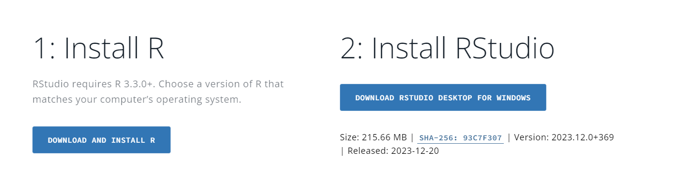
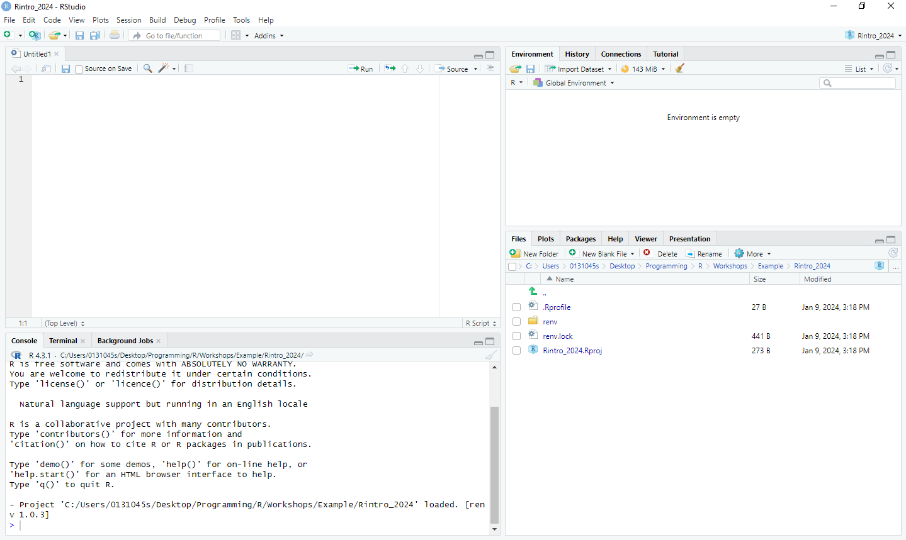
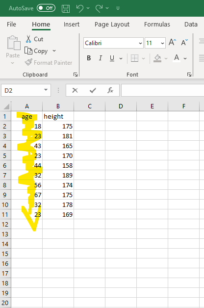

# **Overview**

**Authors:** Dr Ryan Donovan and Dr Ciara Egan.

This is the textbook for the Advanced Research Methods module (PS6183).
This textbook will describe how to use R programming language to import, clean, process, and visualise psychological data.
No prior knowledge of R or any other programming language or statistical software is required to successfully complete this module.

This textbook is still undergoing development and is not the final product.
Consequently, all textbook materials are used for educational purposes only and should only be shared within the University of Galway's School of Psychology.
Any issues or errors with the textbook should be reported to Ryan Donovan (ryan.donovan\@universityofgalway.ie).

## What will I learn in R?

In terms of specific R skills, students will learn how to:

-   Import, export, and create datasets.

-   Use basic programming concepts such as data types, functions, and loops.

-   Apply key techniques for data cleaning to enable statistical analysis.

-   Run descriptive and inferential statistics.

-   Create APA-standard graphs.

-   Deal with errors or bugs with R code.

## What will I not learn to do in R?

This is not an exhaustive introduction to R.
Similar to human languages, programming languages like R are vast and will take years to master.
After this course, you will still be considered a "newbie" in R.
But the material covered here will at least provide you a solid foundation in R, enabling you to go ahead and pick up further skills if required as you go on.

This course will teach you data cleaning and wrangling skills that will enable you to wrangle and clean a lot of data collected on Gorilla or Qualtrics.
But you will not be able to easily handle all data cleaning problems you are likely to find out in the "wild" world of messy data.
Such datasets can be uniquely messy, and even experienced R programmers will need to bash their head against the desk a few times to figure out a way to clean that dataset entirely in R.

Similarly, do not expect to be fluent in the concepts you learn here after these workshops.
It will take practice to become fluent.
You might need to refer to these materials or look up help repeatedly when using R on real-life datasets.
That's normal - so do not be discouraged when it happens.

This textbook mainly uses the tidyverse approach to R.
The tidyverse is a particular philosophical approach to how to use R (more on that later).
The other approach would be to use base R.
This can incite violent debates in R communities on which approach is better.
We will focus mainly on tidyverse and use some base R.

This textbook does not teach you how to use R Markdown.
R Markdown is a package in R that enables you to write reproducible and dynamic reports with R that can be converted into Word documents, PDFs, websites, PowerPoint presentations, books, and much more.
There are a lot of excellent resources available to learn how to use R markdown, but it's far more important to learn how to use R first.

## Why are we learning R?

There are many reasons to learn R.

Psychological research is increasingly moving towards open-science practices.
One of the key principles of open-science is that all aspects of data handling - including data wrangling, pre-processing, processing, and output generation - are openly accessible.
This is not just an abstract ideal; several top-tier journals require that you submit R scripts along with manuscripts.
If you don't know how to use R (or at least no one in your lab does), then this puts you at a disadvantage.
The upside to this is that if you do know how to use R, then you will be at an advantage in your future career prospects.

R enables you to import, clean, analyse, and publish manuscripts from R itself.
You do not have to switch between SPSS, Excel, and Word or any other software.
You can conduct your statistical analysis directly in R and have that "uploaded" directly to your manuscript.
In the long run, this will save you significant time and energy.

R is capable of more than statistical analysis.
You can create websites, documents, and books in R.
This e-book was developed in R!
We will talk more in class about the advantages of using R over existing propriety statistical software.

## Where and when will the classes take place?

The sessions will take place in **AMB-G035** (Psychology PC Suite).
The schedule for the sessions is as follows:


## Do I need to bring a laptop to the class?

If you have a laptop that you work on, please bring it.
That way, we can get R and RStudio installed onto your laptop, and you'll be able to run R outside of the classroom.

If you work with a desktop, don't worry.
The lab space will have computers that you can sign in and work on and use R.

## Office hours and why they are important for everyone (R Support - Ryan Donovan).

Programming concepts can take a while to sink in and it is naturally to need additional help.  
But in my experience, students often worry about asking for help, often from fears of being judged by their instructor.
This fear is exacerbated in courses involving mathematics and programming, as students are quick to label themselves as "*no good*" at these subjects.

This is a completely unwarranted belief.
My job is to teach you R.
Consequently, if you are reading the material or listening in class, and it's not sinking in at all, then that is ***my fault, not yours.*** If this is happening, then it is important that this feedback is being relayed.
The most valuable teaching hours I've had are while talking with a student who is struggling to understand the material, because it forces me to see the errors in how I am explaining that material and adjust. That way, I learn better ways to explain a particular concept and the student comes with away with a greater understanding of said concept.
We all win.

So pretty please, do not be a silent martyr and let me know if you are struggling with any of the R-based material in this course. 


+-------------------------------------+-----------------------------------------------------+-------------------------------------------------------------------------------------------------------------------------------------------------------------------------------------------------------------------------------------------------------------------------------+
| Staff Member                        | Office Hours                                        | Location                                                                                                                                                                                                                                                                      |
+-------------------------------------+-----------------------------------------------------+-------------------------------------------------------------------------------------------------------------------------------------------------------------------------------------------------------------------------------------------------------------------------------+
| Ryan Donovan                        | Wednesdays, 2.30-3.30pm.                            | 2065A, which is on the top floor of the Psychology building. It is in the corridor right next to the elevator.                                                                                                                                                                |
|                                     |                                                     |                                                                                                                                                                                                                                                                               |
| ryan.donovan\@universityofgalway.ie | (In-person or online option).                       | Teams Link: [click here](https://teams.microsoft.com/l/meetup-join/19%3ameeting_NDQ1YjRiNmQtNDQ4MC00NjgzLWIwYTQtNWI5OTg3ZmE1NWRj%40thread.v2/0?context=%7b%22Tid%22%3a%2213e3b186-c446-4aab-9c6d-9ab9bb76816c%22%2c%22Oid%22%3a%22c088ea08-9d92-460e-8972-64cd26bc4899%22%7d) |
|                                     |                                                     |                                                                                                                                                                                                                                                                               |
|                                     | Time does not suit?                                 |                                                                                                                                                                                                                                                                               |
|                                     |                                                     |                                                                                                                                                                                                                                                                               |
|                                     | Just get in touch, we can arrange a different time. |                                                                                                                                                                                                                                                                               |
+-------------------------------------+-----------------------------------------------------+-------------------------------------------------------------------------------------------------------------------------------------------------------------------------------------------------------------------------------------------------------------------------------+

<!--chapter:end:index.Rmd-->

---
output:
  word_document: default
  html_document: default
---

# **Getting Started with R and RStudio** {#rstudio}

This session introduces the programming language R and the RStudio application. Today, we will download both R and RStudio, set up our RStudio environment, and write and run our first piece of R Code. This will set us up for the rest of the course.

## What is R?

R is a statistical programming language that enables us to directly communicate with our computers and ask it perform tasks. Typically we rely on button-click applications (e.g. SPSS, Excel, Word) to communicate with our computers on our behalf. These applications translate our button-click commands into a language that our computer can understand. Our computer then carries out those commands, returns the results to the application, which then translates those results back to us.

Applications like SPSS are convenient. They usually have a user-friendly interface that makes it easy to communicate with our computer. Consequently, this means one can become highly competent in a short amount of time with such applications.

However, these applications also limit what we can do. For example, base SPSS is functional when it comes to creating data visualizations, but it is difficult to make major changes to your graph (e.g., making it interactive). If we want to create such visualizations, we will likely need to use an alternative application. Similarly, we might also be financially limited in our ability to use such apps, as proprietary software like SPSS is not cheap ([it can cost between \$3830 - 25200 for a single licence depending on the version](https://www.ibm.com/products/spss-statistics/pricing))!

In contrast, R is a free, open-source statistical programming language that enables us to conduct comprehensive statistical analysis and create highly elegant visualizations. By learning R, we can cut out the middleman.

```{r fig.cap = "BBC graphs created in R.", echo = FALSE, warning = FALSE}

library(knitr)

include_graphics("img/01-bbc.png")


```

But why R and not a different programming language? R was developed by statisticians for the purpose of conducting statistic analysis. In contrast, other popular programming languages (Python, JavaScript, C) were designed for different purposes. Consequently, R contains an extensive vocabulary that enables us to carry out sophisticated and precise statistical analysis. I have both used R and Python (often used in Data Science) to conduct statistical analysis, and I have found it significantly easier in R to run a wide range of statistical tests. Similarly, there is extensive support available online to enable you to run statistical analyses in R. This explains why R is typically used among statisticians, social scientists, data miners, and bioinformaticians. For these reasons, we will be using R in this course [^02-rstudio-1].

[^02-rstudio-1]: There are always tradeoffs in selecting a language. Many programming concepts are easier to grasp in Python than in R. Similarly, there is a lot of resources available for conducting machine-learning analysis in Python.

    But if you are goal is conduct data cleaning, analysis, visualization, and reporting, then R is a excellent choice. The good thing is that once you achieve a certain level of competency in one programming language, you will find it significantly easier to pick up a following one.

## Create a Posit Cloud Account.

In the next section, I am going to show you how to download R and RStudio onto your laptop. But before we do that, I want you to set up a free account on Posit Cloud (formerly known as RStudio Cloud). Posit Cloud enables you to run R and RStudio online for free, with no need to install anything.

***If you are using the desktops in the lab,*** then please only use Posit Cloud in all of our R and RStudio classes. It is much easier to run R and RStudio on Posit Cloud than on the absolute tragic disaster of an operating system they use on the desktop Windows machines. Please, please, please do not use the RStudio version on the desktop computers in the lab, or else your R life will be brutal and painful.

***If you are using your own laptop,*** then use Posit Cloud as a backup option in case any technical issues pop up. During class, we might not be able to solve those issues quickly and efficiently (in a large classroom, one must always account for Murphy's Law). Rather than being hamstrung by technical difficulties, you can sign into Posit Cloud and keep following along with the session.

You might be wondering, why not just use Posit Cloud? The reason is that there are some restrictions to the free version of Posit Cloud, namely that you can only use 25 hours per month and are limited in the amount of data you can use during that time. It's highly unlikely that we will hit those restrictions in the next 10 weeks, but if you primarily use your laptop and Posit Cloud secondarily, then we do not have to worry about that.

For those of you on the desktop computers, if you do hit the max limit, then get in touch with Ryan (email: ryan.donovan\@universityofgalway.ie). The simplest solution is just to create a second Posit Cloud account.

### Instructions for Creating a Posit Cloud Account

To create a Posit Cloud account, please follow the following instructions:

1.  [Go to their sign up page website](https://login.posit.cloud/register?redirect=%2Foauth%2Fauthorize%3Fredirect_uri%3Dhttps%253A%252F%252Fposit.cloud%252Flogin%26client_id%3Dposit-cloud%26response_type%3Dcode%26show_auth%3D0) and enter your details to create an account or Sign up with Google.

    ```{r echo = FALSE}

    include_graphics("img/01-posit-sign-up.png")

    ```

2.  Once you have created an account and are in Posit Cloud, click "New Project" From the drop-down menu click "New RStudio Project". This should take a few seconds to set up (or "deploy")

```{r echo=FALSE}

include_graphics("img/01-posit-newproject.png")

```

3.  Once it is deployed, name your project at the top as ***rintro***

```{r echo=FALSE}
include_graphics("img/01-posit-rintro.png")
```

Don't worry about what anything on the screen means for now. We'll come back to that in the section **Creating an RProject (2.5).**

## Downloading R on to your Computer (personal laptop or desktops only)

If you are using your own personal laptop or desktop (if at home), then please follow the following instructions to download R on either Windows or Mac.

***If you are using the Desktops in the lab, do not follow these instructions, as we will be using Posit Cloud***

### Downloading R on Windows

1.  Go to the website: <https://cran.r-project.org/>
2.  Under the heading *Download and Install R,* click *Download R for Windows*

```{r echo = FALSE}
include_graphics("img/01-cran.png")
```

3.  Click the hyperlink ***base*** or ***install R for the first Time***

4.  Click Download R-4.4.2 for Windows (depending on the date you access this, the version of R might have been been updated. That's okay, you can download the newer version). Let the file download.

```{r fig.cap = "The R programming language is occasionally updated, so the specific version of R that you see might be different than mine. But that\'s okay!", echo = FALSE}


```

5.  Once the file has been downloaded, open it and click "Yes" if you are asked to allow this app to make changes to your device. Choose English as your setup language. The file name should be something like "R-4.4.2.-win" (numbers will differ depending on the version downloaded).
6.  Agree to the terms and conditions and select a place to install R. The default option is fine.

### Downloading R on Mac

The instructions are largely the same for Mac.

-   Go to the website: <https://cran.r-project.org/>

-   Click Download R for (Mac) OS X.

```{r echo=FALSE}

include_graphics("img/01-rstudiodownload-mac.png")

```

-   Check the **Latest release** section for the appropriate version and follow the directions for download. If you are unsure, please ask me.

```{r echo=FALSE}

include_graphics("img/01-rversion-mac.png")

```

-   Once the file download is complete, click to open the installer. Click **Continue** and proceed through the installer. I recommend going with all default options.

```{r fig.cap= "Depending on your version of Mac OS, this might look slightly different. But you should still be able to install it.", echo=FALSE}

include_graphics("img/01-mac_installer.png")

```

-   Once the R installer has finished, click **Close.**

```{r echo=FALSE}

include_graphics("img/01-install_finish_mac.png")

```

## Install and Open RStudio

Once R is installed, we will install RStudio. ***Again, if you are using the desktops in the lab, you do not need to install RStudio—just make sure you have followed the Posit Cloud instructions.***

RStudio is a user-friendly front-end program for R, enhancing your R coding experience without sacrificing any capabilities. RStudio allows us to write and save R code, create plots, manage files, and perform other useful tasks. Think of RStudio as similar to Microsoft Word compared to a basic text editor; while you can write a paper in a text editor, it's much quicker and more efficient in Word.

1.  **NB:** Make sure that R is installed ***before*** trying to install RStudio.

2.  Go to the RStudio website: <https://posit.co/download/rstudio-desktop/.>

3.  The website should automatically detect your operating system. Click the ***Download RStudio Desktop*** button.

```{r echo = FALSE}

```

Once the file is downloaded, open it and allow it to make changes to your device. Follow the instructions to install the program. I recommend using all the default options during installation.

After downloading both R and RStudio, open RStudio on your computer. You do not have to open R separately, as RStudio will work with R if everything is set up correctly.

When you first open RStudio, you will see three panes or "windows" in RStudio: **Console** (left), **Environment** (top right), and **Files** (bottom right).

```{r echo = FALSE}

include_graphics("img/rstudio_first.png")

```

## Creating an R Project

***Note: If you are using PositCloud instructions from 2.2.1, you have already created a project on PositCloud. Only follow this section if you are using your own computer or laptop. 

Our first step in RStudio is to create an *R Project*. R Projects are environments that group together input files (e.g., data sets), analyses on those files (e.g., code), and any outputs (e.g., results or plots). Creating an R Project will set up a new directory (folder) on your computer. Whenever you open that project, you are telling R to work within that specific directory (in this context, "directory" is just a fancy word for a folder).


***Activity - Create an R Project (Personal Computer or Laptop)***

Let's create an R Project that we will use during these sessions

1.  Click "File" in the top left-hand corner of RStudio → then click "New Project."

2.  The "New Project Wizard" screen will pop up. Click "New Directory" → "New Project."

3.  In the "Create New Project" screen, there are four options we are going to change:

**Option 1**: The "Directory name" options sets the name of the project and associated folder.

-   I ***recommend*** that you set the same directory name as me - ***rintro***

-   You can actually set this directory name to whatever you want, I cannot stop you. ***Just don't set it to "R",*** as this can create problems down the line.

**Option 2**: The "Create project as sub-directory of" option selects a place to store this project on your computer.

-   You can save it anywhere you like (e.g., your Desktop). Just ensure it's in a place you can easily find and where it won't be moved later.

-   My recommendation is to create a folder called "PS6183" on your desktop and save your project inside this folder.

-   Regardless of where you save your project, make a note of the location on your computer and keep it handy (e.g., in a text file).

**Option 3**: The "Use renv with this project" option enables you to create a virtual environment for this project that will be separate to other R projects. Don't worry for now about what that means, it will be explained later on.

-   Tick this option.

**Option 4:** The "Open in new session" just opens a new window on RStudio for this project.

-   Tick this option.

**Note on Github Repository**: This will probably not appear on your RStudio project, but that's okay, you don't need it for this course.

You can see my example below. Once you're happy with your input for each option, click "Create Project" This will open up the project ***rintro***.

```{r fig.cap = "New Project Set Up", echo = FALSE, warning = FALSE}

library(knitr)

include_graphics("img/01-newproject-ma.png")


```

## Navigating RStudio

In our new project, ***rintro***, we are going to open the "Source" pane, which we will often use for writing code and viewing datasets.

### Opening the Source Pane

There are a variety of ways to open the Source pane:

-   **Button approach**: Click the "File" tab in the top-left corner → Click "New File" → Select "R Script."

```{r echo = FALSE}
include_graphics("img/rstudio_create_file.png")
```

-   **Button Shortcut**: Directly underneath the *File* tab, there is an icon of a white sheet with a green addition symbol. You can click that too.

-   **Keyboard Shortcut:** Press "Ctrl" + "Shift" + "N" on Windows, or "Cmd" + "Shift" + "N" on Mac.

Now you should see your four panes: **Source**, **Console**, **Environment**, and **Files**.

```{r echo = FALSE}



```

#### The RStudio Workspace

Let’s briefly describe the purpose of each pane:

-   **Source Pane**: Where you write R scripts. R scripts enable you to write, save, and run R code in a structured format. For instance, you might have an R script titled "Descriptive," containing code for computing descriptive statistics on your dataset. Similarly, you might have another R script titled "Regression" for performing regression analyses.

-   **Console Pane**: Where you can write R code or enter commands into R. The console also displays various outputs from your R scripts. For example, if you create a script for running a t-test, the results will appear here. Any error or warning messages related to your code will also be highlighted in the console. In short, this is where R actually runs your code.

-   **Environment Pane**: Displays information about datasets and variables imported or created in R within a specific project. The "History" tab shows a history of R code executed during the project. This pane is helpful for reviewing your work or returning to a project after some time.

-   **Files Pane**: Includes project files (Files tab), outputs of plots you create (Plots tab), a list of downloaded packages (Packages tab), and help documentation about R functions (Help tab).

We will use all four panes extensively during these classes.

### Checking our Working Directory

Every time you open a project or file in RStudio, it's good practice to check the working directory. The working directory is the environment on your computer where R is currently operating.

Ideally, you want the working directory to match the location of your R project. This ensures that any files you import into RStudio or any files you export (datasets, results, graphs) can be easily found in your R project folder. Checking the working directory can help prevent many common R problems.

To check the working directory, type the following into the console pane:

```{r}
getwd()
```

This will display the current working directory where R is operating. Your working directory will likely differ from mine, which is normal. Just confirm that it matches the location you specified when creating your project (**Option 2**).

### Setting up a new Working Directory {#set_wd}

In our R Project, we are going to create a folder for Week 1 of the workshop. Anything we create in R will then be saved into this folder.

-   Click "Session" in the RStudio toolbar → Select "Set Working Directory" → Click "Choose Directory."

```{r echo = FALSE}

include_graphics("img/01-wd.png")

```

-   By default, you should be in your R Project (e.g., ***rintro***).

<!-- -->

-   Within this R Project, create a new folder and call it "week1."

-   Click "week1" and then click "Open."

```{r echo=FALSE}

include_graphics("img/01-new_wd.png")

```

You should see something like the following in your console

```         
> setwd("C:/Users/0131045s/Desktop/Programming/R/Workshops/rintro/week1")
```

Check whether this location is where you want to store your files for this course. If it is, you're all set. If not, let me know during class.

### Changing some default settings

Like most applications, RStudio comes with default settings, some of which can be annoying if you use R frequently. One such setting restores your data and commands from your last session when you reopen RStudio. While this sounds helpful, it can cause issues if you’re working on multiple projects or sharing code with others. Let’s change this setting:

1.  In the toolbar at the top of RStudio, click **Tools** → **Global Options**.

2.  Under the **General** tab, look for the "Save workspace to .RData on exit" option. Change it to "Never." Untick the box as well.

```{r echo=FALSE}

include_graphics("img/01-workspace-setting.PNG")

```

## Writing our first R Code

Let’s write our first line of R code in the console. The R console uses the prompt symbol `>` to indicate that it is ready for a new line of code.

Type in each of the following instructions (after the `>` prompt) and press Enter. Feel free to modify the second line of code to include your own name:

```{r first piece of code}

print("Hello World")

print("My name is Ryan and I am learning to code in R")

```

Congratulations, you've written your first piece of code!

Let's describe what is going on here. We used a function called print() to print the words "Hello World" and "My name is Ryan, and I am learning to code in R" in the console. Functions are equivalent to verbs in the English language—they describe actions. Here, R identifies the `print()` function, looks inside the parentheses to see what we want to print, and then displays the specified text. Pretty straightforward.

Functions are a core programming concept, and there is a lot more going on under the hood than I have described so far. We'll revist functions repeatedly and filling you in with more information. But in essence, functions are verbs that enable us to tell our computer what actions to perform.

## Console vs Source Script

You might have noticed that I asked you to write code in the console rather than the source pane. Let’s discuss the differences:

-   **Console**: This is like having a live chat with R. You type commands, and R executes them immediately. The console is great for experimentation and quick feedback but not ideal for saving or organising your work.

-   **Source Script**: This is where you write and save your code in a structured format. Scripts allow you to keep a record of your work, organise it into sections, and rerun it later. Think of the source pane as a document for your final code.

From now on, we’ll write most of our code in R scripts. If I want you to use the console, I’ll let you know.

## Let's write some statistical code {#firstpieceofcode}

Now that we’ve talked a lot about R and RStudio, let’s write some code that will:

-   Take a dataset

-   Calculate descriptive statistics

-   Generate a graph

-   Save the results

Don’t worry if you don’t understand all the code provided below. Just follow along and type it yourself into the R script we opened earlier. If it’s not open, click "File" → "New File" → "R Script." Save the script as **"01-sleep-descriptives."**

When you download R, it comes with several built-in functions (e.g., `print()`) and datasets. One of these datasets is called **`sleep`**, which we’ll use here. To learn more about the **`sleep`** dataset, type **`?sleep`** into the console. You’ll find more information in the "Help" tab in the Files pane.

First, let’s take a look at the **`sleep`** dataset by writing the following code in your R script. To run scripts in R, highlight the code and click the "Run" button (with the green arrow) in the top right corner of the script pane.

```{r}

print(sleep) 

```

The **`print()`** function displays the **`sleep`** dataset in the console. There are other functions to explore datasets, such as **`head()`**, **`tail()`**, **`View()`**, and **`str()`**. Try these functions with the **`sleep`** dataset by typing them into the console to see their outputs.

From **`print(sleep)`**, we can see there are 20 observations (rows) with three variables (columns):

-   **extra**: The extra hours of sleep participants had

-   **group**: The treatment group they were assigned to

-   **ID**: Their participant ID

### Calculating Descriptive Statistics

Let’s calculate some descriptive statistics using the **`summary()`** function. This function takes an object (e.g., a dataset) and summarizes its data. Write the following code in your script and press "Run":

```{r}

summary(sleep) 
```

The **`summary()`** function provides descriptive statistics for each variable. For instance, it shows the mean change in hours of sleep (+1.5) and that there were 10 participants in each group.

However, this isn’t quite what we need. For instance, we don’t need descriptives for participant ID, and we want the mean scores split by treatment group. To get this, we can use the **`aggregate()`** function, which splits data into subsets and computes summary statistics for each subset. Add this to your script and run it:

```{r eval = F}


aggregate(data = sleep, extra ~ group, FUN = mean)


#Here is what the code means


# code: data = sleep meaning: Go to the sleep data set

# code: extra ~ group meaning: Take the variable "extra" and split it into subsets based on the variable "group"

# code: FUN = mean meaning: Apply the mean() function (FUN) on each subset 

```

```{r echo = F}


aggregate(data = sleep, extra ~ group, FUN = mean)


```

Running this code shows the mean extra sleep for each treatment group. Participants in **group 2** slept an extra 2.33 hours on average, while participants in **group 1** slept only 0.75 hours more. It seems treatment 2 is more effective.

### Creating a Visualisation

It's always a good step to create visualisations with your data to get a better picture of what is going on. Let's visualise our data with the `plot()` function.

```{r}
plot(sleep$group, sleep$extra)
```

The **`plot()`** function automatically determines the most appropriate plot—in this case, a boxplot. While this plot is functional, we can make it more informative by adding a title and labels for the axes:

```{r fig.cap="Generic Boxplot with appropriate labelling"}


#xlab = creates a label for the x-axis  

#ylab = creates a title for the y-axis  

#main = creates a title for the plot  


plot(sleep$group, sleep$extra, xlab = "Treatment", ylab = "Hours of Sleep", main = "Effect of Treament on Sleep Duration")  


```

This plot is more descriptive and also suggests a difference between the two groups. But is this difference meaningful? Later in the course, we’ll learn how to evaluate whether differences like these are statistically significant using inferential statistical tests.

### Saving the Plot

Now, let's take this plot and save it to a PDF so that we can share our results with others. The standard way of doing this in R is a bit cumbersome. We have to tell R that we are about to create a plot that we want to make into a PDF. Then we have to generate the plot. Then we have to tell R we are done with creating the PDF. We'll learn a much simpler way to do this in future weeks, but this will do for now.

```{r}

pdf(file = "myplot.pdf") #Tells R that we will create a pdf file called "my_plot" in our working directory

plot(sleep$group, sleep$extra, xlab = "Treatment", ylab = "Hours of Sleep", main = "Effect of Treament on Sleep Duration")  #this will save the plot to our pdf


dev.off() #this tells R that we are done with adding stuff to our PDF

```

Go to the files pane, and open up the pdf "myplot.pdf". It should be in your working directory. Open up the PDF and have a look at your graph[^02-rstudio-2].

[^02-rstudio-2]: This is a fairly generic type of graph offered by base R. During the course we will looking at ways we can create "sexier" and more APA friendly type of graphs. But for one line of code, it's not bad!

### Comments

You might have noticed that I wrote several lines of text with a **`#`** before them. These are known as comments. Comments are pieces of text that R ignores—they are not executed as part of the code. They are fundamental to writing clear and understandable code.

We create comments using the **`#`** symbol. This tells R to ignore everything that comes **after** the `#` on the same line.

Comments serve a variety of purposes:

```{r fig.cap = "Four Examples of Comments Use", echo = FALSE, warning = FALSE}

library(knitr)


```

In the above figure, you'll see four different types of comments.

1.  **Provide an Introduction**: It can be really useful here to provide clear information on what this script is trying to do, what data it is working on (the sleep dataset), and who wrote or developed this script. This makes it significantly easier for anyone who might be reviewing your work or trying to apply your code to their own work to understand what is going on.

2.  **Structure Your Script**: The second type of comment structures the format of the script by providing headings or steps. Again, this just makes it easier to understand what is going on.

3.  **Disable Code Temporarily**: The third type of comment is placed before the summary. This means that the code **`summary(sleep)`** will not be executed in R. Why would we do this? If we wanted to temporarily disable a piece of code but not delete it, because we think might be useful later. This is useful if you want to skip certain steps or keep old code for reference.

4.  **Explain Specific Lines of Code**: The fourth type of comment provides some context or information on what a specific line of code is doing, namely, what the **`aggregate()`** function does. Again, this is really useful, particularly if you are using functions that are not well-known.

### Why Comments Are Important

Writing comments is like leaving notes for your future self (or for others working with your code). Imagine this scenario: you spend weeks creating a detailed R script to clean a messy dataset and run complex analyses. Months later, a reviewer or your supervisor asks for changes. When you reopen your script, you realise you’ve forgotten what each piece of code does! Without comments, you may spend hours trying to understand your own work.

By including comments, you save time and frustration. Additionally, comments help you solidify your understanding by requiring you to explain your code as you write it.

### Best Practices for Comments

-   Comment frequently: It's better to over-comment than to leave yourself guessing later.

-   Keep comments concise but clear: Avoid overly verbose comments that are harder to read.

-   Update comments if you change your code: Outdated comments can be misleading.

-   Use comments to break your script into logical sections.

## Summary

There we have it! That completes our first session with R and RStudio. Today was more about getting to grips with the software R and RStudio, but we still got our first pieces of code written. Hopefully, it's given you a tiny glimpse into what R can do.

In the next two sessions, we will learn basic programming concepts that will help you use R effectively, learn how to import data in R, and learn how to run descriptive statistics.

## Glossary

This glossary defines key terms introduced in Chapter 2.

| Term | Definition |
|----------------------|--------------------------------------------------|
| Comment | Text in an R script that is ignored by R. Comments are preceded by the `#` symbol and are used to add explanations, headings, or disable code temporarily. |
| Console | The interactive interface in RStudio where you can type and execute R commands and see their immediate output. |
| Environment Pane | The pane in RStudio that displays information about data sets, variables, and the history of R commands used in the current R session. |
| Files Pane | The pane in RStudio that displays the files and folders in your current working directory, as well as other useful tabs like Plots, Packages, and Help. |
| Function | A fundamental programming concept in R, representing a reusable block of code that performs a specific task. Functions are like verbs in English; they describe actions. |
| R | A programming language and environment for statistical analysis and data visualization. |
| R Project | An environment created in RStudio that groups together input files, code, and outputs. It helps organize and manage your work in a specific directory. |
| RStudio | An integrated development environment (IDE) for R, providing a user-friendly interface and tools for coding, data analysis, and visualization. |
| Script | A file containing a sequence of R commands that can be saved, executed, and reused. |
| Source Pane | The pane in RStudio where you can write and edit R scripts. |
| Term | Definition |
| Working Directory | The directory or folder on your computer where R is currently operating. It is important for managing file paths and organizing project files. |

<!--chapter:end:02-rstudio.Rmd-->

# **Programming Fundamentals in R (Part I)** {#programming1}

In this session, we are going to introduce fundamental programming concepts in R. In particular, we will learn important information about the syntax and rules of R, best practices on creating variables, the different ways that R stores, handles, and structures data, and how we can create and access that data.

By the end of this session, you should be capable of the following:

-   Running and troubleshooting commands in the R console.
-   Understanding different data types and when to use them.
-   Creating and using variables, and understanding best practices in naming variables.
-   Grasping key data structures and how to construct them.

```{r echo=FALSE, warning=FALSE}

library(webexercises)

```

## Activity 1: Set up your Working Directory

It's good practice to set your working directory when you first open RStudio. Remember that the working directory is the location where R will look or store files by default. Last week I showed you how to set the Working Directory using [a button-and-click interface](#set_wd).

Using those instructions, create a folder called "Week2" in the `rintro` project folder for this class, and set it as your working directory.

Your output should be similar to mine.

```{r eval = F}

> setwd("C:/Users/0131045s/Desktop/PS6183/rintro/week2")

```

You can also use the ´getwd()´ command to check if you have successfully changed your working directory.

```{r eval = F}

> getwd()

[1] "C:/Users/0131045s/Desktop/PS6183/rintro/week2"

```

## Using the Console

In the previous chapter, I made a distinction between the script and the console. I said that the script was an environment where we would write and run polished code, and the R console is an environment for writing and running "dirty" quick code to test ideas, or code that we would run once.

That distinction is kinda true, but it's not completely true. In reality, when we create a script we are preparing ***commands*** for R to ***execute*** in the console. In this sense, the R script is equivalent to a waiter. We tell the waiter (script) what we want to order, and then the waiter hands that order to the chef (console).

It's important to know how to work the R console, even if we mostly use scripts in these workshops. We don't want the chef to spit on our food.

### Typing Commands in the Console

We can type commands in the console to get R to perform calculations. Just a note, if you are typing these commands into the console, there is no need to type the `>` operator; it simply indicates that R is ready to execute a new command, which can be omitted for clarity.[^03-programming-p1-1]

[^03-programming-p1-1]: Including the "\>" is a pain when formatting this book, so I won't include "\>" in examples of code from this point forward.

```{r eval=FALSE}

> 10 + 20

[1] 30

```

```{r eval=FALSE}

> 20 / 10

[1] 2

```

R follows the BEMDAS convention when performing calculations ([BEDMAS - Bracets, Exponents, Division, Multiplication, Addition, and Subtraction?](https://www.tes.com/en-ie/teaching-resource/bidmas-bodmas-bedmas-bimdas-pemdas-permdas-11154272#:~:text=%E2%80%A2%20BIMDAS%20%2D%20Brackets%2C%20Indices%2C,Multiplication%2C%20Division%2C%20Addition%2C%20Subtraction)). So if you are using R for this purpose, just be mindful of this if the result looks different from what you expected.

```{r eval = FALSE}


> (20 + 10 / 10) * 4 

[1] 84

> ((20 + 10) / 10) * 4

[1] 12

```

You may have noticed that the output after each of line of code has **`[1]`** before the actual result. What does this mean?

This is how R labels and organises its response. Think of it as having a conversation with R, where every question you ask gets an answer. The square brackets with a number, like **`[1]`**, serve as labels on each response, indicating which answer corresponds to which question. This is R ***indexing*** its answer.

In all the examples above, we asked R questions that have only 1 answer, which is why the output is always **`[1]`**. Look what happens when I ask R to print out multiple answers.

```{r}

print(sleep$extra) #this will print out the extra sleep column in the sleep dataset we used last week

```

Here R tells us that the first answer (i.e., value) corresponds to `0.1`. The next label is `[16]`. which tells us that the 16th answer corresponds to 4.4. If you run this code in your console, you might actually see a different number than `[16]` depending on wide your console is on your device.

But why does it only show the `[1]` and `[16]`th index? This is because R only prints out the index when a new row of data is needed in the console. If there were indexes for every single answer, it would clutter the console with unnecessary information. So R uses new rows as a method for deciding when to show us another index.

We'll delve deeper into indexing later in this session; it's a highly useful concept in R.

### Console Syntax (Aka "I'm Ron Burgundy?")

#### R Console and Typos

One of the most important things you need to know when you are programming, is that you need to type *exactly* what you want R to do. If you make a mistake (e.g., a typo), R won't attempt to decipher your intention. For instance, consider the following code:

```{r eval=F}

> 10 = 20

```

```{r error = TRUE, echo = FALSE}

10 = 20

```

R interprets this as you claiming that 10 equals 20, which is not true. Consequently, R panics and refuses to execute your command. Now any person looking at your code would guess that since `+` and `=` are on the same key on our keyboards, you probably meant to type `10 + 20`. But that's because we have a theory of mind, whereas programming languages do not.

So be exact with your code or else be [Ron Burgundy?](https://www.youtube.com/watch?v=X3zfP14pLxc).

On the grand scheme of mistakes though, this type of mistake is relatively harmless because R will tell us immediately that something is wrong and stop us from doing anything.

However, there are silent types of mistakes that are more challenging to resolve. Imagine you typed `-` instead of `+`.

```{r eval= FALSE}

> 10 - 20

[1] -10

```

In this scenario, R runs the code and produces the output. This is because the code still makes sense; it is perfectly legitimate to subtract 20 away from 10. R doesn't know you actually meant to add `10` to `20`. All it can see is three objects `10`, `-`, and `20` in a logical order, so it executes the command. In this relationship, you're the one in charge.

In short calculations like this, it is clear what you have typed wrong. However, if you have a long block of connected code with a typo like this, the result can significantly differ from what you intended, and it might be hard to spot.

The primary way to check for these errors is to always review the output of your code. If it looks significantly different from what you expected, then this silent error may be the cause.

I am not highlighting these issues to scare you, it's just important to know that big problems (R code not running or inaccurate results) can often be easily fixed by tiny changes.

#### R Console and Incomplete Commands

I have been talking a lot of smack about the console, but there are rare times it will be a good Samaritan.

For example, if R thinks you haven't finished a command it will print out `+` to allow you to finish it.

```{r eval = FALSE}

> (20 + 10
 
+ )

[1] 30

```

So when you see "+" in the console, this is R telling you that something is missing. R won't let you enter a new command until you have finished with it.

```{r eval = FALSE}

(20 + 10

+ #if I press enter, it will keep appearing until I finish the code
+
+
+
+

```

If nothing is missing, then this indicates that your code might not be correctly formatted. To break out of the endless loops of "+", press the ***Esc*** key on your keyboard.

### Exercises

1.  Practice performing basic calculations in R console. Calculate the following:
    1.  25 multiplied by 4
    2.  72 divided by 8
    3.  0 multiplied by 4, and then divided by 2
2.  Imagine you want to calculate the average/mean of the following 5 numbers 15, 22, 18, 30, and 25. Use the R console to find the average.
3.  If I type the following code, then I get the `+` operator, how can I fix it? Run the code yourself and test your answer.

```{r eval = FALSE}

> (60 / 100
   
+   

```

## Data Types

Our overarching goal for this course is to enable you to import your data into R, prepare it for analysis, conduct descriptive and statistical analysis, and create nice data visualisations.

Each of these steps becomes significantly easier to perform if we understand ***What is data and how is it stored in R?***

Data comes in various forms, such numeric (integers and decimal values) or alphabetical (characters or lines of text). R has developed a system for categorising this range of data into different data types.

## Basic Data types in R

R has 4 basic data types that are used 99% of the time. We will focus on these following data types:

### Character

A character is anything enclosed within quotation marks. It is often referred to as a *string*. Strings can contain any text within single or double quotation marks.

```{r}

#we can use the class() function to check the data type of an object in R

class("a")

```

```{r}

class("cat")

```

Numbers enclosed in quotation marks are also recognised as character types in R.

```{r}

class("3.14") #recognized as a character
class("2") #recognized as a character
class(2.13) #not recognised as a character

```

### Numeric (or Double)

In R, the numeric data type represents all real numbers, with or without decimal value, such as:

```{r}

class(33)

class(33.33)

class(-1)

```

### Integer

An integer is any real whole number without decimal points. We tell R to specify something as an integer by adding a capital "L" at the end.

```{r}

class(33L)

class(-1L)

class(0L)

```

You might wonder why R has a separate data type for integers when numeric/double data types can also represent integers.

The very technical and boring answer is that integers consume less memory in your computer compared to the numeric or double data types. \``33 contains less information than 33.00`\`. So, when dealing with very large datasets (in the millions) consisting exclusively of integers, using the integer data type can save substantial storage space.

It is unlikely that you will need to use integers over numeric/doubles for your own research, but its good to be aware of just in case.

### Logical (otherwise know as Boolean)

The Logical data type has two possible values: **`TRUE`** or **`FALSE`**. In programming, we frequently need to make decisions based on whether specific conditions are true or false. For instance, did a student pass the exam? Is a p-value below 0.05[^03-programming-p1-2]?

[^03-programming-p1-2]: If you do not know what a p-value is, do not worry. We will introduce this concept later and discuss it extensively.

The Logical data type in R allows us to represent and work with these true or false values.

```{r}


class(TRUE)

class(FALSE)

```

One important note is that it is case-sensitive, so typing any of the following will result in errors:

```{r eval = FALSE}

class(True)   # Error: object 'True' not found
class(False)  # Error: object 'False' not found
class(true)   # Error: object 'true' not found
class(false)  # Error: object 'false' not found

```

### Data Types - So What?

The distinction between data types in programming is crucial because some operations are only applicable to specific data types. For example, mathematical operations like addition, subtraction, multiplication, and division are only meaningful for numeric and integer data types.

```{r, eval=FALSE}
11.00 + 3.23 #will work

[1] 14.23


11 * 10 #will work

[1] 120

"11" + 3 # gives error

Error in "11" + 3 : non-numeric argument to binary operator

```

This is an important consideration when debugging errors in R. It's not uncommon to encounter datasets where a column that should be numeric is incorrectly saved as a character. This can be problematic if we need to perform statistical operations (e.g., calculating the mean) on that column. Luckily, there are ways to convert data types from one type to another.

### Data Type Transformation

Following on from our previous example, we can convert a data type into numeric using the **`as.numeric()`** function.

```{r}

as.numeric("22")


```

The following functions enable you to convert one data type to another:

```{r eval=FALSE}

as.character()  # Converts to character
as.integer()    # Converts to integer
as.logical()    # Converts to logical

```

### Exercises

1.  Have a look at each of the following pieces of code and guess what data type it is. Check whether you are correct by using the `class()` function.
    1.  `"Hello World!"`
    2.  `43`
    3.  `"42.34"`
    4.  `FALSE`
    5.  `44.4`
    6.  `72L`
2.  The following data types have been erroneously entered in R. Use the appropriate converting function to correct for it.
    1.  Convert "42.34" from character to numeric.
    2.  Convert "FALSE" from logical to character.
    3.  Convert 2024 from numeric to string.
    4.  Convert 1 from integer to logical (see what happens!). For bonus points, convert 0 from numerical to logical as well.

## Variables

Until now, the code we have used has been disposable; once you type it, you can only view its output. However, programming languages allow us to store information in objects called ***variables.***

Variables are labels for pieces of information. Instead of running the same code to produce information each time, we can assign it to a variable. Let's say I have a character object that contains my name. I can save that character object to a variable.

```{r}

name <- "Ryan"

```

To create a variable, we specify the variable's name (in this case, **`name`**), use the assignment operator (**`<-`**) to inform R that we're storing information in **`name`**, and finally, provide the data that we will be stored in that variable (in this case, the string "Ryan"). Once we execute this code, every time R encounters the variable **`name`**, it will substitute it with "Ryan."

```{r}

print(name)

```

Some of you might have seen my email and thought, *"Wait a minute, isn't your first name Brendan? You fraud!"* Before you grab your pitchforks, yes, you are technically correct. Fortunately, we can reassign our variable labels to new information.

```{r}

name <- "Brendan" #please do not call me this

print(name)

```

We can use variables to store information for each data type.

```{r}

age <- 30L

height <- 175 #centimetre 

live_in_hot_country <- FALSE

print(age)

print(height)

print(live_in_hot_country)

```

```{r}


paste("My name is", name, "I am", age, "years old and I am", height, "cm tall. It is", live_in_hot_country, "that I was born in a hot country")


```

We can also use variables to perform calculations with their information. Suppose I have several variables representing my scores on five items measuring Extraversion (labeled **`extra1`** to **`extra5`**). I can use these variable names to calculate my total Extraversion score.

```{r}

extra1 <- 1
extra2 <- 2
extra3 <- 4
extra4 <- 2
extra5 <- 3

total_extra <- extra1 + extra2 + extra3 + extra4 + extra5

print(total_extra)

mean_extra <-  total_extra/5

print(mean_extra)
```

Variables are a powerful tool in programming, enabling us to create code that works across various situations.

### What's in a name? (Conventions for Naming Variables)

There are strict and recommended rules for naming variables that you should be aware of.

**Strict Rules (Must follow to create a variable in R)**

-   Variable names can only contain uppercase alphabetic characters (A-Z), lowercase (a-z), numeric characters (0-9), periods `(.)`, and underscores `(_)`.

-   Variable names must begin with a letter or a period (e.g., **`1st_name`** or **`_1stname`** is incorrect, while **`first_name`** or **`.firstname`** is correct).

-   Avoid using spaces in variable names (**`my name`** is not allowed; use either **`my_name`** or **`my.name`**).

-   Variable names are case-sensitive (**`my_name`** is not the same as **`My_name`**).

-   Variable names cannot include special words reserved by R (e.g., if, else, repeat, while, function, for, in, TRUE, FALSE). While you don't need to memorize this list, it's helpful to know if an error involving your variable name arises. With experience, you'll develop an intuition for valid names.

**Recommended Rules (Best practices for clean and readable code):**

-   Choose informative variable names that clearly describe the information they represent. Variable names should be self-explanatory, aiding in code comprehension. For example, use names like "income," "grades," or "height" instead of ambiguous names like "money," "performance," or "cm."

-   Opt for short variable names when possible. Concise names such as **`dob`** (date of birth) or **`iq`** (intelligence quotient) are better than lengthy alternatives like **`date_of_birth`** or **`intelligence_quotient`**. Shorter names reduce the chances of typos and make the code more manageable.

-   However, prioritize clarity over brevity. A longer but descriptive variable name, like **`total_exam_marks`**, is preferable to a cryptic acronym like **`tem`**. A rule of thumb is that if an acronym would make sense to anyone seeing the data, then use it. Otherwise, you a more descriptive variable name.

-   Avoid starting variable names with a capital letter. While technically allowed, it's a standard convention in R to use lowercase letters for variable and function names. Starting a variable name with a capital letter may confuse other R users.

-   Choose a consistent naming style and stick to it. There are three common styles for handling variables with multiple words:

    1.  **snake_case**: Words are separated by underscores (e.g., **`my_age`**, **`my_name`**, **`my_height`**). This is the preferred style for this course as it aligns with other programming languages.

    2.  **dot.notation**: Words are separated by periods (e.g., **`my.age`**, **`my.name`**, **`my.height`**).

    3.  **camelCase**: Every word, except the first, is capitalized (e.g., **`myAge`**, **`myName`**, **`myHeight`**).

For the purposes of this course, I recommend using **`snake_case`** to maintain consistency with my code. Feel free to choose your preferred style outside of this course, but always maintain consistency.

### Exercises

1.  Create a variable called `favourite_colour` and assign your favourite colour to this `favourite_colour`. What data type is this variable? Check it with `class()`.

2.  Create two numeric variables, `num1` and `num2`, and assign them any two different numeric values.

3.  Calculate the sum of `num1` and `num2` and store it in a new variable called `sum_result`

4.  Print the value of `sum_result`.

5.  Create a variable named `height_cm` and assign it your height in centimeters (a numeric value).

6.  Create another variable named `height_m` and assign it the height in meters by dividing `height_cm` by 100.

7.  Print the values of `height_cm` and `height_m.`

## Data Structures

So far, we have talked about the different types of data that we encounter in the world and how R classifies them. We have also discussed how we can store this type of data in variables for later use. However, in data analysis, we rarely work with individual variables. Typically, we work with large collections of variables that have a particular order. For example, datasets are organized by rows and columns.

Collections of variables like datasets are known as **data structures.** Data structures provide a framework for organising and grouping variables together. In R, there are several different types of data structures, with each structure having specified rules for how to create, change, or interact with them. For the final part of this session, we are going to introduce the two main data structures used in this course: **`vectors`** and **`data frames`**.

### Vectors

The most basic and important data structure in R is ***vectors***. You can think of vectors as a list of data in R that are of the same data type.

For example, I could create a character vector with names of people in the class:

```{r}

rintro_names <- c("Gerry", "Aoife", "Liam", "Eva", "Helena", "Ciara", "Niamh", "Owen")


print(rintro_names)

```

```{r}

is.vector(rintro_names) 

```

And I can create a numeric vector with their marks (which were randomly generated!)[^03-programming-p1-3]

[^03-programming-p1-3]: I used the function `rnorm()` to generate these values. If you want to read more about this very handy function, type `?rnorm` into the console, or follow this [link](https://www.statology.org/r-runif-vs-rnorm/).

```{r}

rintro_marks <- c(69, 65, 80, 77, 86, 88, 92, 71)

print(rintro_marks)

```

And I can create a logical vectors that describes whether or not they were satisfied with the course (again randomly generated!):

```{r}

rintro_satisfied <- c(FALSE, TRUE, TRUE, FALSE, FALSE, TRUE, TRUE, FALSE) 

print(rintro_satisfied)

```

Technically, we have been using vectors the entire class. Vectors can have as little as 1 piece of data:

```{r}

instructor <- "Ryan/Brendan"

is.vector(instructor)

```

However, we can't include multiple data types in the same vector. Going back to our numeric marks vector, look what happens when we try to add in a character grade to it.

```{r}

rintro_grades <- c(69, 65, 80, 77, 86, 88, "A1", 71)


print(rintro_grades)
```

So what happened here? Well, R has converted every element within the `rintro_grades` vector into a character. The reason for this is that R sees that we are trying to create a vector, but sees that there are different data types (numeric and character) within that vector. Since a vector can only have elements with the same data type, it will try to convert each element to one data type. Since it is easier to convert numerics into character (all it has to do it put quotation marks around each number) then characters into a vector (how would R know what number to convert A1 into?), it converts every element in `r_intro_grades` into a character.

This is a strict rule in R. A vector can only be created if every single element (i.e., thing) inside that vector is of the same data type.

If we were to check the class of `rintro_marks` and `rintro_grades`, it will show us this conversion

```{r eval=FALSE}


class(rintro_marks) 

[1] "numeric"


class(rintro_grades)

[1] "character"

```

Remember how I mentioned that you might download a dataset with a column that has numeric data but is actually recognized as characters in R? This is one scenario where that could happen. The person entering the data might have accidentally entered text into a cell within a data column. When R reads this column, it sees the text, and then R converts the entire column into characters.

#### Working with Vectors

We can perform several types of operations on vectors to gain useful information about it.

**Numeric and Integer Vectors**

We can run functions on vectors. For example, we can run functions like **`mean()`**, **`median`**, or **`sd()`** to calculate descriptive statistics on numeric or integer-based vectors:

```{r}


mean(rintro_marks)

median(rintro_marks)

sd(rintro_marks)

```

A useful feature is that I can sort my numeric and integer vectors based on their scores:

```{r}

sort(rintro_marks) #this will take the original vector and arrange from lowest to highest scores

```

The **`sort()`** function by default arranges from lowest to highest, but we can also tell it to arrange from highest to lowest.

```{r}

sort(rintro_marks, decreasing = TRUE) 

```

**Character and Logical Vectors**

We are more limited when it comes to operators with character and logical vectors. But we can use functions like `summary()` to describe properties of character or logical vectors.

```{r}


summary(rintro_names)
summary(rintro_satisfied)


```

The **`summary()`** function tells me how many elements are in the character vector (there are six names), whereas it gives me a breakdown of results for the logical vector.

#### Vector Indexing and Subsetting

A vector in R is like a list of items. To be more specific, vectors in R are actually *ordered* lists of items. Each item in that list will have a position (known as its index). When you create that list (i.e. vector), the order in which you input the items (elements) determines its position (index). So the first item is at index 1, the second at index 2, and so on. Think of it like numbering items in a shopping list:

```{r fig.cap = "Indexing for Numeric Vector", echo = FALSE, warning = FALSE}


library(knitr)

include_graphics("img/03-index_numeric.png")

```

```{r fig.cap = "Indexing for Character Vector", echo = FALSE, warning = FALSE}


library(knitr)

include_graphics("img/03-index-character.png")

```

```{r fig.cap = "Indexing for Logical Vector", echo = FALSE, warning = FALSE}

library(knitr)

include_graphics("img/03-index-logical.png")


```

This property in vectors means we are capable of extracting specific items from a vector based on their position. If I wanted to extract the first item in my list, I can do this by using **`[]`** brackets:

```{r}

rintro_names[1]

```

Similarly, I could extract the 3rd element.

```{r}

rintro_marks[3]

```

Or I could extract the last element.

```{r}

rintro_satisfied[8]

```

This process is called subsetting. I am taking an original vector and taking a sub-portion of its original elements.

I can ask R even to subset several elements from my vector based on their position. Let's say I want to subset the 2nd, 4th, and 6th elements. I just need to use **`c()`** to tell R that I am subsetting several elements:

```{r}

rintro_names[c(2, 4, 8)]

```

```{r}

rintro_marks[c(2, 4, 8)]

```

```{r}

rintro_satisfied[c(2, 4, 8)]

```

If the elements you are positioned right next to each other on a vector, you can use **`:`** as a shortcut:

```{r}

rintro_names[c(1:4)] #this will extract the elements in index 1, 2, 3, 4

```

It's important to know, however, that when you perform an operation on a vector or you subset it, it does not actually change the original vector. None of these following code will actually change the variable **`rintro_marks`.**

```{r warning = FALSE, eval = FALSE}

sort(rintro_marks, decreasing = TRUE)

[1] 91 90 89 88 87 87

print(rintro_marks)
[1] 69 65 80 77 86 88 92 71

rintro_marks[c(1, 2, 3)]

[1] 87 91 87

print(rintro_marks)
[1] 69 65 80 77 86 88 92 71

```

You can see that neither the **`sort()`** function nor subsetting changed the original vector. They just outputted a result to the R console. If I wanted to actually save their results, then I would need to assign them to a variable.

Here's how I would extract and save the top three exam marks:

```{r}

marks_sorted <- sort(rintro_marks, decreasing = TRUE)

marks_top <- marks_sorted[c(1:3)]

print(marks_top)

```

#### Vectors - making it a little less abstract.

You might find the discussion of vectors, elements, and operations very abstract - I did when I was learning R. While the list analogy is helpful, it only works for so long before it becomes problematic, mainly because there's another data structure called **`lists`**. This confused me.

What helped me understand vectors was realising that a vector is simply a “line of data.” Imagine we’re running a study and collecting data on participants’ age. When we open the Excel file, there will be a column called “age” with all the ages of our participants. That column is like a vector in R, containing a single line of data, where every value must be of the same type. For example, a column of ages in Excel becomes this vector in R:


```{r}

age <- c(18, 23, 43, 23, 44,32, 56, 67, 32, 23)

```

```{r echo = FALSE}



```

Similarly, rows are lines of data going horizontally. Imagine, I collect data from another participant (p11). I could represent the data from that individual participant like this in R:

```{r}

p11 <- c(30, 175)


```


So whenever you think of a vector, just remember that it refers to a line of data, like a column or a row. 

So what happens when we combine different vectors (columns and rows) together? We create a **`data frame`**.

### Data frames

A data frame is a rectangular data structure that is composed of rows and columns. A data frame in R is like a spreadsheet in Excel or a table in a word document:

```{r fig.cap = "The relationship between data frames and vectors. The different colours in the data frame indicate they are composed of independent vectors", warning = FALSE, echo = FALSE}

library(knitr)

include_graphics("img/03-dataframes_vectors.png")

```

Data frames are an excellent way to store and manage data in R because they can store different types of data (e.g., character, numeric, integer) all within the same structure.

Let's create such a data frame using the **`data.frame()`** function:

```{r}


my_df <- data.frame(
  name = c("Alice", "Bob", "Charlie"), #a character vector
  age = c(25L, 30L, 22L), #an integer vector
  score = c(95.65, 88.12, 75.33) #a numeric vector
)

my_df

```

Take a moment and think about what is going on inside `data.frame`. We have three variables `name`, `age`, `score`. Each of these variables correspond to a different type of vector (character, integer, and numeric). Or in other words, each of these variables correspond to different lines of data. We use the `data.frame` function to combine these vectors together into a table. 

#### Selecting Data from a Data Frame

Once you have created or imported a data frame, you will often need to access it and perform various tasks and analyses. Let's explore how to access data within a data frame effectively.

##### Selecting Columns

Columns in a data frame represent different variables or attributes of your data. Often in data analysis, we want to select a specific column and then perform analyses on it. So how can we individually select columns? Well, in a data frame, every column has a name, similar to how each column in an Excel spreadsheet has a header. These column names enable you to access and manipulate specific columns or variables within your data frame.

We select columns based on their names via two methods:

The **\$** Notation: You can use a dollar sign (\$) followed by the column name to select **an individual column** in a data frame. For example, let's select the **`name`** column in the **`my_df`** data frame:

```{r}

my_df$name

```

**Square Brackets** **`[]`**: This is a similar approach to accessing elements from a vector. Inside the brackets, you can specify both the row and columns that you want to extract. The syntax for selecting rows and columns is: **`the dataframe[the rows we want, the columns we want]`**.

So if we wanted to access the "age" column of **`my_df`**, we could run the following code:

```{r}

my_df[, "age"]

```

You will notice that we left the "rows" part empty in the square brackets. Leaving this empty tells R "keep all the rows for this column."

We can also use this approach to access multiple columns using the **`c()`** function:

```{r}

my_df[, c("age", "score")]

```

##### Selecting Rows

Rows in a data frame represent individual observations or records. You can access rows using indexing, specifying the row number you want to retrieve, following the syntax: **`the dataframe[the rows we want, the columns we want]`**.

To get the first row of your data frame (**`my_df`**), you can type the following:

```{r}
my_df[1, ]
```

This time I left the columns part blank; this tells R "please keep all the columns for each row."

To access the third row:

```{r}
my_df[3, ]
```

If you want multiple rows, you can use the **`c()`** function to select multiple rows. Let's select the 1st and 3rd rows:

```{r}

my_df[c(1, 3), ]

```

If you wanted to select a range of rows, you can use the : operator:

```{r}
my_df[2:4, ]
```

These methods allow you to extract specific rows or subsets of rows from your data frame.

##### Selecting Rows and Columns

We can also select both rows and columns using **`[]`** and our syntax: **`the dataframe[the rows we want, the columns we want]`**.

For example, we could select the first and third rows for the **`Age`** and **`Score`** columns:

```{r}

my_df[c(1,3), c("age", "score")]
```

Similar to when we indexed vectors, this won't change the underlying data frame. To do that, we would need to assign the selection to a variable:

```{r}

my_df2 <- my_df[c(1,3), c("age", "score")]

my_df2

```

#### Adding Data to your Data Frame

##### Adding Columns

You may often need to add new information to your data frame. For example, we might be interested in investigating the effect of **`Gender`** on the **`Score`** variable. The syntax for creating a new data frame is very straightforward:

```{r eval = FALSE, warning = FALSE}

existing_df$NewColumn <- c(Value1, Value2, Value3)

```

Using this syntax, let's add a **`Gender`** column to our **`my_df`** dataframe:.

```{r}

my_df$gender <- c("Female", "Non-binary", "Male")

#let's see if we have successfully added a new column in

my_df

```

Let's say I noticed I mixed up the genders, and that Bob is Male and Charlie is Non-Binary. Just like we can rewrite a variable, we can also rewrite a column using this approach:

```{r}

my_df$gender <- c("Female", "Male", "Non-binary")

#let's see if we have successfully rewritten the Gender Column

my_df

```

##### Adding Rows

What about if we recruited more participants and wanted to add them to our data frame (it is pretty small at the moment)? This is slightly more complicated, especially when we are dealing with data frames where each column (vector) is of a different data type.

What we need to do is actually create a new data frame that has the same columns as our original data frame. And this new data frame will contain the new row(s) we want to add.

```{r}

new_row <- data.frame(name = "John", age = 30, score = 77.34, gender = "Male")

```

Once we have this new data frame we can use the **`rbind()`** function to add the new row to your original data frame. **`rbind`** takes in two data frames and combines them together. The syntax is as follows:

```{r}

my_df <- rbind(my_df, new_row)

my_df
```

One important thing to note when adding rows. 

### Exercises

1.  Create one vector of each data type:

    1.  Create a character vector called `friends` with the name of 3 of your friends.

    2.  Create an integer vector called `years` that describes the amount of years you have been friends (if it's less than 1 year, put 1).

    3.  Create a numeric vector called `extra` with their extraversion scores (out of 5).

    4.  Create a logical vector called `galway` that describes whether they live (`TRUE`) or don't live (`FALSE`) in Galway.

    5.  Once you have created each vector, check whether it is the correct data type using the `class()` function.

2.  Index the 2th, 4th, and 6th element for each of the following vectors.

    ```{r}

    vect1 <- c("No, not this element", "Yes, this element", "No, not this element", "Yes, this element", "No, not this element", "Yes, this element")

    vect2 <- c(0, 1, 0, 1, 0, 1)

    vect3 <- c("FALSE", "TRUE", "FALSE", "TRUE", "FALSE")

    ```

3.  How could we extract and save the bottom 3 results from the `rintro_marks`vector? Bonus Points: Calculate the mean of both the top 3 marks and bottom 3 marks.

4.  Write code that adds a column to the `my_df` data frame called `Nationality`. The values for the column should be `"Irish"`, `"American"`, `"English"`, `"Irish"`.

```{r echo = FALSE}

my_df$nationality = c("English", "American", "Irish", "Irish")
```

4.  Check whether that Nationality column has been successfully added by using the \`\$\` notation. The output should look like this.

```{r echo = FALSE}

my_df$nationality

```

5.  What code could you write that would take the \`my_df\` data frame and give you this output?

```{r echo = FALSE}

my_df[my_df$gender != "Male", c("name", "age", "nationality")]

```

6.  Write code that adds a row to the `my_df` data frame with your information for each of the columns (e.g., my data would be: `"Ryan"`, `30L`, `100`, `"Male"`). The `score` variable is a fake exam, so give yourself whatever score you want!

## Summary

That concludes this session. Well done, we did a lot of work today. We learned more about the relationship between the console and the script and how we need to be precise when writing commands. We introduced the different types of data that R stores and how those data types can be stored in single lines of data in vectors or combined together in a table in a **`data frame`**.

Don't feel like you need to have mastered or even remembered all the material that we covered today. Even though these concepts are labeled as "basic," that does not mean they are intuitive. It will take time for them to sink in, and that's normal. We'll drill these concepts a bit further next week. We'll also learn how to import **`data frames`**, which will set us up nicely for working with the type of data sets we see in Psychological research.

## Glossary

This glossary defines key terms introduced in Chapter 3.

| Term | Definition |
|--------------------|----------------------------------------------------|
| Assignment | The process of assigning a value to a variable using the assignment operator (`<-` or `=`). |
| Character | A data type representing text or strings of characters. |
| Data Frame | A two-dimensional data structure in R that resembles a table with rows and columns. It can store mixed data types. |
| Data Type | The classification of data values into categories, such as numeric, logical, integer, or character. |
| Element | An individual item or value within a data structure, such as a character in a vector. |
| Index | A numerical position or identifier used to access elements within a vector or other data structures. |
| Indexing | The process of selecting specific elements from a data structure using their index values. |
| Integer | A data type representing whole numbers without decimals. |
| Logical | A data type representing binary values (TRUE or FALSE), often used for conditions and logical operations. |
| Numeric | A data type representing numeric values, including real numbers and decimals. |
| Object | A fundamental data structure in R that can store data or values. Objects can include vectors, data frames, and more. |
| Subsetting | The technique of selecting a subset of elements from a data structure, such as a vector or data frame, based on specific criteria. |
| Variable | A named storage location in R that holds data or values. It can represent different types of information. |
| Vector | A one-dimensional data structure in R that can hold multiple elements of the same data type. |

## Variable Name Table

| Rule | Type | Incorrect Example | Correct Example |
|----------------------|----------------|-----------------|-----------------|
| Variable names can only contain uppercase alphabetic characters A-Z, lowercase a-z, numeric characters 0-9, periods ., and underscores \_. | Strict | 1st_name | first_name |
| Variable names must begin with a letter or a period. | Strict | \_1stname | .firstname |
| Avoid using spaces in variable names. | Strict | my name | my_name |
| Variable names are case-sensitive. | Strict | my_name == my_Name | my_Name == my_Name |
| Variable names cannot include special words reserved by R. | Strict | print | to_print |
| Choose informative variable names that clearly describe the information they represent. | Recommended | money | income |
| Opt for short variable names when possible. | Recommended | date_of_birth | dob |
| Prioritize clarity over brevity. | Recommended | tem | total_exam_marks |
| Avoid starting variable names with a capital letter. | Recommended | FirstName | firstName |
| Choose a consistent naming style and stick to it. | Recommended | myName, last_Name | my_name, last_name or myName and lastName |

<!--chapter:end:03-programming-p1.Rmd-->

